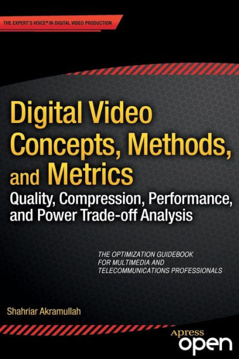

**数字视频概念，方法和测量指标：质量，压缩，性能和电量等的权衡分析**（中文版）

该书是[《**Digital Video Concepts, Methods, and Metrics: Quality, Compression, Performance, and Power Trade-off Analysis**》](https://link.springer.com/book/10.1007/978-1-4302-6713-3)一书的中文版，仅供学习交流之用。希望对想学习和了解数字视频相关技术的同学，有所帮助。

在翻译的过程中，尽可能的保留了原书的内容，并且对原书中的个别内容进行了修正和补充。

项目主页：https://github.com/wangwei1237/digital_video_concepts.git

在线预览：https://wangwei1237.gitbook.io/digital_video_concepts

本项目采用gitbook方式编写，可以利用gitbook将该项目打包成静态网页格式或者PDF
格式，具体可以参见：[gitbook教程](https://einverne.github.io/gitbook-tutorial/output/static.html)。

译者信息：

* 王伟（17哥），github [@wangwei1237](https://github.com/wangwei1237)
* 木子小兀，github [@muzixiaowu](https://github.com/muzixiaowu)
* 刘一卓，github [@GerenLiu](https://github.com/GerenLiu)
* 孙晓洁，github[@webxiaojie](https://github.com/webxiaojie)
* 吴玉，github [@wy-xyz](https://github.com/wy-xyz)
* 杨光，github [@yangguang10](https://github.com/yangguang10)

