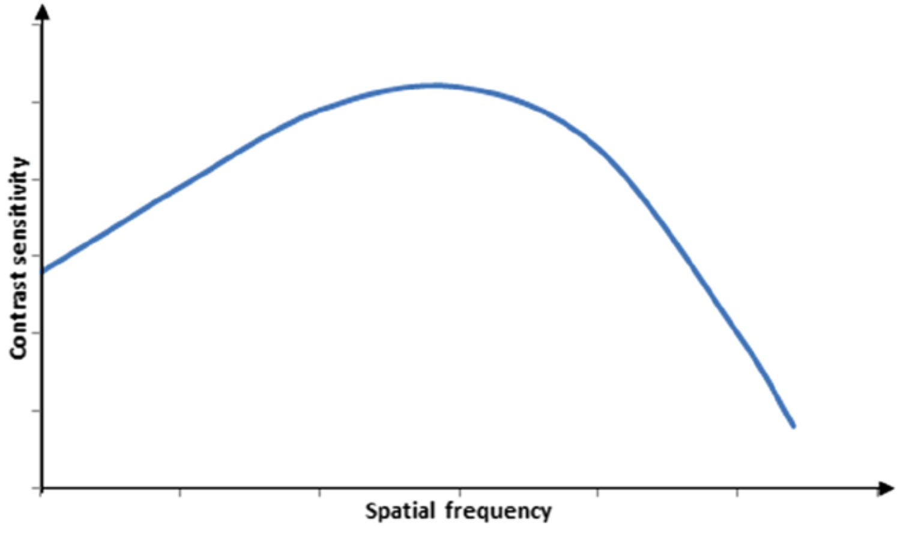

# HVS模型
视觉感知使用了人类大脑中80％以上的神经元，由此可知，视觉感知的过程非常复杂。尽管已经在该领域做了大量的研究工作，但仍未对其全过程得到很好的理解。HVS模型通常用于简化需要可视化/感知的复杂的生物过程。由于HVS由非线性空间频率信道组成，因此可以使用非线性模型对其进行建模。为了简化分析，一种方法是将线性模型作为第一近似模型，该模型会忽略HVS的非线性因素。然后，对该近似模型进行完善和扩展以包括HVS的非线性因素。

##  第一近似模型
该模型认为HVS是线性的，各向同性的（*isotropic*），并且是时空不变的。线性是指，如果从物体发出的光的强度增加，则HVS的响应应成比例地增加。各向同性意味着方向不变。尽管在实践中，HVS是各向异性的，并且它对旋转的对比光栅（*rotated contrast grating*）的响应取决于光栅的频率以及方向角度，但简化模型忽略了这种非线性因素。时空不变性很难修改，因为HVS并不是均匀的。但是，空间不变性假设在光轴和中央凹区域附近部分成立。时间响应是复杂的，在简单模型中通常不会考虑。

在第一近似模型中，对比度灵敏度为用空间频率的函数关系表示HVS的光学传递函数（*OTF，optical transfer function*）。OTF的大小称为调制传递函数（*MTF，modulation transfer function*），如图2-1所示。

**图2-1.** 典型的MTF图

图2-1中的曲线表示各种空间频率对应的可见性阈值，从图中可以看出，该曲线呈倒U形，并且其大小随观看距离和视角而变化。曲线的形状表明，HVS对中频最敏感，而对高频则不敏感，从而表现出带通（*band-pass*）特性。

因此，可以用带通滤波器表示MTF。将低通滤波器和高通滤波器组合在一起，可以更准确地对MTF建模。低通滤波器对应于眼睛的光学器件。 即使对于没有视力障碍的人，眼睛的镜片也不是完美的。这种缺陷导致球面像差（*spherical aberration*）[^1]，球面像差表现为图像在焦平面上的模糊现象。可以将这种模糊建模为二维低通滤波器。瞳孔直径为2mm~9mm。该孔径也可以建模为低通滤波器，其最高截止频率对应于2mm，并且频率随着瞳孔直径的增大而减小。

另一方面，高通滤波器解决了以下现象。给定位置的视网膜后神经信号（*post-retinal neural signal*）可能会受到一些横向定位感光器的抑制。这种抑制被称为横向抑制，并且会导致马赫带效应。对于马赫带效应，在光强度平滑斜坡（*ramp*）的过渡区域附近会出现可见光带。这是从恒定亮度的一个区域到另一个区域的高频变化，并通过滤波器的高通部分进行建模。

## 包含非线性因素的改进模型

## 模型的暗示

## 模型的应用

[^1]: 球面像差(spherical aberration)是由于透镜表面是球面而引起的。由光轴上同一物体发出的光线，通过镜头后，在像场空间上不同的点会聚，从而发生了结像位置的移动。