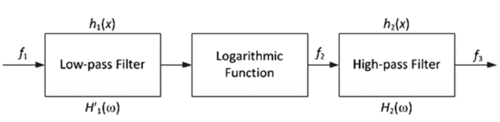
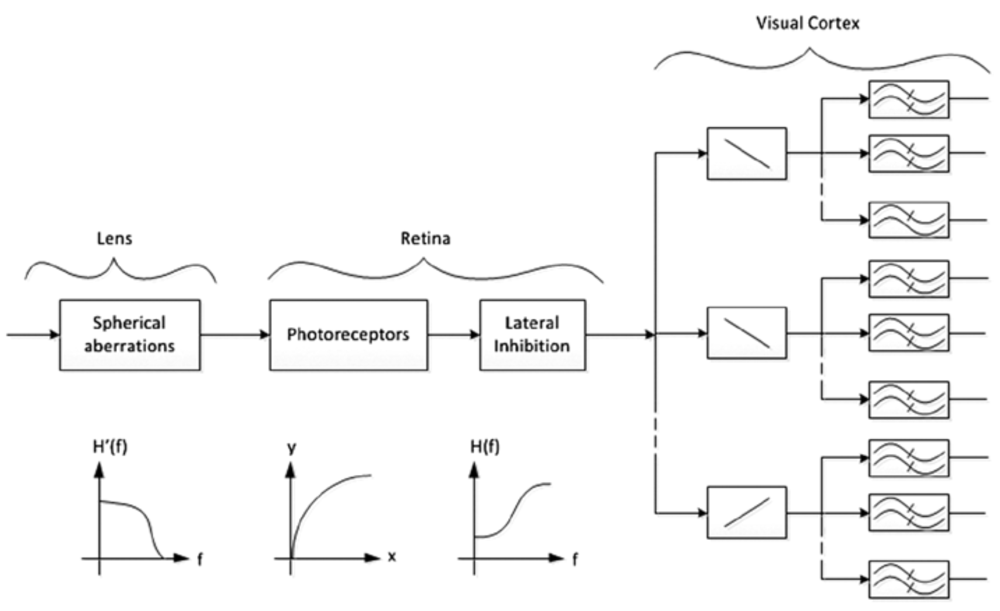

# HVS模型
视觉感知使用了人类大脑中80％以上的神经元，由此可知，视觉感知的过程非常复杂。尽管已经在该领域做了大量的研究工作，但仍未对其全过程得到很好的理解。HVS模型通常用于简化需要可视化/感知的复杂的生物过程。由于HVS由非线性空间频率信道组成，因此可以使用非线性模型对其进行建模。为了简化分析，一种方法是将线性模型作为第一近似模型，该模型会忽略HVS的非线性因素。然后，对该近似模型进行完善和扩展以包括HVS的非线性因素。

##  第一近似模型
该模型认为HVS是线性的，各向同性的（*isotropic*），并且是时空不变的。线性是指，如果从物体发出的光的强度增加，则HVS的响应应成比例地增加。各向同性意味着方向不变。尽管在实践中，HVS是各向异性的，并且它对旋转的对比光栅（*rotated contrast grating*）的响应取决于光栅的频率以及方向角度，但简化模型忽略了这种非线性因素。时空不变性很难修改，因为HVS并不是均匀的。但是，空间不变性假设在光轴和中央凹区域附近部分成立。时间响应是复杂的，在简单模型中通常不会考虑。

在第一近似模型中，对比度灵敏度为用空间频率的函数关系表示HVS的光学传递函数（*OTF，optical transfer function*）。OTF的大小称为调制传递函数（*MTF，modulation transfer function*），如图2-1所示。

**图2-1.** 典型的MTF图

图2-1中的曲线表示各种空间频率对应的可见性阈值，从图中可以看出，该曲线呈倒U形，并且其大小随观看距离和视角而变化。曲线的形状表明，HVS对中频最敏感，而对高频则不敏感，从而表现出带通（*band-pass*）特性。

因此，可以用带通滤波器表示MTF。将低通滤波器和高通滤波器组合在一起，可以更准确地对MTF建模。低通滤波器对应于眼睛的光学器件。 即使对于没有视力障碍的人，眼睛的镜片也不是完美的。这种缺陷导致球面像差（*spherical aberration*）[^1]，球面像差表现为图像在焦平面上的模糊现象。可以将这种模糊建模为二维低通滤波器。瞳孔直径为2mm~9mm。该孔径也可以建模为低通滤波器，其最高截止频率对应于2mm，并且频率随着瞳孔直径的增大而减小。

另一方面，高通滤波器解决了以下现象。给定位置的视网膜后神经信号（*post-retinal neural signal*）可能会受到一些横向定位感光器的抑制。这种抑制被称为横向抑制，并且会导致马赫带效应。对于马赫带效应，在光强度平滑斜坡（*ramp*）的过渡区域附近会出现可见光带。这是从恒定亮度的一个区域到另一个区域的高频变化，并通过滤波器的高通部分进行建模。

## 包含非线性因素的改进模型
线性模型的优点是，可以利用傅立叶变换技术进行分析，此时只要知道MTF，就可以确定任何输入激励的系统响应。但是，对于HVS而言，线性模型是不够的，线性模型忽略了系统中的、重要的非线性因素。例如，光线刺激感光器会引起感光器细胞膜存电位差，该电位差会调制神经脉冲的频率。目前已经确定，该脉冲频率是光强度（*light intensity*）的对数函数（韦伯-费希纳定律）。这种对数函数可以近似HVS的非线性。但是，一些实验结果表明，信号在高频的空间频率时会出现非线性失真的现象，但是在低频空间频率却不会发生信号的非线性失真。

如上的结果与对数非线性之后再增加线性独立的频率信道的模型不一致。因此，与HVS最一致的模型是一种简单地将低通滤波器置于对数非线性之前的模型，如图2-2所示。该模型还可以扩展用于颜色的空间视觉，其中在低通滤波器和对数函数之间增加了从光谱能量空间到三刺激空间[^2]的转换，并且低通滤波器被三个独立的滤波器（每个频段一个滤波器）取代。

**图2-2.** 用于HVS的非线性模型

## 模型的意义
这种——低通、非线性、高通的结构不仅限于空间响应，甚至不限于光谱空间响应。目前还发现，该基本结构对也可用于HVS的时间响应建模。该模型的基本前提是HVS使用低频的空间频率作为特征。作为低通滤波器的结果，快速的离散变化表现为连续变化。这与把离散的时变视频帧显示为连续时间的视频以产生平稳运动的感觉是一致的。

该模型还表明，HVS与可变带宽滤波器类似，并由输入图像的对比度控制。输入图像的对比度增加，系统的带宽则减小。因此，需要限制带宽以最大化信噪比。由于噪声通常包含一些高频的空间频率，因此限制系统传递函数的最小带宽是明智的。但是，在实际的视频信号中，高频细节也非常重要。因此，利用该模型，只能以模糊高频细节为代价来实现噪声滤波，并且需要适当的权衡以获得最佳的系统响应。

## 模型的应用
在图像识别系统中，关联低频空间频率滤波的图像和视觉初级接受区域的存储原型，其中低通—非线性—高通模型可以充当预处理器。例如，在具有可变对比度信息的复杂场景的识别和分析中，当用户将注意力转移到复杂场景的各个子部分时，基于此模型的自动化系统可以计算该子部分的平均局部对比度并相应地调整过滤器参数。此外，在图像编码和视频编码的情况下，也可以利用该模型作为预处理器，以在仅对相关信息编码之前适当地反映噪声过滤效果。同样，该模型还可以用作带宽减少和高效存储系统的预处理器。

HVS模型的框图如图2-3所示，其中描述了与晶状体，视网膜和视觉皮层有关的部分。

**图2-3.** HVS的框图

在图2-3中，第一个部分是空间各向同性的低通滤波器，其代表晶状体的球面像差、瞳孔的影响、以及有限数量的感光体对频率的限制。接下来的部分是感光器的非线性特性，用对数曲线表示。在视网膜层级，此非线性变换之后是与横向抑制现象相对应的各向同性的高通滤波器。最后，有一个定向滤波器组，用以代表视觉皮层细胞。框中的线条表示定向滤波器。接下来是另一个由双波表示的滤波器组，用于检测刺激的强度。值得一提的是，由于远离中央凹区域的分辨率会降低，因此整个系统是变化的。

[^1]: 球面像差(spherical aberration)是由于透镜表面是球面而引起的。由光轴上同一物体发出的光线，通过镜头后，在像场空间上不同的点会聚，从而发生了结像位置的移动。

[^2]: 三刺激值tristimulus values是引起人体视网膜对某种颜色感觉的三种原色的刺激程度之量的表示。