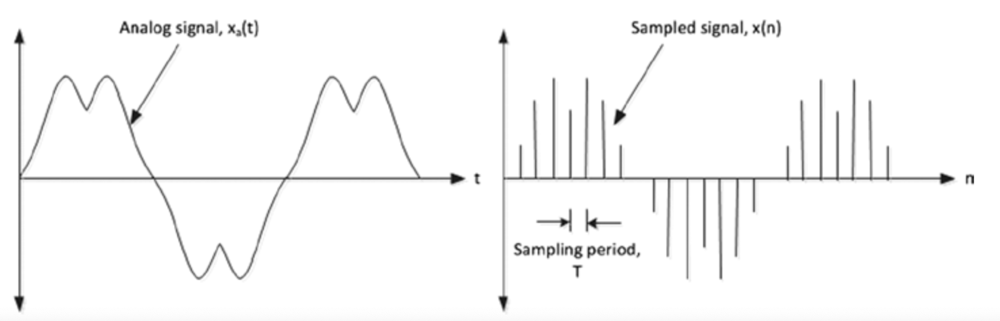
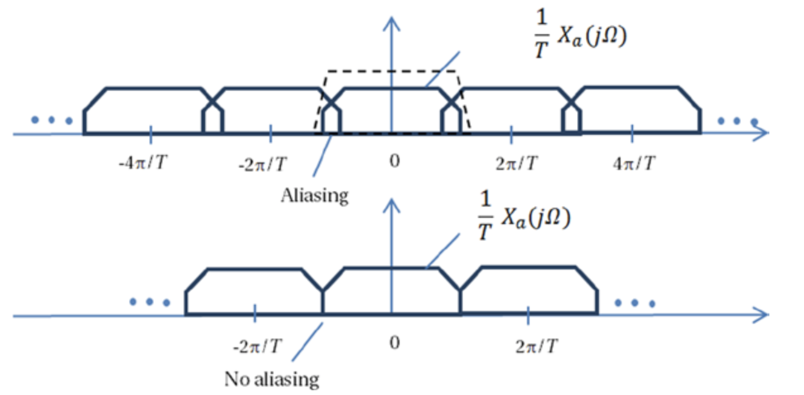
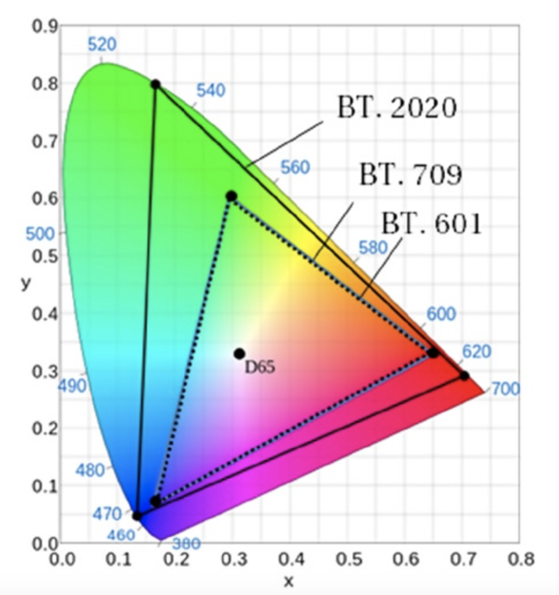

## Data Structures and Concepts
数字视频信号通常被表征为一种计算机数据形式。视频信号传感器通常输出三种颜色信号——红色，绿色和蓝色，这就是经常说的RGB颜色。RGB三种信号分别转换为数字形式并存储为图像元素（像素）阵列。和模拟视频信号不同，RGB信息不需要模拟视频信号中必须存在的消隐[^1]或同步[^2]脉冲。水平和垂直分布的像素阵列称为图像（*image*）或位图（*bitmap*），在视频领域称其为视频帧。时间序列上帧的集合则构成了完整的视频信号。位图的相关参数有5个：内存中的起始地址，每行的像素数，每帧的行数，间距值，每个像素的位数。 在以下讨论中，图像（*image*）和帧（*frame*）表述的是一个意思。

### Signals and Sampling
A/D(*analog to digital*)转换就是讲模拟信号转换为离散信号，A/D转换主要通过采样（*sampling*）实现。 采样就是按照一定时间间隔$$\Delta t$$在模拟信号$$x_a(t)$$上逐点采取其瞬时值。

对于任意的$$T>0$$，如果$$x(n)=x_a(nT)$$，则$$x(n)$$就是模拟信号$$x_a(t)$$的采样信号，其中$$T$$成为采样周期，$$2\pi/T$$为采样频率或采样率。

图2-4展示了信号$$x_a(t)$$的空域表示极其对应的采样信号$$x(n)$$。

图2-4. 模拟型号的空域表示及其采样

利用傅里叶变换可以将信号的空域表示转换成频域表示，信号的频域表示以$$2\pi/T$$的均匀间隔描述模拟信号的频率$$X_a{(j\Omega)}$$，信号的振幅为$$\frac{1}{T}$$的倍数。如图2-5所示。

图2-5. 模拟带限信号(analog bandlimited signal)采样的傅里叶变换

对于信号$$X_a(t)$$的变换版本$$X_a{(j\Omega)}$$而言，如果在$$X_a{(j\Omega)}$$上存在重叠，则会因为提取的信号中有相邻副本的残余而导致发生混叠[^3]现象。如果不存在混叠，就可以利用采样信息$$x(n)$$对信号$$x_a(t)$$进行还原。对于频率为$$[-\frac{\pi}{T}, \frac{\pi}{T}]$$的限带信号（*band limited signal*），$$\frac{2\pi}{T}$$或者更高的采样率会避免混叠，此时的采样信号不会丢失有用的信息。1928年，美国电信工程师奈奎斯特首先提出该采样定理，因此称为奈奎斯特采样定理。1933年，苏联工程师科捷利尼科夫首次用公式严格地表述这一定理，因此在苏联文献中称为科捷利尼科夫采样定理。1948年信息论的创始人香农对这一定理加以明确地说明并正式作为定理引用，因此在许多文献中又称为香农采样定理。

奈奎斯特采样定理可以用于一维或多维信号的采样。 当然，可以通过使用更少的样本来实现信号的压缩，但是在采样频率小于信号最大频率的两倍的情况下，将会出现令人讨厌的混叠伪影。

### Common Terms and Notions
在数字视频中经常使用的几个术语我们需要了解一下。
#### 幅型比(*aspect ratio*)
几何图形在不同维度上的尺寸的比例，例如，图像的幅型比是指图像的宽度和高度的比例。
#### DAR(*display aspect ratio*)
计算机显示器的宽高比。DAR的常见值为4:3和16:9，其中16:9的DAR为宽屏显示器的宽高比。
#### PAR(*pixel aspect ratio*)
像素宽高比。如果把像素想象成一个长方形，PAR即为这个长方形的长与宽的比。当长宽比为1时，这时的像素我们成为方形像素。最常用的PAR为方形像素（*square pixel*）。实际上还存在其他的PAR，例如12:11，16:11，但是这些很少使用。由于历史原因，PAR在视频行业中的作用非常重要。 随着数字显示技术、数字广播技术和数字视频压缩技术的发展，PAR一直是解决视频帧差异的最常用方法。如今，如上的三种技术均主要使用方形像素。
#### SAR(*storage aspect ratio*)
对图像采集时，横向采集与纵向采集构成的点阵中横向点数与纵向点数的比值。比如VGA图像640/480 = 4:3，D-1 PAL图像720/576 = 5:4。$$SAR * PAR = DAR$$
#### 基色（*primary colors*）
因为其它颜色可以从基色的线性组合获取，例如RGB颜色模型的基色为红色、绿色和蓝色，CMYK模型的基色为青色、品红色、黄色和黑色。色彩模型中的基色是颜色空间的基本组成部分。色彩空间中的所有颜色的全集称为色域（color gamut）。标准RGB（sRGB）是计算机最常用的色彩空间。国际电信联盟（ITU）已经给出了用于标清（SD），高清（HD）和超高清（UHD）电视的色彩基色的建议。如上的建议分别包含在ITU-R BT.601、ITU-R BT.709和ITU-R BT.2020定义的数字演播室标准中。sRGB使用ITU-R BT.709建议中定义的基色。
#### 亮度（*Luma*）
图像的明亮（*brightness*）程度，通常用于表示图像的黑白信息。虽然色彩学中的照度（*luminance*）和视频工程中的亮度（*luma*）[^4]有一些细微的差别，但是在讨论视频的时候，亮度和照度表示的是一个概念。实际上，照度（*luminance*）由正比于光功率的线性RGB的加权组合构成，该加权和不是计算而来，而是单位面积内光能量的表示。而亮度（*luma*）是非线性传递函数单独应用到每个线状光的RGB分量后（RGB分量转换为$$R'G'B'$$，$$'$$用来表示非线性变换），再经过非线性伽马函数（$$y=x^{\gamma}, \gamma=0.45$$）校正$$R'G'B'$$分量后的加权和构成。需要伽玛函数来补偿感知视觉的特性，以便在感知上将噪声均匀地分布在从黑色到白色的色调范围内，同时使用更多位来表示对人眼更敏感的颜色信息。没有学过色彩学的电视工程师经常误将亮度（$$Y'$$，luma）说成照度（lumanance），并表示为$$Y$$，这导致了很多的混乱。虽然在视频中，我们可以模糊这两者的细微差别，但是在用的时候务必需要清楚其差别。
#### 色度（*chroma*）
亮度通常都会和色度（*chroma*）一起描述。色度主要用来表示光的色彩信息。由于人的实力对颜色信息的感知能力比亮度感知能力要弱很多，因此对于色度信息而言，经常会采用亚采样的方式。色度亚采样会在不丢失敏感的色度信息的前提下以较低分辨率处理和存储色度信息。在分量视频（*component video*）中，传递色彩信息的3个分量都是分别传送的。在传送的过程中，并不直接发送$$R'G'B'$$信息，取而代之的是传送三个衍生的分量——亮度信息（$$Y'$$）和两个色差信息：$$B'-Y'$$和$$R'-Y'$$。[^5]。在模拟视频中，分别用$$U$$和$$V$$来表示如上的色差信息。而在数字视频中，我们分别用$$C_B$$和$$C_R$$来表示如上的色差信息。实际上，$$U$$和$$V$$仅仅用在模拟视频中，但是这中表述也经常会被误用在数字视频中。
#### 色品（*chromaticity*）
色品用来描述色彩信号的特性，而色度（*chroma*）用来描述信号之间的色差信息。一般而言区分色品和色度的概念是一件很容易的事情。实践中，我们仅仅利用色品信息（不考虑照度信息）来客观度量色彩信息的质量。色品的特征在于色相（*hue*）和饱和度（*saturation*）。色相用于说明颜色是“红色”，“绿色”等。色相以单色调的色轮中的度数来度量。颜色信号的饱和度则是它与灰色的差异程度。图2-6展示了ITU-R  BT.709和ITU-R BT.2020建议书中定义的色品图。从图中可以看出，因为不同标准的差异性，利用ITU-R BT.2020色彩表示的视频信号不能直接在BT.709色彩的设备上显示。为了如实的重建真实的色彩，需要对不同标准的基色进行适当的转换。

  

图2-6. ITU-R BT.601, BT.709, BT.2020 定义的色品坐标及其基色坐标，D65代表白色

可以用如下的公式将$$R'G'B'$$样本转换为$$Y'C_BC_R$$样本。

$$ 
\begin{array}{11}
Y'=K_rR' + K_gG' + K_bB' \\
C_B=\frac{B'-Y'}{2(1-K_b)} \\
C_R=\frac{R'-Y'}{2(1-K_r)} \\
\end{array}
$$

表2-2中列举了ITU-R的不同建议中定义的$$K_r,K_g,K_b$$。

**表2-2.** Constants of R'G'B' Coefficients to Form Luma and Chroma Components

| 标准 | $$K_r$$ | $$K_g$$ | $$K_b$$ |
| --- | --- | --- | --- |
| ITU-R BT.2020| 0.2627 | 0.6780 | 0.0593 |
| ITU-R BT.709| 0.2126 | 0.7152 | 0.0722 |
| ITU-R BT.601| 0.2990 | 0.5870 | 0.1140 |

值得注意的是，如上的ITU-R建议还定义了用于表示从黑色到白色之间的可见范围的位深（*bit depths*）。具体可以参见ITU-R的相关建议：ITU-R BT.2020[^6]，ITU-R BT.709[^7]，ITU-R BT.601[^8]。

[^1]: 消隐：电视系统中，扫描正程期间传送图像信号，逆程期间不传送图像信号。电子束逆程扫描在荧光屏上出现回扫线，将对正程的图像造成干扰，影响图像的清晰度。因此电视机在行、场扫描逆程期间需要使电子束截止，以消除行、场逆程回扫线，即实现消隐。方法是在电视台让同步机发出消隐信号使接收机显像管在行、场逆程扫描期间关断电子束。

[^2]: 同步：在电视系统中，为了使电视机重现的图像与摄像机拍摄的图像完全一致，要求接收端与发送端的电子束扫描必须同步。所谓同步是指收、发端扫描的频率(快慢)和扫描的相位(起始位置)完全相同。如果收、发端扫描不同步，则重现的图像会变形或不稳定，严重时图像混乱不能正常收看。为保证收、发端行场扫描同步，电视台同步机发出行、场同步信号，使电视接收机正确地重现图像。

[^3]: 混叠是指取样信号被还原成连续信号时产生彼此交叠而失真的现象。当混叠发生时，原始信号无法从取样信号还原。而混叠可能发生在时域上，称做时间混叠，或是发生在频域上，被称作空间混叠。

[^4]: Digital Video and HD:Algorithms and Interfaces, Chapter 10, Constant luminance.

[^5]: Digital Video and HD:Algorithms and Interfaces, Chapter 12, Introduction to luma and chroma, color difference coding, p123.

[^6]: https://www.itu.int/rec/R-REC-BT.2020/en, Parameter values for ultra-high definition television systems for production and international programme exchange. 

[^7]: https://www.itu.int/rec/R-REC-BT.709/en, Parameter values for the HDTV standards for production and international programme exchange.

[^8]: https://www.itu.int/rec/R-REC-BT.601/en, Studio encoding parameters of digital television for standard 4:3 and wide screen 16:9 aspect ratios.

