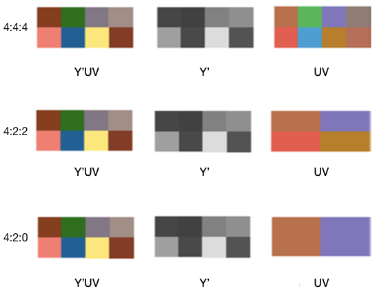
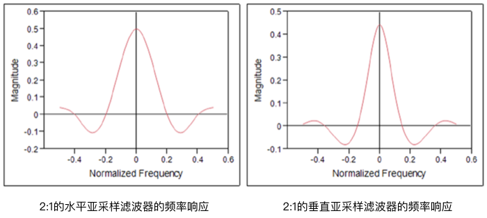

## Chroma subsampling
如前所述，HVS对颜色信息的敏感度要弱于亮度信息。利用这一特点，技术人员开发了在不会显著降低视觉质量的情况下减少色度信息的方法。色度亚采样（*chroma subsampling*）是一种常见的降低数据带宽的技术，该技术在模拟视频和数字视频编码方案中都有应用。除了视频，色度亚采样还可以用于流行的单图像（*single image*）编码算法中。这些图像编码算法由ISO和ITU-T的联合图像专家组（*JPEG, Joint Photographic Experts Group*）定义。利用颜色信息的高相关性和HVS的特性，色度亚采样降低了整体的数据带宽。例如，对于矩形图像而言，水平方向上2:1的色度亚采样算法会将整体数据带宽降低1/3，但是在正常观看距离下，数据带框的降低几乎没有导致可察觉的视觉质量损失，从而实现数据带宽的节省。

### 4:4:4 to 4:2:0
通常，在$$R'G'B'$$颜色空间中捕获图像，然后使用*图2-2*的转换公式将图像转换到$$Y'UV$$颜色空间（对于数字视频而言，会转换到$$Y'C_BC_R$$空间。简单起见，$$Y'UV$$和$$Y'C_BC_R$$表示一个概念）。转换之后得到的$$Y'UV$$图像是全分辨率（*full resolution*）图像，全分辨率图像分别具有4:4:4的$$Y'$$，$$U$$和$$V$$分量的采样比。这意味着对于$$Y'$$（亮度）的每四个样本，存在四个$$U$$样本和四个$$V$$样本存在于图像中。这些比率通常定义为4×2的样本区域，在比率4:a:b中，基于4×2样本区域的顶行和底行中的色度样本的数量来确定a和b。因此，4:4:4图像具有完全水平和垂直色度分辨率，4:2:2图像具有一半水平分辨率和完整垂直分辨率，4:2:0图像在水平和垂直方向都有一半的分辨率。4:2:0不同于4:1:1，因为在4:1:1中，一个样本存在于4×2区域的每一行中，而在4:2:0中，两个样本存在于顶行，但在底行没有。图2-7展示了常见的色度格式。

**图2-7.** 4:a:b采样示例

亚采样也称为下采样（*downsampling*）或采样率压缩（*sampling rate compression*）。如果输入信号以某种方式不受带宽限制，则亚采样会导致混叠现象和信息丢失，从而导致不可逆操作。为了避免混叠，在大多数应用中，在进行亚次采样之前通常会使用低通滤波器确保信号具有带宽限制。大多数国际标准都会使用4:2:0的图像格式，因为这种格式利用了颜色分量之间的高度相关性为可接受的感知质量提供了足够的颜色分辨率。通常将相机捕获的$$R'G'B'$$图像转换为$$Y'UV$$ 4:2:0格式以进行压缩和处理。为了将4:4:4图像转换到4:2:0图像，通常采用两步法：首先，通过水平滤波和亚采样将4:4:4图像转换为4:2:2图像；然后，通过垂直滤波和亚采样将得到的图像转换为4:2:0格式。亚采样的过滤器如图2-8所示。

**图2-8.** 用于2:1亚采样的FIR(Finite Impulse Response)滤波器

表2-5给出了图2-8有限脉冲响应（FIR）滤波器的滤波器系数。在该示例中，当水平滤波器具有零相位差时，垂直滤波器具有0.5采样间隔的相移。

表2-5. 有限脉冲响应（FIR）滤波器的滤波器系数

| 水平 | 0.0430 | 0.000 | -0.1016 | 0.0000 | 0.3105 | 0.5000 | 0.3105 | 0.0000 | -0.1016 | 0.0000 | 0.0430 |
| --- | --- | --- | --- | --- | --- | --- | --- | --- | --- | --- | --- |
| 垂直 | 0.0098 | 0.0215 | -0.0410 | -0.0723 | 0.1367 | 0.4453 | 0.1367 | -0.0723 | -0.0410 | 0.0215 | 0.0098 |
| 归一化 | -0.5 | -0.4 | -0.3 | -0.2 | -0.1 | 0 | 0.1 | 0.2 | 0.3 | 0.4 | 0.5 |
