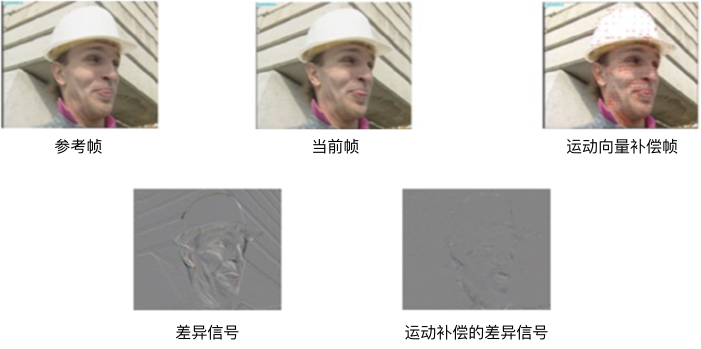

# Reduction of Redundancy
数字视频信号在相邻像素和相邻帧之间包含许多相似和相关的信息，这使得通过删除或减少冗余来实现压缩成为一种理想的压缩方案。我们已经讨论了色度亚采样以及这种亚采样并没有带来视觉上的差异的事实。从这个意义上讲，色度的全分辨率是一种冗余信息。通过对色度信息进行亚采样，可以降低数据速率，即实现数据压缩。除此之外，在数字视频信号中还存在其它形式的冗余信息，接下来会对这些冗余信息进行简要的介绍。

## Spatial Redundancy
数字化操作终结了使用大量的bits来表示图像或视频帧的情况。然而，由于视频中冗余信息的存在，可能会使用更少的bits来表示帧的信息。冗余定义为：1减去表示图像所需的最小bits与表示它的实际bits的比值。冗余的范围大致在46%和74%之间[^1]。对于具有大量空间细节的图像（例如树叶场景）冗余通常为46％。对于细节信息较少的图像（例如面部图片）冗余通常为74％。压缩技术旨在通过移除或减少可用的冗余信息来减少表示帧所需的bits。

空间冗余（也称为图像内相关，intra-picture correlation）是图像或视频帧内部的相邻像素值之间存在的相关性。视频帧中的相邻像素彼此之间通常非常相似，尤其是当帧被分解成亮度和色度分量时，这种相似性会更加明显。帧可以被划分成较小的像素块以利用这种像素相关性。在像素块内部，像素之间的相关性是很高的。换句话说，在帧的某一小区域内，空间维度的变化率通常较低。这意味着，在视频帧的频域表示中，大部分能量通常集中在低频区域，而高频的边缘信息相对较少。图2-9展示了视频帧中存在的空间冗余。

**图2-9.** 视频帧中的空间冗余

帧中存在的冗余取决于很多参数，例如，采样率，量化级别的数量以及源或传感器噪声都会影响压缩的实现程度。更高的采样率，低量化级别和低噪声意味着更高的像素之间的相关性和更高的可利用的空间冗余度。

## Temporal Redundancy
时间冗余（也称为图像间相关性，inter-picture correlation）取决于视频中不同图像或帧之间的相关性。数字视频中存在大量的时间冗余。为了人类能够感知到平滑、连续的运动，视频经常以超过15fps的帧速率显示，这也要求相邻帧之间需要具备一定的相似性。图2-10展示了视频的时间冗余。需要注意的是，降低的帧率会带来一定的数据压缩，但这也会导致可感知的视频闪烁。

**图2-10.** 视频的时间冗余信息

因此，帧可以用相邻的参考帧以及和参考帧之间的差异信息表示。 在传输系统的接收端会重建独立帧，所以不需要传输先前的参考帧。利用来自已经接受到的参考帧的信息，仅仅使用帧之间的差异信息就足以完美的重建帧。由于时间冗余，帧之间的差异信号通常非常小。只编码差异信号并将其发送到接收端，接收器则可以利用差异信号和已经接受到的参考帧获得视频帧，从而实现非常高的压缩量。图2-11显示了如何利用时间冗余的示例。

**图2-11.** 利用时间冗余重建帧

通常使用运动补偿（motion-compensated）来表示信号差异，以最小化其中的信息量，从而可以获得更高的压缩。图2-12展示了使用运动补偿来减少信息的示例。

**图2-12.** 利用运动补偿降低信息量

预测和重建实际上是无损的，预测算法越好，差异信号中剩余的信息越少，这样就能导致更高的压缩。因此，每一代新的国际视频编码标准都试图改进前一代的预测算法。

## Statistical Redundancy
在信息理论中，描述信源的数据是信息和数据冗余之和。数据压缩的目标是减少或消除不必要的冗余。如之前所述，视频信号的特征在于具有各种类型的冗余，包括空间冗余和时间冗余。除此之外，在视频信号的数字表示中还包含统计冗余，也就是说，通常在传输之前可以消除额外的比特。

例如，二进制图像（传真图像或视频帧）可以被视为0和1的字符串，0表示白色像素，1表示黑色像素。这些字符串，其中相同的bit会现在一系列或连续的数据中，因此可以使用行程代码进行表示。行程代码是指每个1（或0）构成的字符串的地址，后跟该字符串的长度。例如，1110 0000 0000 0000 0000 0011可以使用（1,3），（0,19），（1,2）来编码，代表3个1，19个0，2个1。假设仅存在两个符号0和1，则还可以使用（0,3），（22,2）对字符串进行编码，表示位置0和位置22处的1的长度。

行程的长度变化也是可能的。行程编码的思想是：仅编码和存储连续数据元素的数量来代替原始数据元素，从而实现显着的数据压缩。行程编码是一种无损数据压缩技术，可以有效地用于压缩量化系数。对于图像数据而言，尤其是在丢弃图像的高频信息之后，量化系数会包含一系列连续的0和1。根据Shannon的源编码定理，统计冗余可以达到的最大压缩率如下：

$$
C=\frac{average\ bit\ rate\ of\ the\ original\ signal\ (B)}{average\ bit\ rate\ of\ the\ encoded\ data\ (H )}
$$

这里，$$H$$表示原信号的熵（每个符号的比特位数）。尽管通过设计诸如矢量量化或块编码的编码方案可以实现该理论的极限值，但是对于实际视频帧而言，其码本（codebook）规模可能非常大，例如：尺寸为1920×1080像素，且每像素为24位的视频帧[^2]。因此，国际标准通常使用熵编码方法来任意接近理论极限。

[^1]: M. Rabbani and P. Jones, Digital Image Compression Techniques.

[^2]: A. K. Jain, Fundamentals of Digital Image Processiong.

