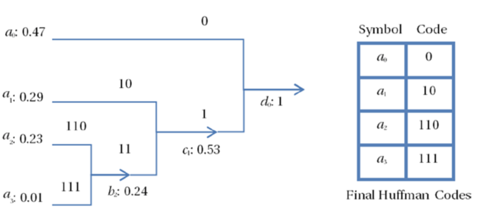
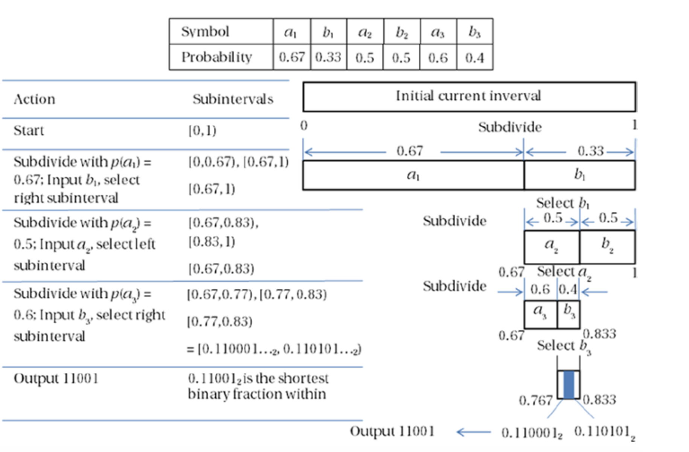

# 熵编码
考虑使用**B** *bit*来表示每个像素的一组量化系数。如果量化系数不是均匀分布的，则它们的熵将小于**B** *bit/像素*。对于一个**M**像素的图像块，假设每个*bit*可以是两个值之一，则总共有$$L = 2^{MB}$$个不同的像素块。

对于给定的数据集，特定的块$$i$$出现的概率为$$p_{i}$$，其中$$i = 0, 1, 2, ..., L-1$$。熵编码是一种无损编码方案，其目标是使用$$-log_{2}p_{i}$$ bits编码该像素块，从而使的其平均码率为该M个像素块的熵：$$H=\sum_{i=0}^{L-1}{p_{i}(-log_{2}{p_{i}})}$$。熵编码为**M**个像素的每个块提供了一个可变长度的代码，将较小的代码长度分配给了最可能出现的像素块。在大多数视频编码算法中，量化系数通常是行程编码的，而所得的数据则会再经过一次熵编码以进一步减少统计冗余。

对于给定的块大小，霍夫曼编码是最有效和最受欢迎的可变长度编码方法，可以接近可实现的最大压缩的香农极限。其他著名的熵编码技术是算术编码和Golomb-Rice编码。

当已知近似熵特征时（例如，在输入流中，小值比大值更频繁出现时）Golomb-Rice编码特别有用。通过使用样本到样本的预测，Golomb-Rice编码算法可为每个像素产生0.25 *bit*的一维差分熵（每个像素的熵值范围为0~8 *bits*），而无需存储任何码字（*code words*）。Golomb-Rice编码本质上是最佳游程编码。为了比较，我们主要讨论霍夫曼编码和算术编码。

## 霍夫曼编码
David Huffman在1952年开发的霍夫曼编码已经成为最流行的无损熵编码算法。霍夫曼编码使用可变长度码表（*code table*）对源符号进行编码，而该码表是基于源符号中每个可能值的出现概率计算得出。霍夫曼编码以这样的方式表示每个源符号：对出现频率最高的源符号给以最短的编码，频率最低的源符号给以最长的编码。赫夫曼码的码字（各符号的代码）是异前置码字，即任一码字不会是另一码字的前缀，从而使其可唯一解码。

为了了解霍夫曼编码的工作原理，考虑一组分别具有概率$$\{0.47, 0.29, 0.23, 0.01\}$$的源符号$$\{a_0, a_1, a_2, a_3\}$$。首先，从左到右生成一个二叉树，将两个最不可能的符号合并到一个新的等效符号中，其概率等于两个符号的概率之和。因此，在我们的示例中，我们采用$$a_2$$和$$a_3$$合并形成概率为$$0.23+0.01=0.24$$的新符号$$b_2$$。重复该过程，直到只剩下一个符号。

然后从右到左向后遍历二叉树，并将码字分配给不同的分支。在此示例中，将码字`0`（1 *bit*）分配给符号$$a_0$$，因为这是源字母中最可能出现的符号，而码字`1`留给了$$c_1$$。$$c_1$$是其所有分支码字的前缀，从而确保独特的可解码性。在下一个分支级别，将码字`10`（2 *bits*）分配给下一个可能的符号$$a_1$$，而将`11`分配给$$b_2$$并作为其分支的前缀。因此，$$a_2$$和$$a_3$$分别接收码字`110`和`111`（3 *bits*）。图2-13显示了该过程以及最终的霍夫曼代码。

**图2-13.** 霍夫曼编码的例子

尽管可以使用两位码字来编码这四个符号（00，01，10，11），但由于这4个符号的概率分布并不均匀，并且每个符号的熵仅为1.584 *bits*，因此还有可提升的空间。如果使用霍夫曼码字，则每个符号需要1.77 *bits*。尽管使用霍夫曼码字，每个符号的码字长度仍然比理论的最小值（1.584 *bits*）还多0.186 *bits*，但与固定长度码字相比，霍夫曼编码已经提供了约12％的压缩率。通常，最大概率符号和最小概率符号之间的概率差异越大，霍夫曼编码提供的编码增益越大。当每个输入符号的概率是2的幂的倒数时，霍夫曼编码是最佳的。

## 算术编码
算术编码是无损熵编码技术。算术编码与霍夫曼编码的不同之处在于，算术编码将整个输入消息编码为0.0~1.0之间的小数，而不是将输入分成单个符号并用码字单独编码每个符号。当带编码的符号的概率分布未知，不是独立且分布不均等时，算术编码可以提供更好的压缩能力。虽然算术编码提供了最佳的压缩效果，但是却非常复杂，实际中需要专用的硬件引擎来加速执行速度。

为了描述算术编码的工作方式，让我们考虑三个事件（例如，文本中的三个单词）的示例：第一个事件是$$a_1$$或$$b_1$$，第二个事件是$$a_2$$或$$b_2$$，第三个事件是$$a_3$$或$$b_3$$。为简单起见，尽管该算法也适用于多事件，但每个步骤仅在两个事件之间进行选择。假设输入文本为$$b_1a_2b_3$$，并且每个符号的概率如图2-14所示。

**图2-14.** 算术编码的例子