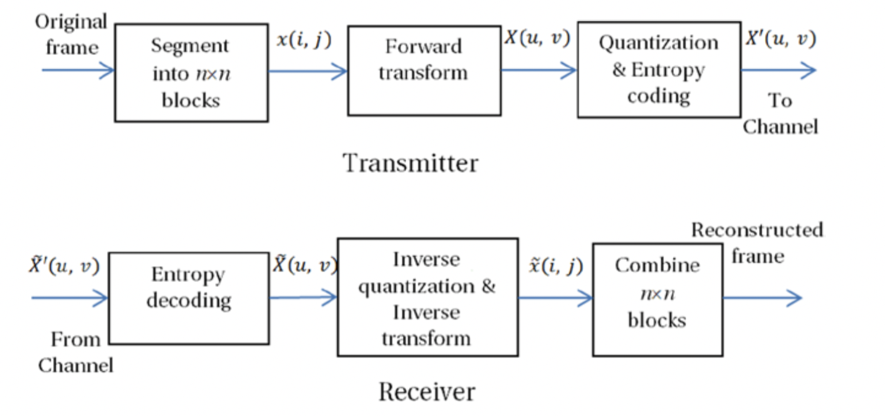
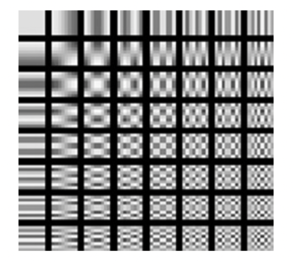
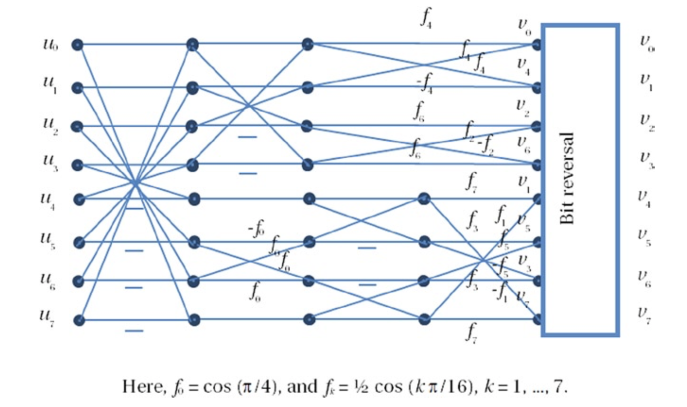
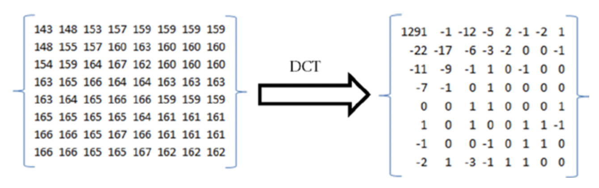
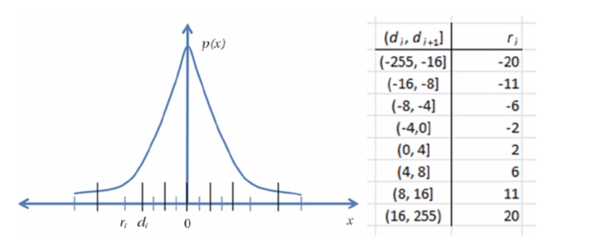

# 变换编码技术

如前所述，块中的像素彼此相似并且具有空间冗余。 但是，像素数据块没有太多的统计冗余，并且不容易适用于可变长度编码。 变换域中的去相关表示具有更多的统计冗余，并且更适合使用可变长度代码进行压缩。

在变换编码中，通常将大小为N×M的视频帧细分为较小的n×n块，并将可逆线性变换应用于这些块。 该变换通常具有一组完整的正交离散基函数，而其目标是去相关原始信号并在一小组变换系数之间重新分配信号能量。 因此，可以在编码剩余的几个系数之前通过量化过程丢弃许多具有低信号能量的系数。 变换编码的框图如图2-15所示。

图2-15. 传输系统中变换编码的框图

 

## 离散余弦变换
离散余弦变换（DCT）根据具有不同频率和幅度的余弦函数之和表示离散数据点的有限序列。 DCT是一种线性，可逆，无损的变换，可以非常有效地将像素块中存在的冗余去相关。 实际上，DCT是可用于此目的的最高效、实用的变换，它接近理论上最理想的Karhunen-Loeve变换（KLT），因为几乎不需要余弦函数来逼近典型信号。 因此，DCT被广泛用于视频和音频压缩技术。
DCT有四种表示形式，其中DCT-II17是最常见的形式：

$$
X(k)=\sum_{n=0}^{N-1} \ x(n) \ cos[ \frac{\pi}{N} \left(n + \frac{1}{2}\right)k]
\qquad \ k=0,...,N-1
$$

这里，$$X_{k}$$是变换后的DCT系数，$$x_n$$是输入信号。 该一维DCT可以一个接一个地在垂直和水平方向上单独使用，以获得二维DCT。 对于图像和视频压缩，DCT通常在8×8像素块上执行。 8×8二维DCT可以表示为：

$$
X(u,v)=\frac{1}{4}\alpha(u)\alpha(v)\sum_{m=0}^7\sum_{n=0}^{7}\ x(m,n) \ cos[\frac{(2m+1)u\pi}{16})] \ cos[\frac{(2n+1)v\pi}{16}) ]
$$

这里，$$u$$和$$v$$是水平和垂直空间频率，$$0 \leq u$$，$$v<8$$； $$a(k)$$是归一化因子，当$$k=0$$时等于1/2，否则等于1。 $$x(m,n)$$是
空间位置的像素值$$(m,n)$$； $$X(u,v)$$是频率坐标$$(u,v)$$的DCT系数。
DCT将8×8的输入值块转换为64个二维DCT基本函数的线性组合，这些线性函数以64种不同的模式表示，如图2-16所示。

图2-16. 8×8输入块的64个二维DCT基函数

 

尽管该变换是无损的，但是由于计算系统的算术精度的限制，它可能会引入不准确性，从而在进行逆运算时可能无法获得相同的准确输入。 为了处理这种不准确性，标准委员会经常采取诸如定义IEEE标准1180之类的措施，本章稍后将对此进行描述。
图2-17中显示了八点DCT（和逆DCT）的信号流程图，代表一维DCT，其中输入数据集为（u0，...，u7），输出数据集为 （v0，...，v7）和（f0，...，f7）是中间结果的基于余弦函数的乘法因子。 文献中有许多快速的DCT算法和实现，因为几乎所有国际标准都采用DCT作为减少空间冗余的选择。

图2-16. 八点DCT的信号流程图，从左到右（以及IDCT从右到左）

 

可以使用硬件或软件轻松实现DCT。 经过优化的软件实现可以利用多媒体指令集（如MMX或SSE）中可用的单指令多数据（SIMD）并行构造。此外，在基于Intel集成图形处理器的编解码器解决方案中还有专用的硬件引擎。
图2-18给出了一个像素块及其DCT转换系数的示例。

图2-18. 一个像素块及其DCT转换版本

 

## 量化

由于DCT具有典型的无损特性，因此它本身并不存在压缩。
它仅对输入数据进行解相关。但是，DCT通常后面是量化过程，该过程会利用视频帧中存在的空间冗余来截断变换后的数据块的高频信息。
量化器是一种阶梯函数，可将具有许多值的连续输入信号或离散输入信号映射为较小的有限数量的输出电平。如果x是一个
实数标量随机变量，其中$$p(x)$$是其概率密度函数，量化器将x映射到离散变量$$\hat x \in \{r_{i} ,i =0,1,...,N -1\}$$，其中每个水平$$r_{i}$$被称为a重建水平。映射到特定x的x的值由一组决策级别$$\{di,i = 0,...,N-1\}$$。根据量化规则，如果x位于间隔(di，di + 1]中，则将其映射（即量化为$$r_{i}$$），该$$r_{i}$$也位于相同的间隔中。给定$$p(x)$$和给定的优化准则。
图2-19显示了一个示例八阶非线性量化器。在此示例中，(-255，16]之间的x的任何值都映射到-20，类似地(-16，-8]之间的x的任何值都映射到-11，(-8，-4]之间的任何x的值都被映射到-6，依此类推。对于(-255，255)之间的任何输入值，此量化过程仅导致八个非线性重构级别。
量化之后，一个8×8变换数据块通常从64个系数减少到5个到10个系数，通常实现大约6到12倍的数据压缩。但是，请注意，量化是一种有损过程，其中在执行逆运算后无法重新获得被丢弃的高频信息。尽管高频信息通常可以忽略不计，但并非总是如此。因此，变换和量化过程通常会引入质量损失，这通常称为量化噪声。所有国际标准都详细定义了转换和量化过程，并要求符合定义的过程。
在通常是对像素块执行量化的二维信号（例如图像或视频帧）的情况下，由于块是独立变换和量化的，因此在块边界处会产生轮廓效果。结果，块边界变得可见。这通常称为阻塞或阻塞伪影。尽管量化级别越粗糙，数据压缩程度越高，但值得一提的是，信号的量化级别越粗糙，将引入更多的阻塞伪像。

图2-19. 八阶非线性量化器

 

## Walsh-Hadamard和其他的变换

Walsh-Hadamard变换（WHT）是线性，正交和对称变换，通常对2m实数进行运算。 它仅具有适度的去相关能力，但是由于其简单性，它是一种流行的转换。 WHT基函数由+1或-1的值组成，并且可以从正交Hadamard矩阵的行中获取。 可以从相同类型的最小2×2矩阵（即大小为2的离散傅里叶变换（DFT））递归构造正交哈达玛矩阵，如下所示：

$$
H_{2}={1\over \sqrt{2}}
\left[
 \begin{matrix}
   1 & 1 \\
   1 & -1
  \end{matrix}
\right],
and H_{2n}=
\left[
 \begin{matrix}
   H_{n} & H_{n} \\
   H_{n} & -H_{n}
  \end{matrix}
\right]
$$

Hadamard变换可使用快速算法进行计算，使其适用于许多应用，包括数据压缩，信号处理和数据加密算法。在视频压缩算法中，通常以绝对变换差之和（SATD）的形式使用它，这是一种视频质量度量，用于确定一个像素块是否与另一个像素块匹配。
在各种视频压缩方案中还有其他不常用的变换。其中值得注意的是离散小波变换（DWT），其最简单的形式称为Haar变换（HT）。 HT是基于Haar矩阵的可逆线性变换。可以将其视为一种采样过程，其中Haar矩阵的行充当越来越精细的采样。它提供了一种简单的方法
与非局部WHT相对，分析信号的局部方面非常有效，并且在算法（例如子带编码）中非常有效。 4×4 Haar矩阵的一个示例是：

$$
H_{4}=
\left[
 \begin{matrix}
   1 & 1 & 1 & 1 \\
   1 & 1 & -1 & -1 \\
   1 & -1 & 0 & 0 \\
   0 & 0 & 1 & -1
  \end{matrix}
\right]
$$

[^17]:K. R. Rao and P. Yip, Discrete Cosine Transform: Algorithms, Advantages, Aapplications (New York: Academic Press, 1990).

[^18]:S. Akramullah, I. Ahmad, and M. Liou, “Optimization of H.263 Video Encoding Using a Single Processor Computer: Performance Tradeoffs and Benchmarking,” IEEE Transactions on Circuits and Systems for Video Technology 11, no. 8 (2001): 901–15.

[^译者注释1]:因为一副图像中直流和低频区占大部分，高频区占小部分。这样，空间域的图像变换到频域或所谓的变换域，会产生相关性很小的一些变换系数，并可对其进行压缩编码，即所谓的变换编码.图像从空域变化到频域后，进行传输够起到压缩的作用