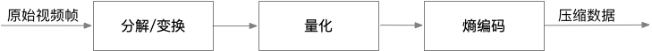
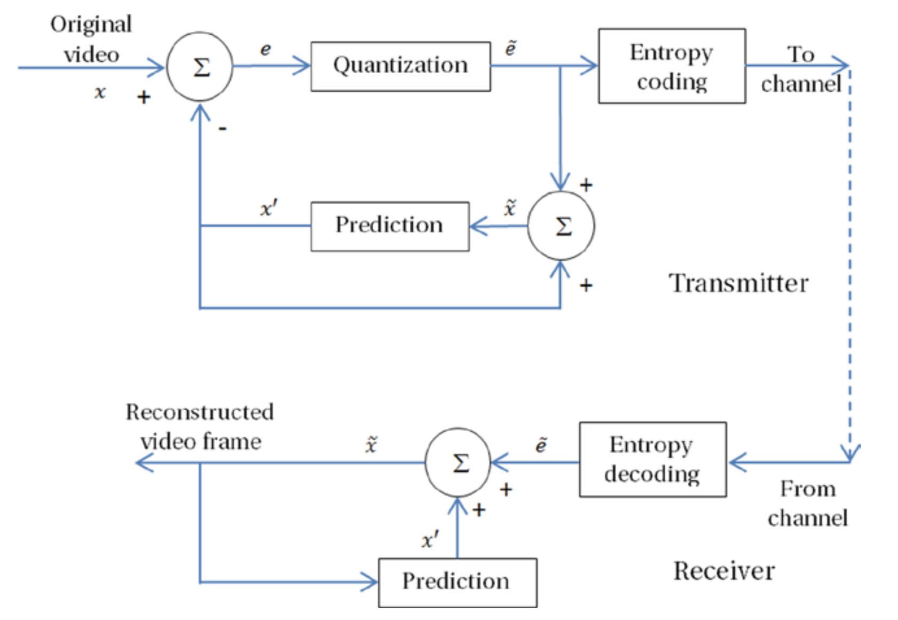
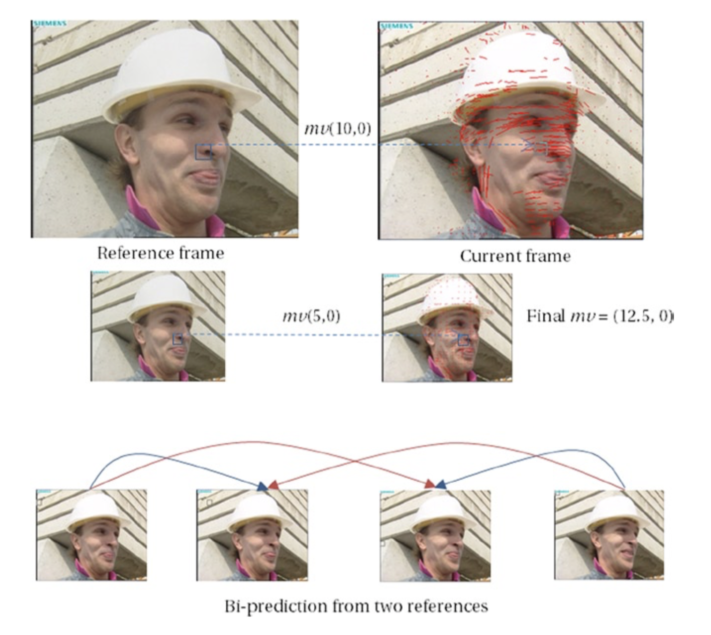
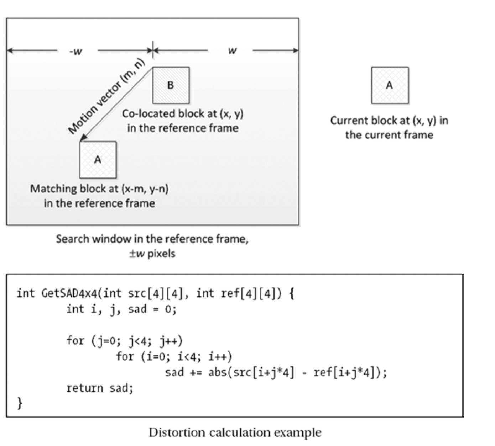

# 预测编码技术
预测是一种重要的编码技术。在传输系统的接收端，如果解码器可以用某种方式预测信号，即使预测信息有错误（一般称之为残差，*residuals*），解码器就可以重建输入信号的近似版本。但是，如果残差是已知的，或者将残差传输到解码器，此时解码器就可以更完美的重建原始信号。预测编码技术利用了残差信息这一原理。预测编码可以是有损的，也可以是无损的。接下会介绍几种预测技术。

## 无损预测编码
通过利用空间冗余，像素可以通过相邻的像素预测。因为相邻像素之间的差异很小，编码差异而不是编码实际像素是一种更有效的方式。这种方法称为差分脉冲编码调制（*DPCM*）技术。在DPCM中，存储了最可能的估计，并且计算实际像素$$x$$与其最可能的预测$$x'$$之间的差异。该差异$$e=x-x'$$称为误差信号，并且通常使用可变长度编码进行熵编码。

为了获得更好的估计，可以用之前的少量像素的线性组合来预测。由于解码器已经完成对先前的像素的解码，因此可以使用它们来预测当前像素以获得$$x'$$，并且在接收到误差信号$$e$$时，解码器可以执行$$e + x'$$以获得真实像素值。 图2-20显示了这个概念。

**图2-20.** DPCM预测两行像素的示例

在图2-20的例子中，可以根据先前解码的像素的线性组合来预测当前像素$$X$$。例如，根据相关性，$$X = 0.75A - 0.25B + 0.5C$$。一般而言，预测的图像和原始图像之间会存在有一定的误差，但是与原始图像相比，预测后的图像有更小的方差以及更少的空间相关性。因此，在DPCM中，可以使用诸如霍夫曼编码或算术编码的可变长度编码对预测后的图像进行编码。由此，这种方法产生的压缩是无损压缩。

很多应用会综合利用无损压缩和有损的预测算法实现更短的传输时间，例如医学成像等。然而，这些应用可能只能容忍很小的质量下降，并且期望具备高质量的图像重建。为了实现这一目的，需要首先使用有效的有损压缩算法来构造图像的低带宽版本；然后，计算有损版本和原始图像之间的差异来生成残差（*residual*）图像；最后对残差图像进行无损编码。

## 有损预测编码
在有损编码中，允许部分视觉质量损失以适应更低的比特率，更多的质量降级可以实现更大的数据压缩。图2-21显示了有损编码的一般概念，其中将原始图像分解/变换到频域空间，并对频域信息进行量化处理，然后利用熵编码技术来编码剩余信息。

**图2-21.** 有损编码方案

分解和变换会降低信号的动态范围并且还使信号失去相关性，从而可以产生一种可以高效编码的数据格式。分解和变换通常是可逆的、无损的。然而，在接下来的量化过程，会引入信息损失并因此引入质量降级。但是量化处理也同时实现了数据压缩。接下来的熵编码也是无损处理，但是却通过统计冗余来提供一些压缩。

## 有损DPCM
如前所述的在结合无损DPCM编码的预测编码中，可以基于参考形成预测或估计，然后计算预测信号和原始信号的误差并对误差进行编码。然而，DPCM方案也可以用于有损编码并产生有损预测编码。

可以采用原始信号作为预测的参考帧，然而，传输信道的接收端的解码器将仅能基于到目前为止接收到的数据重现部分信号。需要注意的是，接收到的信号是从信号的量化版本重建，因此会包含量化噪声。故而，在重建信号和原始信号之间会存在差异。

为了确保传输信道收、发两端具有相同的预测，编码器还需要基于重建值形成其预测。如图2-22所示，为实现这一点，需要将量化器包含在预测循环中，这实际上相当于将解码器和编码结构合并在了一起。

**图2-22.** 有损DPCM流程图

## 时域预测
除了利用相邻像素之间的空间冗余预测外，还可以利用时间冗余从相邻帧形成预测。除了物体在帧之间的微小移动外，相邻帧是相似的，因此可以捕获帧的差异信号并且可以通过运动来补偿帧的残差信息。

将帧分为不同的块后，在下一帧中，每个块可能会移动到不同的位置。因此，通常会为每个块定义运动矢量，以指示水平和垂直维度上的运动量。运动矢量是整数，并表示为$$mv(x,y)$$。还可以将子采样残差帧的运动矢量与原始分辨率的残差帧的运动矢量组合起来，此时子采样的运动矢量可以用分数表示。图2-23说明了此概念，其中最终运动矢量在当前帧中与参考帧中的原始位置$$(0,0)$$水平相距12.5像素（使用运动矢量的半像素精度）。

**图2-23.** 时域预测的例子

为了执行运动补偿，使用称为运动估计的过程来确定运动矢量，该过程通常针对16×16像素块或其他形状的图片分区进行。运动估计在参考帧中定义搜索窗口，在该搜索窗口中搜索相对于当前帧中的当前块的最佳匹配块。搜索窗口通常在位置$$(0,0)$$周围形成，与当前帧中的当前块相比，该位置在参考帧中具有相同的水平和垂直坐标。然而，在一些算法中，搜索窗口也可以围绕预测运动向量候选者形成。定义一个匹配标准（通常是失真度量）来确定最佳匹配。
这种块匹配运动估计的方法不同于象素递归运动估计，后者涉及以递归方式匹配帧的所有像素。图2-24示出了块匹配运动估计的示例。

**图2-24.** 块匹配运动估计

文献中有大量的运动估计算法。块匹配技术试图最小化失真度量并尝试找到
搜索区域内两个块之间的全局最小距离。典型的失真度量是平均绝对差（MAD），绝对差之和（SAD）和涉及Haar变换的绝对变换差之和（SATD），具有不同的计算复杂性和匹配能力。运动估计是一个计算量很大的过程，以至于编码速度在很大程度上取决于该过程。因此，失真度量的选择在有损预测视频编码中很重要。

