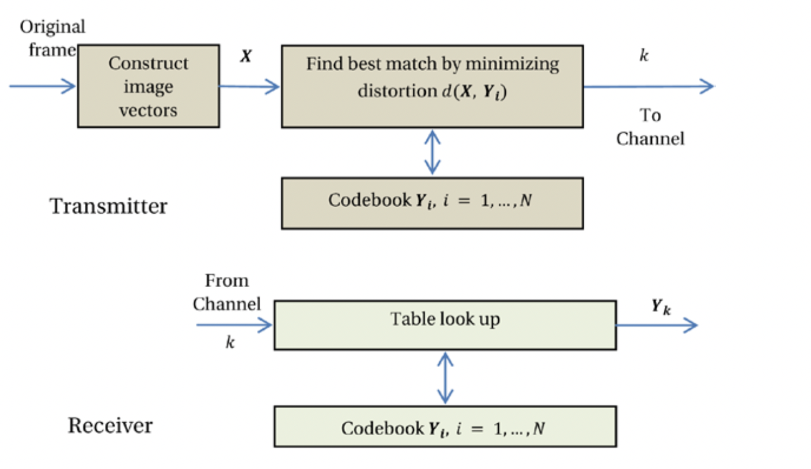

# 其他编码技术
除了之前章节提到的编码算法，还有其它的流行的编码算法，包括矢量量化和子带编码。 这些编码算法也因为各自的特殊特性而广为人知。

## 向量量化
在矢量量化（VQ）中，视频帧被分解为n维矢量。 例如，Y’CBCR分量可以形成三维矢量，或者帧的每一列都可以用作形成w维矢量的矢量元素，其中w是帧的宽度。 将每个图像矢量X与几个代码矢量Yi，i = 1进行比较。 。 ，...，N，其取自先前生成的码本。

根据最小失真准则（例如均方误差（MSE）），比较可得出X和Y（第k个代码向量）之间的最佳匹配。 指标
ķ
k使用log2N位发送。 在接收端，密码本的副本已经存在
可用，其中解码器仅从码本中查找索引k以重现Yk。 VQ框图如图2-25所示。

图2-25. 矢量量化方案的框图

 

之所以能够实现压缩，是因为与可能的代码矢量的数量相比，使用了代码矢量相对较少的代码本。 尽管理论上VQ可以达到接近率失真界限的压缩效率19，但实际上需要一个不合理的大n值。 但是，使用适当的尺寸，使用智能训练算法仍可以实现合理的压缩效率。 有关VQ的详细讨论，请参见Rabbani和Jones。20

## 子带编码

在子带编码（SBC）技术中，对图像进行滤波以创建称为子带的一组图像，每个子带具有有限的空间频率。 由于每个子带的带宽都减小了，因此将原始图像的子采样版本用于每个子带。

过滤和二次采样的过程称为分析阶段。 然后，使用一个或多个编码器，可能使用不同的编码参数，对子带进行编码。 这允许将编码误差分布在不同的子带之间，从而可以通过执行相应的子带的上采样，滤波和随后的组合来实现视觉上最佳的重建。 这种重建方式称为合成阶段。
子带分解本身不提供任何压缩。 但是，与原始图像相比，可以更有效地对子带进行编码，从而提供总体压缩优势。 图2-26给出了该方案的框图。 许多编码技术可以用于编码不同的子带，包括DWT，Haar变换，DPCM和VQ。 在Rabbani和Jones中可以找到关于SBC的详尽讨论21。

图2-26. 二维子带编码方案的框图

 

