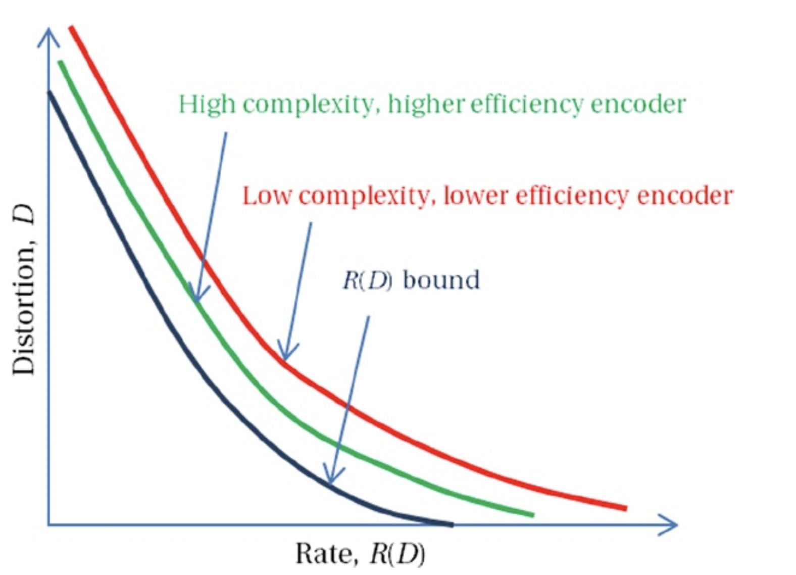

# 率失真理论（*Rate-Distortion Theory*）
信源的熵定义了编码图像或视频帧所需的最小**bit**数。但是，这种定义仅适用于无损编码。实际上，由于HVS的特性，人们可以容忍某些不可逆的视觉质量损失。视觉质量损失的程度可以通过调整编码参数（例如量化级别）来实现。

率失真理论是信息论的一个分支，其目的为：确定在给定码率下的可接受的视觉质量损失量。该理论为有损数据压缩提供压缩效率的理论界限，例如：在特定的码率下能达到的最小失真；或者为了满足特定的失真限制，最小码率应该是多少。率失真理论根据信号保真度准则，通过为各种失真度量和信源模型定义率失真函数—$$R(D)$$。$$R(D)$$函数具有以下属性：

* 对于给定的失真$$D$$，存在一种编码方案，对于该编码方案而言，其失真为$$D$$，其码率为$$R(D)$$。
* 对于任何编码方案，$$R(D)$$代表可以达到$$D$$失真的最小码率。
* $$R(D)$$是U型凸函数，并且是关于$$D$$的连续函数。

图2-27给出了典型的率失真函数的例子。对于无损压缩，其最小码率为$$D=0$$时的**R**值，该值可能等于或小于信源的熵值，具体的数值取决于失真度量。

**图2-27.** 率失真曲线的例子

$$R(D)$$范围取决于信源模型和失真度量。通常，编码器可以用更高的复杂度为代价实现接近$$R(D)$$的压缩效率。更好的编码器则使用较低的码率来获取可容忍的、较少的失真，但与其他编码器相比可能具有更高的复杂度。为了确定相对于$$R(D)$$的压缩效率，经常使用具有单位相关系数的二维高斯-马尔可夫源图像模型作为参考。然而，对于自然图像和视频，寻找良好的信源模型以及寻找与人类视觉系统相关的、良好的失真标准是一个热门的研究领域。

## 有损压缩
影响和区别压缩算法的因素有多个。在为特定的应用模型调整或选择压缩算法时，应认真分析这些因素。这些因素包括：

* **对输入帧类型的敏感性**：压缩算法对于输入帧的不同特征可能会具有不同的压缩效率。输入帧特征包括：动态范围，相机噪声，像素间像素相关性，分辨率等。
* **目标码率**：由于带宽的限制，某些应用程序需要保持一定的码率，但是如果需要，则会牺牲视觉质量以降低码率。压缩算法在率失真曲线上具有不同的最佳点，并且如果目标码率超出其最佳点则将导致较差的视觉质量。某些算法可能无法在低于特定的码率的情况下运行，例如，无论时空复杂度如何，用于HD分辨率的AVC算法必须使用不低于1.5 Mbps的带宽。对于30 FPS的1920×1080的视频，1.5 Mbps的码率的压缩率大约为500倍。
* **恒定码率 vs 恒定质量**：某些算法更适合无缓冲传输，因为它们以恒定的码率运行。但是，对于复杂的场景，可能需要以牺牲视觉质量为代价来维持码率。视频复杂度随场景的变化而变化，此时，恒定的码率会导致重建质量的变化。另一方面，某些算法会保持恒定的质量，码率则会发生变化，这需要在传输时保证足够的缓冲。
* **编码器/解码器的不对称**：某些算法（例如矢量量化方案）使用非常复杂的编码器，而解码器通过简单的表查找来实现。与矢量量化相比，其他方案（例如MPEG算法）需要更复杂的解码器，但其编码器则可以简化。但是，MPEG编码器通常比解码器复杂，因为MPEG编码器中还包含完整的解码器。取决于最终的用户平台，某些方案可能比其他方案更适合特定的应用程序。
* **复杂性和可执行性**：计算复杂性，内存需求以及对并行处理的开放性是压缩算法的硬件或软件实现的主要区别因素。尽管基于软件的实现能够更灵活地进行参数调整以获得最高的可实现质量，并且可以适应未来的变化，但是硬件实现通常会更快且还可以优化功耗。需要根据终端服务平台和应用模型做出适当的权衡。
* **错误恢复能力**：压缩数据容易受到信道错误的影响，但是不同的算法对这种信道错误的敏感性不尽相同。基于DCT的算法可能会因为信道错误而丢失一个或多个块，而带有可变长度代码的简单DPCM算法可能会丢失整帧数据。纠错码（*error-correcting codes*）可以以复杂性为代价来补偿某些错误，但是纠错码在出现突发错误时的效果并不理想。
* **伪像**：有损压缩算法通常会产生各种伪像。即使在相同的码率下，伪像的类型及其严重性也可能因算法而异。在视觉上，某些伪像可能比随机噪声或较柔和的图像更令人反感，例如可见的块边界，锯齿状的边缘，对象的振铃伪像等。而且，伪像还取决于视频内容的特性和观看条件。
* **多代编码的效果**：视频编辑等应用可能需要多代编码和解码，其中解码后的输出再次用作编码器的输入。编码器的输出是第二代压缩输出。某些应用程序支持此类的压缩。某些压缩算法则不适和多代压缩方案，并且对同一帧执行第二代编码后，通常会导致较差的视频质量。
* **系统兼容性**：并非所有标准都适用于所有系统。尽管标准化的目标之一是在整个行业中获得通用格式，但是某些厂商可能会仅强调某种压缩算法。尽管标准化成果通常认可诸如AVC和HEVC之类的格式，但是厂商可以选择推广类似的算法，例如VC-1，VP8或VP9。总体而言，这是一个更大的问题，涉及诸如蓝光（* Blu-ray*）与HD-DVD之类的技术定义。但是，在选择压缩方案时，必须考虑与目标生态系统的兼容。