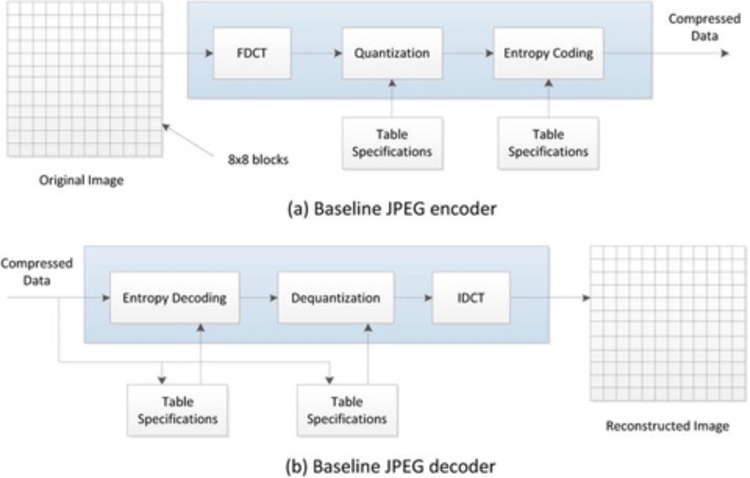

# JPEG 标准

 JPEG是一种连续色调静止图像压缩标准，专为桌面出版，图形艺术，彩色传真，报纸线照片传输，医学成像等应用而设计。 基线JPEG算法使用基于DCT的编码方案，其中将输入分为8×8像素块。 每个块都经过二维正向DCT，然后进行均匀量化。最终的量化系数以Z字形扫描，以形成一维序列，其中高频系数（可能为零值）被放置在序列的后面，以方便游程编码。 经过行程编码后，所得的符号将进行更有效的熵编码。

 第一个DCT系数（通常称为直流系数，因为它是像素块平均值的一个度量），相对于前一个块进行了差分编码。使用可变长度的霍夫曼码对具有非零频率的AC系数的游程长度进行编码，为更可能的符号分配较短的代码字符。图3-1显示了JPEG编解码器框图。

 
 
 **图3-1.**基线JPEG编解码器框图

