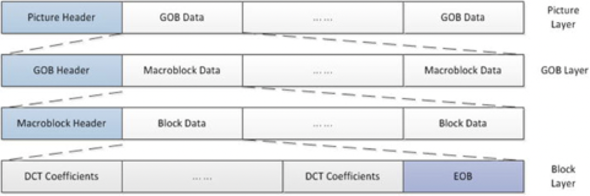
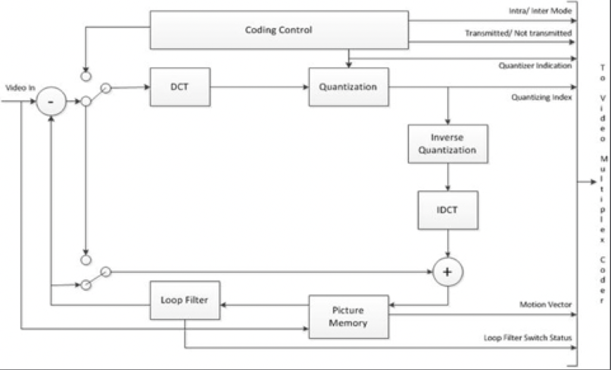

# H.261标准

H.261是业界采用的第一个重要且实用的数字视频编码标准。它是p×64kbps视听服务的视频编码标准（其中p = 1，...，30），旨在通过ISDN提供视频电话和视频会议服务，并将此类应用视频传输的各个方面统一到同一标准上。目标包括以最小的延迟实时传输视频（通常是15-30fps，延迟小于150ms）。尽管作为一个成功的数字视频编码标准，其提供了全行业的互操作性、通用格式和压缩技术，但是H.261已过时，且如今已经很少使用了。

在H.261标准中，所有编解码器必须以四分之一公共中间格式（Quarter Common Intermediate Format，QCIF）的视频格式进行操作，而CIF的使用是可选的。由于CIF和QCIF在29.97fps下的未压缩视频比特率分别为26.45 Mbps和9.12 Mbps，因此在提供正常的视频质量的同时，使用ISDN通道传输这些视频信号非常困难。为了实现此目标，H.261将视频划分为分层的块结构，该结构包括图片，块组（GOB），宏块（MB）和块。一个宏块由四个8×8亮度块和两个8×8色度块组成；3×11的宏块阵列又构成一个块组。一个QCIF图片具有三个块组，而一个CIF图片则有12个。分层数据结构如图3-2所示。

**图3-2.**H.261视频多路复用编码器数据结构

H.261源编码算法是帧内和帧间编码的混合，利用了空间和时间上的冗余。帧内编码类似于基线JPEG，其执行基于块的8×8 DCT变换，并对DCT系数进行量化。量化系数经过可变长度霍夫曼编码的熵编码，利用信号的统计特性实现了比特率的降低。

帧间编码涉及运动补偿帧间预测，并消除图片之间的时间冗余。帧间预测仅在正向执行，没有双向预测的概念。在以整数像素精度执行运动补偿的同时，可以将环路滤波器切换到编码器中，以在必要时通过消除编码后的高频噪声来改善图像质量。 图3-3给出了H.261源编码器的框图。

**图3-3.**ITU-T H.261源编码器框图

