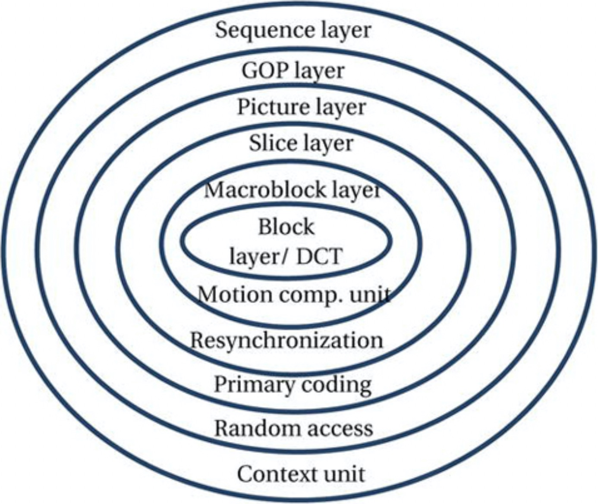

# MPEG-1标准

在19世纪90年代，受光盘数字音频市场成功的鼓舞，CD-ROM进入了数据存储领域。这促使MPEG-1标准的诞生，该标准针对要求1.2至1.5 Mbps视频家庭系统（VHS）品质视频的应用进行了优化。最初的动机之一是将压缩视频装入广泛可用的CD-ROM中；但是，出现了数量惊人的新应用，以利用标准算法提供的高压缩比、质量正常的视频。 MPEG-1仍然是视频编码标准历史上最成功的发展之一。但是，可以说，MPEG-1标准最著名的部分是它引入的MP3音频格式。MPEG-1的预期应用包括CD-ROM存储，计算机多媒体等等。MPEG-1标准在1991年被批准为ISO/IEC11172。该标准包括以下五个部分：

1. 系统：处理视频，音频和其他数据的存储和同步
2. 视频：定义压缩视频数据的标准算法
3. 音频：定义压缩音频数据的标准算法
4. 符合性：定义测试方法以检查标准实施的正确性
5. 参考软件：提供标准关联的软件，作为正确实施编码和解码算法的示例

MEPG-1比特流语法很灵活，由六层组成，每层执行不同的逻辑或信号处理功能。图3-4描绘了洋葱结构中排列的各个层。

**图3-4.**MPEG-1比特流语法的洋葱结构

MPEG-1是为编码渐进视频序列而设计的，推荐的图片大小为约1.5Mbps、360×240（或352×288，又称为CIF）。但它不限于此格式，并且可以应用于更高的比特率和更大的图像尺寸。预期的色度格式为4：2：0，像素深度为8位。该标准要求实时解码，并支持促进与存储的比特流交互。MPEG-1仅指比特流和解码过程的语法，从而为编码器实现提供足够的灵活性。编码器通常是为满足特定的使用需求而设计的，但是它们有望在编码效率和复杂性之间提供足够的权衡。

与任何其他标准一样，MPEG-1视频算法的主要目标是在给定比特率下实现最高的视频质量。为了达到这个目标，MPEG-1采用与H.261相似的压缩方法：它也是帧内和帧间减少冗余技术的混合。对于帧内编码，将帧划分为8×8个像素块，使用8×8 DCT将其转换到频域，进行量化，Z形扫描，并使用可变长度霍夫曼码对生成位的游程长度进行编码。

通过计算原始帧与其根据重构参考帧构造的运动补偿预测之间的差异信号，即预测误差，可以减少时间冗余。但是，MPEG-1的时间冗余减少与H.261在几个重要方面存在差异：
* MPEG-1允许进行双向时间预测，从而为给定质量的图片提供了比仅使用前向预测所能达到的更高的压缩率。对于双向预测，某些帧使用显示顺序的过去或将来帧作为预测参考进行编码。可以从过去参考帧中的一个块、未来参考帧中的一个块、或从两个块的平均中（每个参考帧一个块）预测一个像素块。在双向预测中，以更大的编码器复杂性和额外的编码延迟为代价实现了更高的压缩。但是，它对于数据存储和其他脱机应用程序仍然非常有用。
* 此外，MPEG-1引入了半像素精度进行运动补偿，并剔除了环路滤波器。半像素精度部分补偿了H.261环路滤波器所提供的好处，同时不会传播高频编码的噪声，也不会牺牲编码效率。

视频序列层指定一系列参数，例如视频帧的大小、帧率、码率等。图片组（GOP）层支持随机访问、快速搜索以及编辑。GOP的第一帧必须进行帧内编码（I帧），其只能使用DCT，量化和可变长度编码在空间维度上实现压缩。在I帧之后是前向预测编码帧（P帧）和双向预测编码帧（B帧）的排列。I帧被独立编码并用作解码的入口点，从而为随机访问比特流和快速搜索（例如类似VCR的特技播放，快进和快退）提供了能力。

图片层处理特定的帧，并包含帧类型（I，P或B）的信息以及帧的显示顺序。对应于运动矢量和量化DCT系数的比特位在切片层，宏块层和块层中的包中。切片是宏块的连续段。如果发生位错误，切片层有助于在解码期间重新同步位流。宏块层包含相关的运动矢量位，然后是块层，该块层由编码的量化DCT系数组成。图3-5以编码和显示顺序展示了MPEG图片结构，该结构适用于MPEG-1和MPEG-2。

