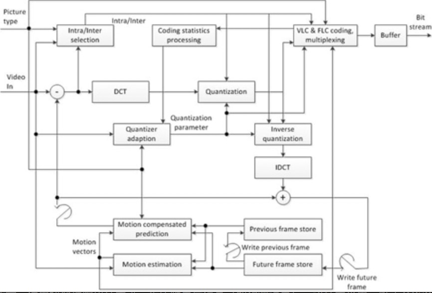
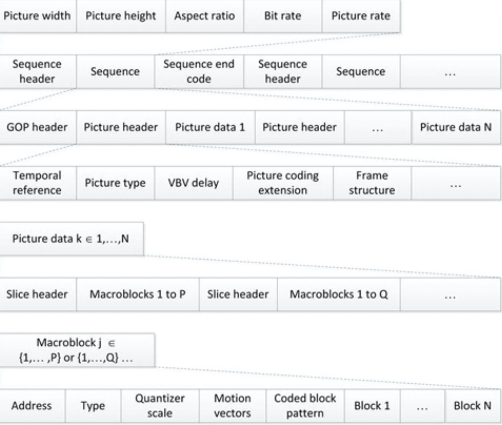

# MPEG-2标准

MPEG-2被定义为运动图像和相关音频的通用编码标准。该标准由国际标准化组织/国际电工委员会（ISO/IEC）和电信标准化部门（ITU-T）的联合技术委员会指定，并于1993年被批准为ISO/IEC国际标准13818和ITU-T H.262建议书。为了解决MPEG-1中的现有问题，MPEG-2的标准化活动主要基于以下考虑：

* 将音频压缩通道的数量从2个通道扩展到5.1个通道。
* 为广播应用中的交错式视频添加标准化支持。
* 除了支持MPEG-1中的“约束参数”比特流以外，还提供更多标准配置文件，以支持更高分辨率的视频内容。
* 从对4:2:0颜色采样的支持，扩展到4:2:2和4:4:4。

对于MPEG标准，标准委员会讨论了视频和音频压缩以及视听数据压缩复用的系统注意事项。在MPEG-2应用中，压缩的视频和音频基础流通过多路复用来构成节目流；几个节目流在传输之前被打包并组合成传输流。在接下来的讨论中，我们将专注于MPEG-2视频压缩标准。

MPEG-2主要针对于2Mbps或更高码率的各种应用，包括高质量（NTSC）制式及高清电视（HDTV）。 尽管广泛用作无线、有线和卫星直播电视系统的数字电视信号格式，但其他典型应用包括数字盒式磁带录像机（VCR），数字视频光盘（DVD）等。作为支持2Mbps至40Mbps范围内各种应用程序的通用标准，MPEG-2的压缩目标在30到40范围内。为提供应用程序独立性，MPEG-2支持多种视频格式，分辨率范围从源输入格式（短距离传输）到高清电视（HDTV）。表3-1展示了MPEG-2应用中使用的一些典型视频格式。

**图3-1.**典型的MPEG-2参数

| 格式 | 分辨率 | 压缩后码率（Mbps）|
| :--- | :--- | :--- |
| SIF | 360x240, 30fps | 1.2~3 |
| ITU-R 601 | 720x480, 30fps | 5~10 |
| EDTV | 960x480, 30fps | 7~15 |
| HDTV | 1920x1080, 30fps | 18~40 |

MPEG-2的目的是提供更好的图像质量，同时保留对编码比特流的随机访问。但是，这是一项相当困难的任务。 由于目标码率所要求的高压缩率，仅通过帧内编码不能获得良好的图像质量。相反，用纯帧内编码可以最好地满足随机访问要求。 这种困境需要在帧内编码和帧间编码之间达到微妙的平衡。与MPEG-1类似，这导致了I帧，P帧和B帧定义的出现。I帧的压缩程度最低，并且在频域中以量化形式大约包含图片的全部信息，通过增强鲁棒性减少错误。P帧是根据过去的I或P帧来进行预测的，而B帧通过使用过去和将来的I或P帧进行运动补偿来提供最大的压缩。但是，B帧最容易出现信道错误。

MPEG-2编码器首先为信号选择合适的空间分辨率，然后进行块匹配运动估计，以找到当前帧中宏块（16×16或16×8像素区域）相对于宏块的位移，该宏块从先前或将来的参考系或其平均值中获得。最佳匹配块的搜索基于平均绝对差（MAD）失真准则；当所有宏块的像素差的累积绝对值最小时，就会发生最佳匹配。然后，运动估算过程将定义一个运动矢量，该运动矢量表示当前块位置相对于最佳匹配块位置的位移。为了减少时间冗余，运动补偿既用于根据先前参考图片对当前图片进行因果预测，又用于根据过去和未来参考图片进行非因果插值预测。图片的预测是基于运动矢量构建的。

为减少空间冗余，使用块变换编码技术进一步压缩差异信号（即预测误差），该技术采用二维正交8×8 DCT变换去除空间相关性。生成的变换系数以交替或锯齿扫描模式排序，然后以不可逆的过程对其进行量化，从而丢弃不太重要的信息。在MPEG-2中，在宏块层使用了自适应量化，从而实现了平稳的码率控制和感知上统一的视频质量。最后，将运动矢量与残差量化系数组合在一起，使用变长霍夫曼码进行传输。霍夫曼编码表是预先确定和优化好的，其适用于某些特定应用的有限压缩比范围。图3-6显示了MPEG-2视频编码框图。

**图3-6.**MPEG-2视频编码框图

MPEG-2中的比特流语法被划分为配置文件子集，这些子集指定了对语法的约束。配置文件进一步分为多个级别，这些级别是对比特流中的参数施加的一组约束集。MPEG-2中定义了五个配置文件：

* 主要：以标清图像的最高质量为目标。
* 简单：直接通过不插入图片来节省内存。
* SNR可扩展：旨在通过使用多于一层的量化来按需提供更好的信噪比。
* 空间可扩展：旨在通过使用加权和重构参考图片的附加层来按需提供可变分辨率。
* 高：旨在支持4：2：2色度格式和完全可伸缩性。

在每个配置文件中，最多定义了四个级别：

* 低：提供与H.261或MPEG-1的兼容性。
* 主要：对应于传统电视。
* 1440高：大致相当于高清电视，每行有1,440个样本。
* 高：大致相当于高清电视，每行1,920个样本。

主要配置文件，主要级别（MP @ ML）反映了MPEG-2在娱乐应用方面的最初关注点。允许的配置文件级别组合为：具有主要级别的简单配置文件，具有所有级别的主要配置文件，具有低级别和主要级别的SNR可扩展配置文件，具有1440高级别的空间可扩展配置文件以及具有除低级别之外的所有级别的高配置文件。

比特流语法也可以划分如下：

* 不可扩展的语法：MPEG-1的超集，具有用于隔行视频信号的额外压缩工具以及可变码率、交替扫描、隐藏运动矢量、DCT转换内部格式等。
* 可扩展语法：类似于不可扩展语法的基础层，以及一个或多个增强层，能够实现有用视频的重构。

压缩比特流的结构如图3-7所示。这些分层类似于MPEG-1。压缩的视频序列以包含图像分辨率、图像速率、码率等的序列头开始。 MPEG-2中有一个序列扩展头，其中包含视频格式、颜色基色、显示分辨率等。序列扩展头之后可以是具有时间码的可选GOP头，其后是包含时间参考、帧类型、视频缓冲验证器（VBV）延迟等的帧头。帧头可以由包含隔行、DCT类型和量化标度类型信息的图片编码扩展所接替，通常在其后跟随切片头以便于重新同步。在切片内，几个宏块被分组在一起，其中宏块的地址和类型、运动矢量、编码块模式等被放置在宏块中所有块的实际VLC编码的量化DCT系数之前。这些分片可以在任何宏块位置开始，并且不限于宏块行的开头。

**图3-7.**MPEG-2视频比特流语法压缩结构

由于MPEG-2基础层是MPEG-1的超集，因此符合标准的解码器可以解码MPEG-1比特流，从而提供向后兼容性。此外，MPEG-2能够为运动补偿预测选择最佳模式，从而可以从整个参考帧或从参考帧的顶部或底部场预测当前帧或场，从而找到更好的场之间的关系。MPEG-2还添加了替代扫描模式，比之字形扫描模式更适合隔行视频。此外，还可以在线性和非线性量化表之间进行选择，并且内部宏块最多支持11位DC精度。相对于MPEG-1不支持非线性量化表，并且仅提供8位的DC内精度，这些是对MPEG-1的改进。在相同的比特率下，MPEG-2的质量比MPEG-1更好，尤​​其是对于隔行视频源。而且，MPEG-2对于给定码率下的参数变化更加灵活，使缓冲区控制更平滑。但是，这些好处和改进是以增加复杂性为代价的。

