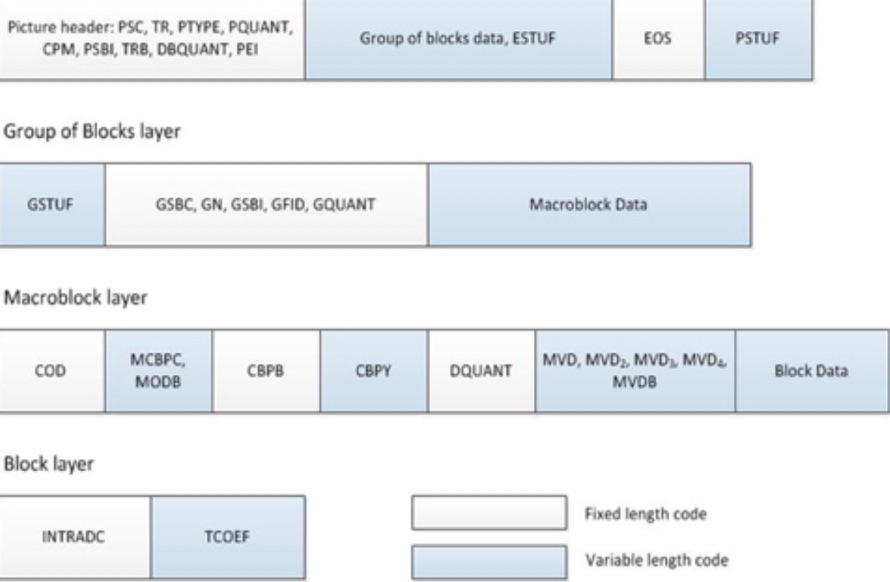

# H.263标准

虽然ITU-T定义的H.263标准致力于低码率视频编码，但未规定对视频码率的限制；这种约束是由终端或网络给出的。H.263的目标是提供比其前身H.261更好的图像质量。从概念上讲，H.263是独立于网络的，并且可以用于广泛的应用程序，但是它的目标应用程序是诸如PSTN，ISDN和无线网络之类的低比特率网络上的可视电话和多媒体。 H.263考虑的一些重要因素包括开销小、导致成本低下低复杂度、与现有视频通信标准（例如H.261，H.320）的互操作性、对信道错误的鲁棒性以及服务质量（QoS）参数。基于这些考虑，开发了一种有效的算法，该算法为制造商提供了在图像质量和复杂度之间进行权衡的灵活性。与H.261相比，它以不到一半的码率提供了相同的主观图像质量。

与其他标准类似，H.263使用图片间预测来减少时间冗余，并对残差预测误差进行变换编码以减少空间冗余。变换编码基于8×8 DCT转换。用标量量化器对变换后的信号进行量化，并且在发送之前对所得符号进行可变长度编码。在解码器处，接收到的信号进行逆量化和逆变换以重建预测误差信号，将其添加到预测中，从而重构图像。重构的图片被存储在帧缓冲器中，以用作下一图片预测的参考。编码器包含一个嵌入式解码器，其执行相同的解码操作，以确保在编码器和解码器上都进行相同的重构。

H.263支持五种标准分辨率：sub-QCIF（128×96），QCIF（176×144），CIF（352×288），4CIF（704×576）和16CIF（1408×1152），涵盖了空间分辨率范围的大部分。解码器中必须同时支持sub-QCIF和QCIF格式，并且编码器必须支持这些格式之一。这一要求是高分辨率和低成本之间的折衷。

图片被分为16×16个宏块，由四个8×8亮度块和两个空间对齐的8×8色度块组成。一个或多个宏块行被组合成一块组（GOB），以在发生传输错误时实现快速重新同步。与H.261相比，GOB结构得到了简化；GOB标头是可选的，并且可以根据错误恢复力和编码效率权衡使用。

为了提升帧间预测，H.263解码器具有块运动补偿功能，而运动补偿功能在编码器中的使用是可选的。每个宏块发送一个运动矢量。与使用全像素精度和环路滤波器的H.261相比，H263使用半像素精度进行运动补偿。在变长编码之后，运动矢量与变换系数一起被传送。可以通过预处理或通过更改以下编码器参数来控制编码视频的码率：量化器比例大小、模式选择和图像速率。

除了上述的核心编码算法，H.263还包括四个可选的编码选项，如下所示。前三个选项用于改善帧间预测，而第四个选项与无损编码有关。编码选项增加了编码器的复杂度，但改善了图像质量，从而允许在图像质量和复杂度之间进行权衡。

* 无限制运动矢量（UMV）模式：在UMV模式下，允许运动矢量指向编码图片区域之外，从而可以实现更好的预测，尤其是位于图片区域之外的参考宏块中的一部分不可用于预测。通常，对于那些不可用的像素，我们使用其周边像素来预测。但是，此模式允许利用完整的参考宏块，从而产生质量增益，尤其是对一些图片边界附近有运动的较小的图片格式。请注意，对于sub-QCIF格式，所有宏块中约有50％位于边界或边界附近。
* 高级预测（AP）模式：在此可选模式下，重叠块运动补偿（OBMC）用于亮度，从而减少了块状伪像并提高了主观质量。一些宏块使用四个8×8运动矢量替代16×16矢量，从而以更多的比特为代价提供了更好的预测。
* PB帧（PB）模式：PB帧模式的主要目的是在不显着增加码率的情况下增加帧率。一个PB帧由两张编码图像组成，这两张图片作为一个单元。从最后解码的P帧预测P帧，从上一个P帧和当前P帧来预测B帧。尽管P帧和B帧来源于MPEG标准，但是H.263标准中的B帧用于完全不同的目的。B帧的质量有意保持较低水平，从而最大程度地减少双向预测的开销，而这种开销对于低比特率应用很重要。B帧仅用所分配比特率的15％到20％，但可以带来如平滑运动般更好的主观感觉。
* 基于语法的算术编码（SAC）模式：H.263已针对非常低的码率进行了优化。严格来讲，它允许使用可选的基于语法的算术编码模式，该模式用可变长度编码的算术编码替换了霍夫曼编码。霍夫曼码必须使用整数位，但算术编码消除了这种限制，从而产生了降低码率后的无损编码。

H.263的视频比特流以分层结构排列，该分层结构由以下几层组成：图像层，块组层，宏块层和块层。每个编码图像包括图像头，其后是布置为块组的编码图像数据。一旦图片的传输完成，就会发送序列结束（EOS）码和填充位（ESTUF）（如果需要）。比特流中有一些可选元素，例如，仅当图片类型（PTYPE）表示B图片时，B帧的时间参考（TRB）和量化参数（DBQUANT）才可用。对于P帧，将传输量化参数PQUANT。

GOB层由一个GOB标头和宏块数据组成。每一帧中的第一个GOB不需要标头，而对于其他GOB，标头是可选的，并根据可用带宽使用。GOB起始代码（GBSC）可能需要组填充（GSTUF）。组号（GN），GOB帧ID（GFID）和GOB量化器（GQUANT）可以出现在GOB标头中。

每个宏块都由宏块头和后面的编码块数据组成。编码宏块通过一个称为COD的标志来标识；对于P帧，所有宏块都被编码过。当由COD标识时或当PTYPE标识为I帧时，会存在色度的宏块类型和编码块模式（MCBPC）。对于PB帧的非帧内宏块，存在B帧（MODB）的宏块模式。可以根据MCBPC来提供亮度编码的块模式（CBPY），以及用于差分量化器（DQUANT）和运动矢量数据（用于高级预测的MVD或MVD2-4）的代码。仅当编码模式为B（MODB）时，才会显示B块（CBPB和MVDB）的CBP和运动矢量数据。如前所述，在正常模式下，宏块由四个亮度块和两个色度块组成。但是，在PB帧模式下，可以将一个宏块视认为包含12个块。块结构由内部DC以及变换系数（TCOEF）组成。对于帧内宏块，为宏块中的每个P块发送帧内DC。图3-8显示了H.263层的每层结构。

**图3-8.**H.263比特流多层结构

