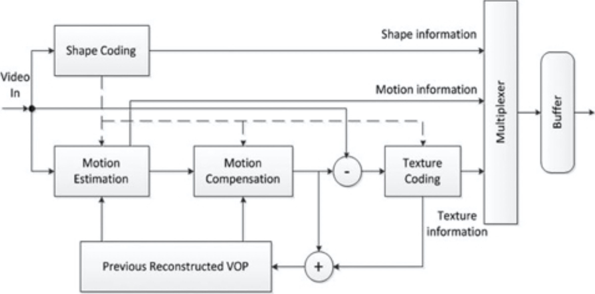

# MPEG-4标准（第二部分）

MPEG-4，于1999年3月被国际标准化委员会/国际电工委员会（ISO/IEC）批准为多媒体数据表示和编码的标准，正式成为ISO/IEC 14496标准。除了音视频编码和多路复用之外，MPEG-4还解决了各种二维或三维合成媒体的编码问题，以及视听场景和组合的灵活表示问题。随着多媒体用途的发展和多样化，MPEG-4的关注范围从最初有限视听材料的低码率编码扩展到了新的多媒体功能。

与MPEG-1或MPEG-2中基于像素的视频处理不同，MPEG-4支持基于内容的通信、访问，及对数字视听对象操纵，用于实时或非实时交互操作或非交互式应用程序。MPEG-4提供了扩展的功能，并改善了先前标准提供的编码效率。例如，它支持可变的像素深度，基于对象的传输以及包括无线网络和Internet在内的各种网络。多媒体创作和编辑功能是MPEG-4特别吸引人的功能，有望取代现有的文字处理器。从某种意义上说，H.263和MPEG-2嵌入在MPEG-4中，确保了对数字电视和可视电话等应用程序的支持，同时还用于基于Web的媒体流。

MPEG-4与较早的视频编码标准不同，它引入了基于对象的表示，及真实或虚拟视听（AV）对象的编码方法。每个AV对象都有其本地3D+T坐标系系统，用于对时间和空间操纵的管理。通过指定从对象的本地坐标系到公共的全局3D+T坐标系（称为场景坐标系）的坐标转换，编码器或最终用户都可以将AV对象放置在场景中。MPEG-4的组合特性使在压缩域中执行比特流编辑和创作成为可能。

一个或多个AV对象（包括其时空关系）从编码器被传输到解码器。在编码器上，AV对象被压缩、错误保护、多路复用并向下游传输。在解码器上，这些对象被解复用、纠错、解压缩、合成并呈现给终端用户。终端用户有机会与演示文稿进行交互。 交互信息可以在本地使用，也可以在上游传输到编码器。

传输的流可以是包含连接设置、配置文件（编码工具的子集）和类定义信息的控制流，也可以是包含所有其他信息的数据流。控制信息至关重要，因此必须通过可靠的渠道进行传输；但是数据流可以通过具有不同服务质量的各种通道进行传输。

标准的第2部分涉及视频压缩。随着支持各种配置文件和级别的需求不断增长，引入了该标准的第10部分来处理这种需求，该需求很快在业界变得比第2部分更加重要和司空见惯。但是，MPEG-4第10部分可以看作是独立的。标准化工作，因为它不提供与MPEG-4第2部分类似的向后兼容性。下一节将讨论MPEG-4第10部分，也称为高级视频编码（AVC）。

MPEG-4第2部分是基于对象的自然和合成混合编码标准。（为简单起见，在下面的讨论中，我们将MPEG-4第2部分简称为MPEG-4。）MPEG-4视频的结构本质上是分层的。在顶层是由一个或多个视频对象（VO）组成的视频会话（VS）。一个VO可以由一个或多个视频对象层（VOL）组成。每个VOL包含一个称为视频对象平面（VOP）的有序时间快照序列。视频对象平面组（GOV）层是VOL和VOP层之间的可选层。比特流可以具有任意数量的GOV标头，而GOV标头的频率是一个编码器问题。由于GOV标头指示绝对时间，因此它可用于随机访问和错误恢复。

视频编码器由许多编码器和相应的解码器组成，每一个都专用于一个单独的视频对象。重建的视频对象被合成在一起并呈现给用户。用户与对象的交互（例如缩放，拖动和链接）可以在编码器或解码器中进行处理。

为了描述任意形状的VOP，MPEG-4通过称为VOP窗口的边界矩形定义了VOP。视频对象由最紧密的VOP窗口限制，以便对最少数量的图像宏块进行编码。每个VO包含三个主要功能：形状编码，运动补偿和纹理编码。在矩形VOP的情况下，MPEG-4编码器的结构类似于MPEG-2编码器的结构，并且可以跳过形状编码。图3-9显示了视频对象编码器的结构。

**图3-9.**MPEG-4 视频对象编码器结构

VOP的形状信息在MPEG-4中称为alpha平面。Alpha平面与亮度的格式相同，并且无论像素是否在视频对象内，其数据都标示相关像素的特性。形状编码器压缩alpha平面。二进制alpha平面通过改进的基于内容的编码算法（CAE）进行编码，而灰度alpha平面则通过类似于纹理编码的运动补偿DCT转换进行编码。完全位于对象外部的宏块（透明宏块）不进行运动或纹理编码；因此，不需要任何开销来标示该模式，因为可以从形状编码中获得该透明度信息。

运动估计和补偿用于减少时间冗余。填充技术应用于参考VOP，该技术允许多边形匹配替代矩形图像的块匹配。填充方法旨在通过填充与信号外推相对应的丢失数据，将任意形状的图像段扩展到规则的块网格，从而可以应用常见的基于块的编码技术。除了基本的运动补偿技术外，MPEG-4视频还支持无限制的运动补偿、高级预测模式和双向运动补偿，从而以增加非常少的复杂性为代价获得了质量上的显着改善。

VOP运动补偿后的内部数据和残差数据，使用类似于以往标准的基于块的DCT方案进行编码。VOP内的宏块使用与H.263相同的技术进行编码。轮廓宏块（即具有对象边缘的宏块）内VOP外部的区域可以以常规DCT变换进行填充，也可以使用形状自适应DCT（SA-DCT）变换进行填充。透明块将被跳过，并且不会在比特流中进行编码。

MPEG-4支持在空域和时域对视频对象进行可伸缩编码，并提供跨媒体的错误恢复能力。视频包同步重试、数据分区、标头扩展编码和可逆VLC这四个主要工具提供了丢失恢复能力，例如重新同步、错误检测、数据恢复和错误隐藏。

