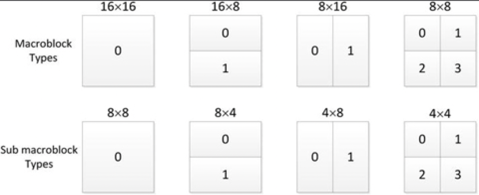
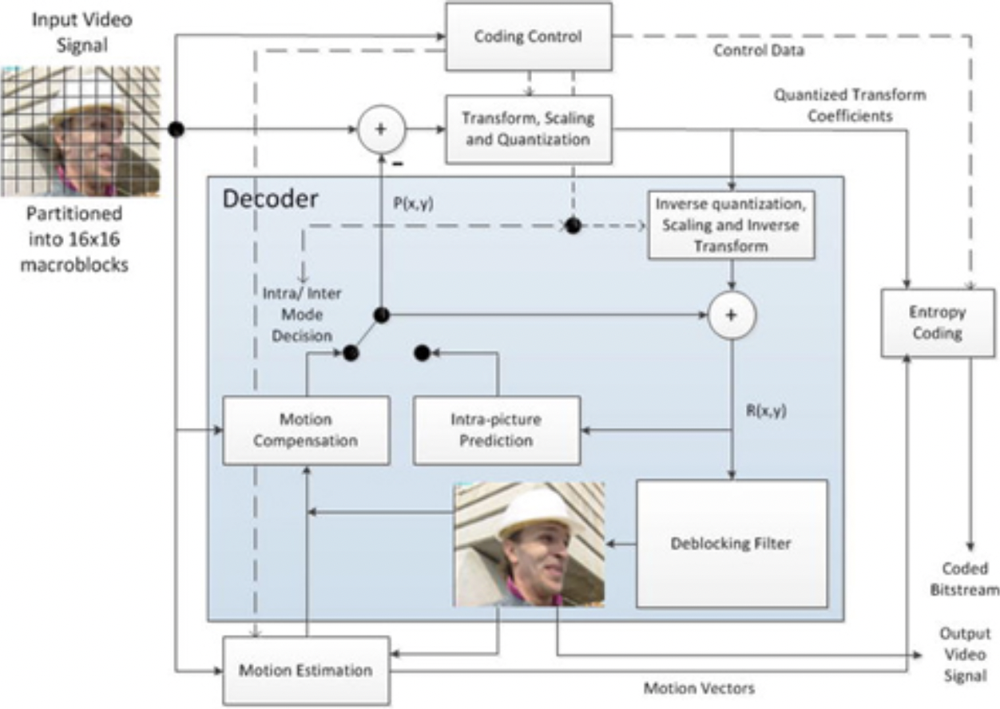
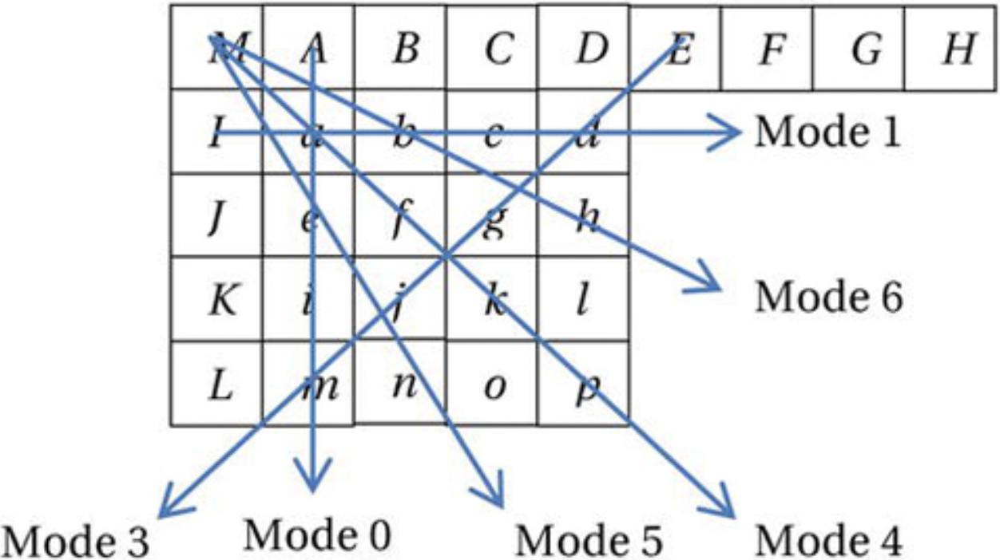
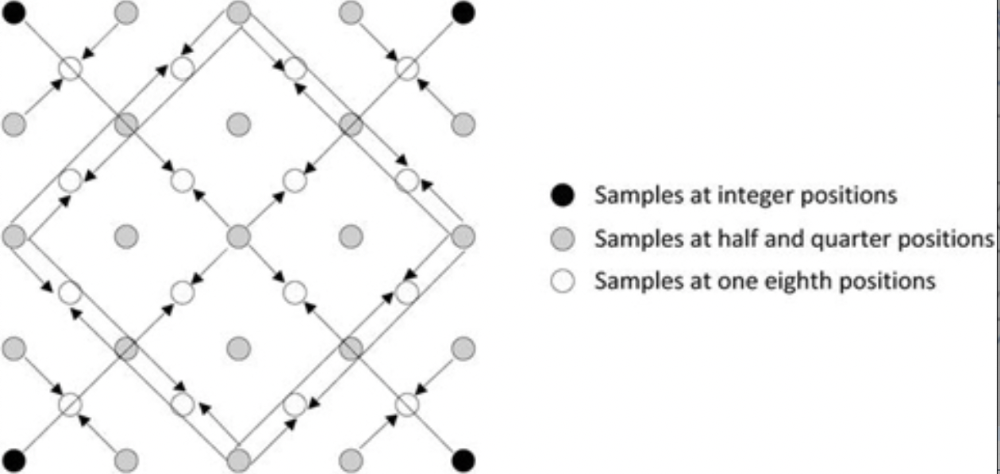
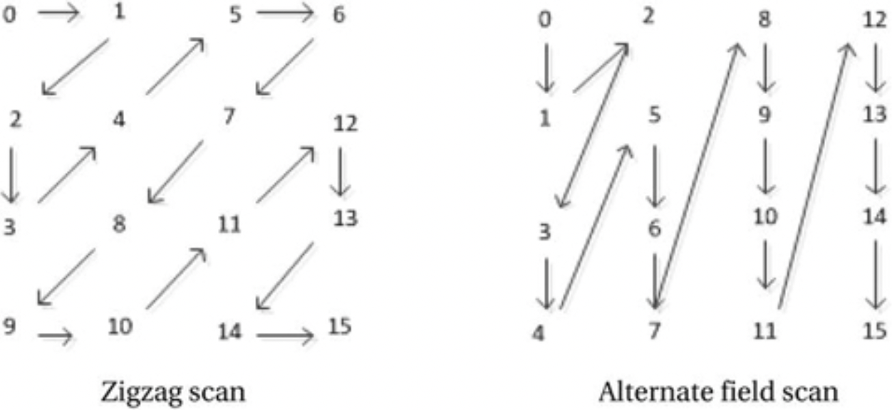
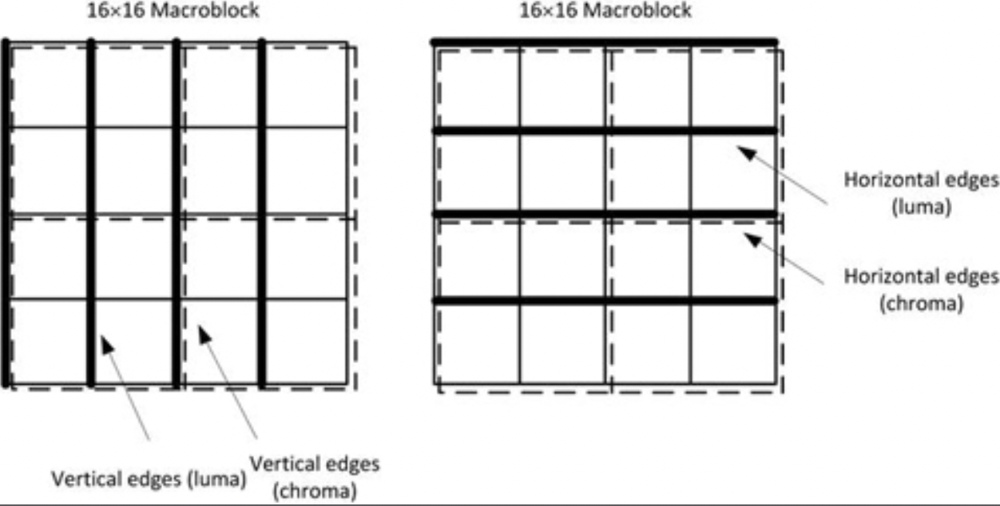

# AVC编码

高级视频编码（AVC），也称为ITU-T H.264标准（ISO/IEC 14496-10），目前是业界用于视频记录和分发的最常见的视频压缩格式。它也被称为MPEG-4第10部分。AVC标准由ITU-T视频编码专家组（VCEG）和ISO/IEC运动图像专家组（MPEG）标准化组织的联合视频小组（JVT）于2003年批准。AVC标准之所以广为人知的原因之一是，它是蓝光的三种压缩标准之一（其他是MPEG-2和VC-1），并且还被YouTube和iTunes等互联网流应用、Flash Player等软件应用程序、Silverlight等软件框架以及在地面、有线和卫星频道上播放的各种HDTV广播等广泛应用。

AVC视频编码标准与之前的MPEG-4 Part 2，MPEG-2，H.263，MPEG-1和H.261标准具有相同的基本功能元素。它使用有损预测、基于块的混合DPCM编码技术。其需要减少空间相关性的变换、用于码率控制的量化、用于减少时间相关性的运动补偿预测、以及用于减少统计相关性的熵编码。但是，为了实现比以前的标准更好的编码性能，AVC合并了每个功能元素的细节更改，包括图片内预测、新的4×4变换、多个参考图片、可变块大小和运动补偿的四分之一像素精度、去滤波器和改善熵编码。AVC还引入了诸如通用B切片之类的编码概念，该概念不仅支持双向前后预测对，而且还支持向前和向后预测对。AVC还定义了其他几种工具，包括直接模式和加权预测，以获得对源信号的非常好的预测，从而使误差信号的能量最小。这些工具可帮助AVC在各种应用程序方面的性能明显优于先前的标准。例如，与MPEG-2相比，AVC通常以一半的码率获得相同的质量，特别是对于以高码率编码的高分辨率内容。

但是，提高编码效率是以牺牲编码器和解码器的额外复杂性为代价的。因此，作为补偿，AVC利用一些方法来降低实现的复杂性，例如，将用于变换和量化的乘法运算相结合,引入了无乘法器整数变换。此外，为了促进在嘈杂的信道条件和容易出错的环境（例如无线网络）上的应用，AVC利用一些方法对网络噪声的进行错误恢复。其中包括灵活的宏块排序（FMO）、交换片、冗余片方法和数据分区。

编码的AVC比特流具有两层，网络抽象层（NAL）和视频编码层（VCL）。NAL提取VCL数据以便在各种通信通道或存储媒体上传输。NAL单元同时指定字节流和基于数据包的格式。字节流格式为应用程序定义了唯一的开始代码，这些应用程序将NAL单元流封装在网络数据包（如MPEG-2传输流）中，作为字节或位的有序流传输。先前的标准在每个元素的开头都包含有关切片、帧和序列的标头信息，在有损环境中丢失这些关键元素会使其余元素数据变得无用。AVC通过将序列和图片参数设置保持在非VCL NAL单元中，使用更加强大的错误保护进行传输来解决此问题。VCL单元包含核心视频编码数据，包括视频序列、帧、切片和宏块。

## 配置文件与级别（Profile and Level）

配置文件是编码算法的一组功能，通过标识这些配置以满足应用程序的某些要求。这意味着编码算法的某些功能在一些配置下是不支持的。该标准针对特定类别的应用程序定义了21组功能。

对于不可缩放的二维视频应用，以下是必要的配置：

* 受约束的基准配置：针对低成本的移动和视频通信应用程序，受约束的基准配置使用与基准配置、主要配置和高级配置相同的功能子集。

* 基准配置：此配置针对需要额外的错误恢复能力的低成本应用程序。因此，除了“受约束的基准配置”所支持的功能之外，它还具有三个功能来增强鲁棒性。但实际上，“受约束的基准配置”比“基准配置”更常用。这两个配置的比特流共享相同的配置标识符代码值。

* 扩展配置：这是用于视频流。与基准配置相比，它具有更高的压缩能力和鲁棒性，并且支持服务器流切换。

* 主要配置：主要配置文件用于标清数字电视广播，但不用于HDTV，因为HDTV主要使用高级配置。

* 高级配置：这是HDTV广播和光盘存储（例如蓝光光盘存储格式）的主要配置。

* 渐进式高级配置：此配置与高级配置类似，不同之处在于它不支持现场编码工具。它适用于使用逐行扫描视频的应用程序和视频展示。

* 高级10配置 配置：主要用于每个样本解码图像精度为10位的高级内容，此配置相比较高级配置，添加了10位的精度支持。

* 高级4:2:2配置：此配置针对使用隔行视频的专业应用程序。在High 10配置的之外，它增加了对4:2:2色度子采样格式的支持。

* 高级4:4:4预测配置：除了High 4:2:2配置之外，此配置还支持高达4:4:4色度采样，每个采样精度高达14位。它还支持无损区域编码，并将每个图片编码为三个单独的色彩平面。

除了上述配置之外，可伸缩视频编码（SVC）扩展定义了另外五个可伸缩配置：可伸缩受约束基准配置、可伸缩基准配置、可伸缩高级配置、可伸缩受约束高级配置和可伸缩高级内部配置。同时，多视图编码（MVC）扩展为三维视频添加了三个配置，即“立体声高级配置”，“多视图高级配置”和“多视图深度高级配置”。此外，为专业编辑应用程序定义了四个帧内配置：高级10帧内配置，高级4:2:2帧内配置，高级4:4:4帧内配置和CAVLC 4:4:4帧内配置。

级别是用于指定配置所需的解码器性能程度的约束；例如，一个级别指定解码器必须遵守的最大图片分辨率、比特率、帧速率等。表3-2给出了一些级别限制的示例。有关完整说明，请参见标准规范[^2]。

**表3-2.**AVC级别限制示例

| 级别 | 每秒最大亮度采样次数 | 最大宏块数 | 最大数量 | 最大视频码率，kbps（基准配置、扩展配置、主要配置）| 最大视频码率，kbps（高级配置）| 帧采样率（宽x高 @帧/秒）|
| :--- | :--- | :--- | :--- | :--- | :--- | :--- |
| 1 | 380,160 | 1,485 | 99 | 64 | 80 | 176x144@15 | 
| 1.1 | 768,000 | 3,000 | 396 | 192 | 240 | 320x240@10 | 
| 1.2 | 1,536,000 | 6000 | 396 | 384 | 480 | 352x288@15 | 
| 1.3 | 3,041,280 | 11,880 | 396 | 768 | 960 | 352x288@30 |
| 2 | 3,041,280 | 11,880 | 396 | 2,000 | 2,500 | 352x288@30 |
| 2.1 | 5,068,800 | 19,800 | 792 | 4,000 | 5,000 | 352x576@25 |
| 2.2 | 5,184,000 | 20,250 | 1,620 | 4,000 | 5,000 | 720x480@15 |
| 3 | 10,368,000 | 40,500 | 1620 | 10,000 | 12,500 | 720x480@30,720x576@25 |
| 3.1 | 27,648,000 | 108,000 | 3,600 | 14,000 | 17,500 | 1280x720@30 |
| 3.2 | 55,296,000 | 216,000 | 5,120 | 20,000 | 25,000 | 1280x720@60 |
| 4 | 62,914,560 | 245,760 | 8,192 | 20,000 | 25,000 | 1280x1080@30 |
| 4.1| 62,914,560 | 245,760 | 8,192 | 50,000 | 62,500 | 2048x1024@30 |
| 4.2 | 133,693,440 | 522,240 | 8,704 | 50,000 | 62,500 | 2048x1080@60 |
| 5 | 150,994,944 | 589,824 | 22,080 | 135,000 | 168,750 | 2560x1920@30 |
| 5.1 | 251,658,240 | 983,040 | 36,864 | 24,000 | 300,000 | 4096x2048@30 |
| 5.2 | 530,841,600 | 2,073,600 | 36,864 | 24,000 | 300.000 | 4096x2160@60 |

## 帧结构（Picture Structure）

视频序列含有帧图片或现场图片。图片通常包括三个样本阵列，一个亮度和两个色度样本阵列（仅在高级4:4:4配置中支持RGB阵列）。AVC支持逐行扫描或隔行扫描，它们可以按相同顺序混合。基准配置仅限于渐进式扫描。

图片分为多个切片。切片是图片内宏块的序列，宏块数量灵活多变。多个切片可以形成切片组；存在宏块到切片组的映射，以确定哪个切片组包括特定的宏块。在4:2:0格式中，每个宏块具有一个16×16亮度和两个8×8色度样本阵列，而在4:2:2和4:4:4格式中，色度样本阵列为8×16和16×16。图片可以被划分为具有各种形状的16×16或更小的分区，例如16×8、8×16、8×8、8×4、4×8和4×4。这些分区用于预测目的。图3-10显示了不同的分区。

**图3-10.**AVC宏块及块分区

## 编码算法

在AVC算法中，编码器可以为每个图片的各个分区选择帧内编码，还是帧间编码。帧内编码（I）在比特流中提供随机访问点，解码可以从随机访问点开始并正常进行。帧内编码使用各种空间预测模式来减少图片内的空间冗余。另外，AVC定义了帧间编码，该帧间编码使用运动矢量进行基于块的画面间预测以减少时间冗余。帧间编码有两种类型：预测（P）和双向预测（B）。因为帧间编码使用像素块的帧间预测，而这些像素块与前序解码过的视频帧相关，因此帧间编码具有更好的编码效率。预测结果是从被用作预测参考的先前重建图片的解块版本中获得的。使用解块滤波器是为了减少块边界处的块效应。可以为图片中的各种块大小指定运动矢量和帧内预测模式。通过对预测残差进行变换以在量化之前消除块中的空间相关性，可以实现进一步的压缩。帧内预测模式、运动矢量和量化的变换系数信息使用熵编码进行编码，例如上下文自适应可变长度编码（CAVLC）或上下文自适应二进制算术编码（CABAC）。如图3-11所示的AVC编码算法的框图，显示了编码器和解码器模块。

**图3-11.**AVC编码算法框图

## 帧内预测

在以往的标准中，对帧内编码的宏块都是独立编码的，没有任何参考，并且对于对要预测的宏块没有一个好的预测方法，因此必须使用帧内编码的宏块。由于帧内宏块使用的位数多于预测所用的位数，因此压缩效率通常较低。为了缓解该问题（即减少编码帧内图片所需的位数），AVC引入了帧内预测，从而根据属于同一图片的先前重建的块来形成预测块。与对当前块本身进行编码相比，需要更少的位来对当前块和预测块之间的残余信号进行编码。

亮度样本的帧内预测块的大小可以是4×4、8×8或16×16。存在几种帧内预测模式，从中选择一种模式并在比特流中进行编码。AVC总共为4×4和8×8亮度块定义了9种帧内预测模式，为16×16亮度块定义了4种模式，为每个色度块定义了4种模式。图3-12示出了用于4×4块的帧内预测模式的示例。在此示例中，[a，b，…，p]是当前块的预测样本，其是从已经解码的左块和上块利用样本[A，B，... ，M]来预测的；箭头表示预测的方向，每个方向都表示为编码比特流中的一种帧内预测模式。对于模式0（垂直模式），通过外推上边的样本（即[A，B，C，D]）来形成预测。类似地，对于模式1（水平模式），外推左边的样本[I，J，K，L]。对于模式2（DC预测模式），将上面和左边样本的平均值用作预测。对于模式3（向左斜下模式），模式4（向右斜下模式），模式5（向右模式），模式6（水平向下模式），模式7（向左垂直模式）和模式8（向左上水平模式），预测样本由预测样本A至M的加权平均值形成。

**图3-12.**4×4的帧内预测模式示例（仅显示了几种模式作为示例）

## 帧间预测

帧间预测通过使用运动估计和运动补偿来减少时间相关性。如之前所述，对于这样的预测，AVC将图片分成从16×16到4×4的几种形状。尽管对于较小的分区，运动矢量和信令分区类型会产生额外比特开销，但运动补偿仍会导致残留信号中的信息减少。

帧内预测可以应用于小至4×4的亮度样本块，具有高达四分之一像素的运动矢量精度。与单独使用整数像素相比，亚像素运动补偿可提供更好的压缩效率；虽然四分之一像素优于半像素，但它涉及更复杂的计算。对于亮度，首先生成半像素样本，并使用权重为（1、-5、20、20，-5、1）/32的六抽头有限脉冲响应（FIR）滤波器从相邻的整数像素样本进行内插。利用可用的半像素样本，使用相邻的半像素或整数像素样本之间的双线性插值来生成四分之一像素样本。对于4:2:0色度，八分之一像素样本对应于四分之一像素亮度，并且是从整数像素色度样本的线性插值获得的。相对于来自相邻运动向量的预测，亚像素运动向量被差分编码。图3-13显示了相对于完整像素的亚像素预测的位置。

**图3-13.**亚像素预测的位置

## 转换和量化

AVC算法使用基于块的转换来消除空间冗余，因为来自帧内或帧间预测的残差信号被分为4×4或8×8块（仅限高级配置），在对它们进行量化之前将其转换为转换域。与之前使用固定8×8 DCT转换的标准相比，在AVC中使用4×4整数变换可以减少振铃失真。同样，在这个较小的尺寸上不需要乘法。AVC引入了分层转换结构的概念，其中将相邻的4×4亮度变换的DC分量组合在一起以形成4×4块，然后使用哈达玛积（Hadamard）变换再次对其进行变换，以进一步提高压缩效率。

AVC中的4×4和8×8变换都是基于DCT的整数变换。整数变换、后缩放和量化在编码器中是组合在一起的；而在解码器中，转换序列是逆量化、预缩放和逆整数变换。为了更深入地了解该过程，请参考下面的矩阵H。

$$H = \begin{bmatrix}
a & a & a & a \\
b & c & -c & -b \\
a & -a & -a & a \\
c & -b & b & -c
\end{bmatrix}$$

使用此矩阵和公式$$X=HFH^{T}$$可以完成4×4 DCT转换，其中HT是矩阵H的转置，F是输入4×4数据块，X是得到的4×4变换后的结果块。对于DCT，变量a，b和c如下：
$$a=\frac{1}{2},b=\sqrt{\frac{1}{2}}cos\left(\frac{\pi}{8}\right),c=\sqrt{\frac{1}{2}}cos\left(\frac{3\pi}{8}\right)$$

AVC算法通过估算来简化这些系数，并通过使用以下方法保持正交性：

$$a=\frac{1}{2},b=\sqrt{\frac{2}{5}},c=\frac{1}{2}$$

通过使用缩放变换$$X=\hat{H}F\hat{H}^{T}\bigotimes SF$$，将变换与量化步骤结合起来，可以进一步简化运算以避免乘法，其中，

$$\hat{H}=\begin{bmatrix} 1 & 1 & 1 &1 \\ 2 & 1 & -1 & -2 \\ 1 & -1 & -1 & 1 \\ 1 & -2 & 2 & -1 \end{bmatrix} ,and SF = \begin{bmatrix} a^{2} & \frac{ab}{2} & a^{2} & \frac{ab}{2} \\ \frac{ab}{2} & \frac{b^{2}}{4} & \frac{ab}{2} & \frac{b^{2}}{4} \\ a^{2} & \frac{ab}{2} & a^{2} & \frac{ab}{2} \\ \frac{ab}{2} & \frac{b^{2}}{4} & \frac{ab}{2} & \frac{b^{2}}{4} \end{bmatrix} $$

SF是一个4×4矩阵，代表正交性所需的比例因子，而\bigotimes 表示逐元素相乘。使用52个可用量化器级别之一（也称为量化步长，Qstep），通过适当的量化，获得具有分量Yi，j的经过变换和量化的信号Y：

$$Y_{i,j}=X_{i,j} round \left(\frac{SF_{\eta}}{Qstep}\right) ,where 0\leq {i,j} \leq {3} $$

在解码器中，使用Qstep和SF作为逆量化和一部分逆变换来缩放接收信号Y，以获得具有分量X'i，j的逆变换块X'：

$$X^\prime_{i,j}=Y_{i,j}Q_{step}SF^-1_{\eta},where 0\leq{i,j}\leq{3}$$

4x4重构块为：$$F^\prime=\hat{H^T_Y}X^\prime\hat{H_Y}$$，其中，证书逆置矩阵为：

$$\hat{H_Y}=\begin{bmatrix} 1 & 1 & 1 \\ 1 & \frac{1}{2} & \frac{-1}{2} & -1 \\ 1 & -2 & -1 & 1 \\ \frac{1}{2} & -1 & 1 & -\frac{1}{2} \end{bmatrix}$$

此外，在用于16×16帧内模式的分层变换方法中，使用Hadamard变换对4×4亮度帧内DC系数进行进一步变换：

$$\tilde{H}=\begin{bmatrix} 1 & 1 & 1 & 1 \\ 1 & 1 & -1 & -1 \\ 1 & -1 & -1 & 1 \\ 1 & -1 & 1 & -1 \end{bmatrix}$$

在4:2:0颜色采样中，对于色度DC系数，变换矩阵如下：

$$\tilde{H}=\begin{bmatrix} 1 & 1 \\ 1 & -1 \end{bmatrix}$$

为了增加游程编码提供的压缩增益，定义了两个扫描顺序以在熵编码之前排列量化系数，即之字形扫描和场扫描，如图3-14所示。之字形扫描适用于逐行扫描的信号源，而交替场扫描则有助于隔行扫描的内容。

**图3-14.**4×4块的之字形扫描和交替场扫描顺序

## 熵编码

早期的标准使用固定的可变长度编码表来提供熵编码，这些表是由基于一组通用视频的概率分布标准预先定义的，无法为特定视频源来优化霍夫曼表。相反，AVC使用不同的VLC根据上下文特征为每个源符号找到更合适的编码。除残差数据外的语法元素使用指数哥伦布码进行编码。残余数据通过之字形扫描或交替场扫描进行重新排列，然后使用上下文自适应可变长度编码（CAVLC）进行编码，或者对于主要配置和高级配置，可选择使用上下文自适应二进制算术编码（CABAC）。与CAVLC相比，CABAC以更高的复杂性为代价提供了更高的编码效率。

CABAC使用自适应二进制算术编码器，在编码每个码元之后更新概率估计，并因此适应于上下文。CABAC熵编码包含三个主要步骤：

* 二进制化：在算术编码之前，将非二进制符号（例如，变换系数或运动矢量）唯一地映射到二进制序列。这种映射类似于将数据符号转换为可变长度代码，但是在这种情况下，二进制代码在传输之前由算术编码器进一步编码。

* 上下文建模：基于先前编码的语法元素，选择称为上下文模型的二进制化符号概率模型。

* 二进制算术编码：在这一步骤中，算术编码器根据所选的上下文模型对每个元素进行编码，然后更新模型。

## 灵活的隔行编码

为了提供增强的隔行编码能力，AVC支持宏块自适应帧场（MBAFF）编码和图片自适应帧场（PAFF）编码技术。在MBAFF中，宏块对结构用于编码为帧的图片，从而允许在场模式下使用16×16宏块。这与MPEG-2相反，在MPEG-2中，帧编码图片中的场模式处理只能支持16×8个半宏块。如果使用PAFF，则可以将编码为完整帧的图像，与包含这些单独的单个场的合并场进行图像混合。

## 环内解块

由于帧内和帧间预测编码中基于块的变换以及变换系数的量化，特别是对于更高的量化尺度，产生了可见且令人讨厌的阻塞伪像。为了减轻在块边界处的此类伪像，AVC提供了解块滤波器，这也可以防止累积的编码噪声传播。

解块过滤器并不是新事物；它是作为可选工具在H.261中引入的，并且在减少编码噪声的时间传播方面取得了一些成功，因为仅运动补偿中的整数像素精度不足以减少这种噪声。然而，在MPEG-1和MPEG-2中，由于其高复杂度而未使用去块滤波器。相反，半像素精确运动补偿（通过对整数像素样本进行双线性滤波获得半像素）起到了平滑编码噪声的作用。

尽管复杂，但AVC还是使用了去块滤波器来获得更高的编码效率。作为预测环路的一部分，其从预测图片中消除了块状伪影，获得了更接近的预测，从而导致了能量误差信号的减少。去块滤波器应用于4×4块的水平或垂直边缘。亮度滤波在四个16样本边缘上执行，色度滤波在两个8样本边缘上执行。图3-15显示了解块边界。

**图3-15.**在宏块中沿垂直和水平边界进行解块

## 容错

AVC提供了增强信道错误恢复能力的功能，其中包括NAL单元、冗余片、数据分区、灵活的宏块排序等。其中一些功能如下：

* 网络抽象层（NAL）：通过定义NAL单元，AVC允许在许多网络环境中使用相同的视频语法。在以往的标准中，标头信息是语法元素的一部分，因此，在包含标头的单个数据包接收出错的情况下，整个语法元素将变得无用。相反，在AVC中，通过从媒体流中解耦与多个切片相关的信息来生成自包含数据包。高级关键参数（即序列参数集（SPS）和图片参数集（PPS））以具有更高级别错误保护的NAL单元保存。在整个编码视频序列中，有效的SPS保持不变，而有效的PPS在编码的图片中保持不变。

* 灵活的宏块排序（FMO）：FMO也称为切片组。与任意切片排序（ASO）一起，该技术对图片中的宏块进行了重新排序，因此丢失数据包不会影响整个图片。丢失的宏块可以通过从相邻的重构宏块进行插值来重新生成。

* 数据分区（DP）：此功能可根据其重要性将语法元素分离为不同的数据包。它使应用程序具有不平等的错误保护（UEP）。

* 冗余切片（RS）：这是AVC中的错误恢复功能，允许编码器发送切片数据的额外表示形式，通常以较低的保真度发送。万一主要数据片因通道错误而丢失或损坏，可以使用此表示形式。

[^2]: ITU-T Rec. H.264: Advanced Video Coding for Generic Audiovisual Services (Geneva, Switzerland: International Telecommunications Union, 2007).

