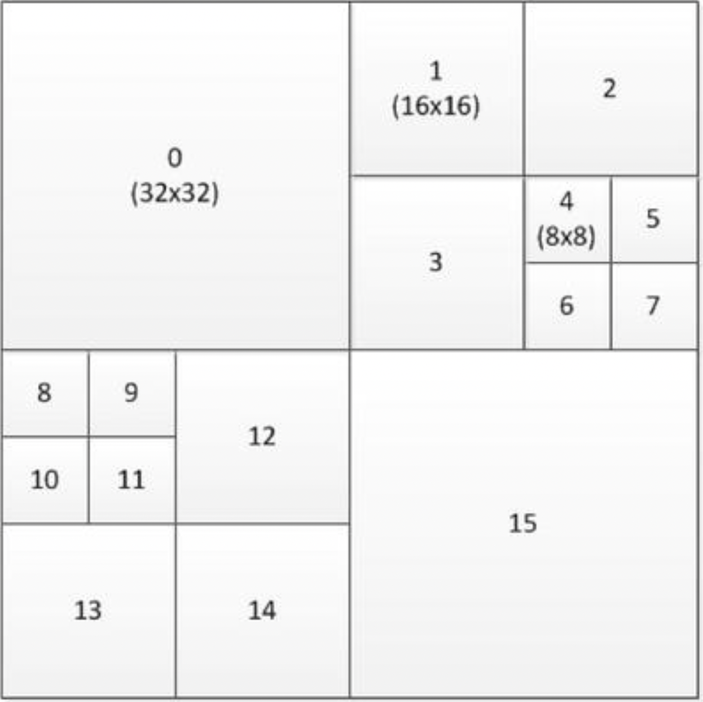
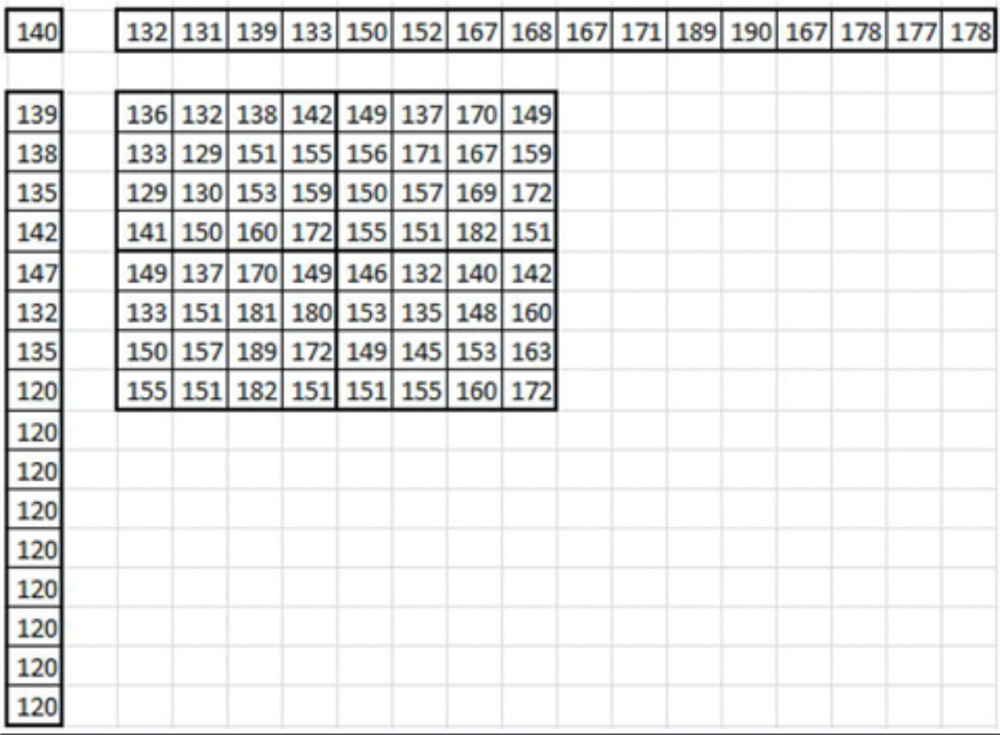

# HEVC

高效视频编码（HEVC）或H.265标准（ISO/IEC 23008-2）是ITU-T视频编码专家组（VCEG）和ISO/IEC运动图像专家组（MPEG）标准化组织在2013年批准的视频编码标准。它遵循先前称为AVC或H.264的标准，该标准也由同一MPEG和VCEG视频编码联合协作小组（JCT-VC）定义，其目标是解决越来越流行的高分辨率视频，例如高清（HD，1920×1080），超高清（UHD，4k×2k）及以上。特别是，HEVC解决了两个关键问题：提高视频分辨率和增加并行处理体系结构的使用。因此，HEVC算法的设计目标是实现比AVC高两倍的压缩效率。

## 图片分割与结构

在较早的标准中，宏块是基本的编码构建块，它包含一个16×16亮度块，通常是两个8×8色度块，用于4:2:0色彩采样。在HEVC中，类似的结构是编码树单元（CTU），也称为最大编码单元（LCU），其中包含亮度编码树块（CTB）、相应的色度CTB和语法元素。在CTU中，亮度块大小可以为16×16、32×32或64×64，在位比特流序列参数集中指定。可以使用树结构和四叉树信令将CTU进一步划分为较小的正方形块。

四叉树指定了编码单位（CU），编码单元构成预测和变换的基础。遍历编码树块中的编码单元并以Z顺序对其进行编码。图3-16显示了在64×64 CTB中的排序示例。

**图3-16.**64×64编码树块中编码单元的排序示例

一个编码单元具有一个亮度和两个色度编码块（CB），根据预测类型，它们可以进一步拆分大小并可以从相应的预测块（PB）进行预测。 HEVC支持可变的PB大小，范围从64×64到4×4样本。使用变换单元（TU）树结构对预测残差进行编码。亮度或色度编码块残差可以与对应的变换块（TB）相同，也可以进一步分成较小的变换块。变换块只能具有4×4、8×8、16×16和32×32的正方形大小。对于画面内预测残差的4×4变换，除了基于常规DCT的整数变换之外，还指定基于离散正弦变换（DST）形式的整数变换。通常认为这种四叉树结构是HEVC相对于AVC的编码效率增益的最大贡献者。

HEVC简化了编码，并且不支持任何隔行扫描工具，因为隔行扫描不再用于显示器中，并且隔行视频在分发中变得越来越不常见。但是，隔行视频仍可以编码为一系列的现场图片。HEVC中提供了元数据语法，以使编码器可以通过编码以下内容之一来指示隔行扫描的视频已发送：

* 隔行扫描视频的每个场（即每个视频帧的偶数或奇数行）作为单独的图片

* 每个隔行扫描帧作为一个HEVC编码图片

这提供了一种对隔行视频进行编码的有效方法，而不会给解码器带来麻烦，因为该解码器需要支持特殊的解码过程。

## 配置文件和级别

HEVC定义了三个配置文件：“主要”配置文件，“主要10”配置文件和“静态图片”配置文件，其中“主”是目前最常用的配置文件。它需要4:2:0的颜色格式，并施加了一些限制；例如，位深度应为8，形成矩形图块的LCU组必须至少为256×64，依此类推（在本章的稍后部分中，将对并行处理工具进行详细说明）。HEVC指定了许多级别，范围从1到6.2。6.2级别比特流在120fps时可支持8192×4320的高分辨率。

## 帧内预测

除了平面和DC预测模式外，帧内预测还支持33种定向模式，而H.264/AVC中只有8种定向模式。图3-17显示了定向帧内预测模式。

**图3-17.**HEVC中的方向帧内预测模式

编码单元中的帧内预测正好遵循TU树，这样，当使用N×N分区模式对帧内编码单元进行编码时，会强制将TU树至少拆分一次，从而确保帧内编码单元与TU树之间的匹配。这意味着始终对32×32、16×16、8×8或4×4大小执行内部操作。与AVC相似，帧内预测需要两个一维数组，其中包含上、左相邻样本以及左上样本。数组的长度是内部块大小的两倍，在块的下面向右边延伸。图3-18显示了一个8×8块的示例数组。

**图3-18.**HEVC中的Luma内部样本和预测结构

## 帧间预测

对于帧间预测，HEVC提供了两个参考列表L0和L1，每个参考列表可容纳16个参考帧，其中最多八个图片是唯一的。这意味着一些参考帧将会出现重复。这有助于从相同的图片以不同的权重进行预测。

## 运动矢量预测

HEVC中的运动矢量预测非常复杂，因为它会建立候选运动矢量列表，并使用在比特流中编码的列表索引从列表中选择一个候选对象。运动矢量预测有两种模式：合并和高级运动矢量预测（AMVP）。对于每个预测单元（PU），编码器决定使用哪种模式，并在比特流中通过标记位来指示该模式。AMVP过程使用增量运动矢量编码，并且可以产生任何期望的运动矢量值。HEVC在16×16网格上对时间运动矢量进行二次采样。这意味着解码器只需要为16×16像素区域的时间运动矢量缓冲区中的两个运动矢量（L0和L1）分配空间。

## 运动补偿

HEVC以四分之一像素的粒度指定运动矢量，但对亮度使用8抽头滤波器，对色度使用4抽头八象素滤波器。这是对AVC中定义的六抽头亮度和双线性（两次抽头）色度滤镜的改进。由于八抽头滤波器的长度较长，因此需要为每个块读取所有侧面的三个或四个额外像素。例如，对于8×4的块，需要将15×11的像素区域读入存储器，而对于较小的块，其影响会更大。因此，HEVC将最小预测单位限制为单向且大于4×4。HEVC支持单向和双向PU的加权预测。但是，权重始终在分片标头中明确传输；与AVC不同，没有隐式加权预测。

## 熵编码

在HEVC中，熵编码是在CTU级别使用上下文自适应二进制算术代码（CABAC）执行的。HEVC中的CABAC算法在AVC的基础上进行了改进，并做了一些小的改进。上下文状态变量大约是AVC中的一半，并且初始化过程要简单得多。通过设计比特流语法，以便将旁路编码的模块尽可能地分组在一起。CABAC解码本质上是一个顺序操作。因此，很难并行化或快速硬件化。但是，可以一次解码多个旁路编码的模块。这与旁路模块分组一起，极大地促进了硬件解码器中的并行实现。

## 回路解块与样本自适应偏移

在HEVC中，可以将两个滤波器应用于重构后的像素值：环路解块（ILD）滤波器和样本自适应偏移（SAO）滤波器。可以选择将这两个过滤器之一或全部应用于图块边界和切片边界。HEVC中的环路解块滤波器与H.264/AVC相似，而SAO是一个新的滤波器，并在环路解块滤波器之后应用。

与在4×4网格边缘进行解块的AVC不同，HEVC仅在8×8网格上进行解块。图片中的所有垂直边缘都首先被解块，然后是所有水平边缘。滤波器本身与AVC中的滤波器相似，但是在HEVC中，仅支持边界强度为2、1，0的块。其边缘之间的距离为8像素，因此它们之间没有依赖性，从而实现了高度并行化的实现。例如，可以使用图片中每8像素列一个线程过滤垂直边缘。仅当对特定边缘的任一侧上的一个PU进行帧内编码时，色度才被解块。

作为解块后的辅助滤波器，SAO通过使用CTB级别的查找表来执行非线性幅度映射。它在CTB的每个像素上运行一次，每个64×64 CTB总共运行6,144次。（64×64 + 32×32 + 32×32 = 6144）。对于每个CTB，在比特流中编码一个滤波器类型和四个偏移值，例如对于8位的视频，其范围从-7到7。编码器选择这些参数的目的是为了更好地匹配重建的图片和源图片。

## 并行处理语法和工具

HEVC标准中具有三个新功能，以支持增强的并行处理能力或出于打包目的而修改切片数据的结构。

## 碎片

有一个称为碎片的选项，可以将图片划分为矩形区域。碎片是图片的独立可解码区域，并使用一些共享的标头信息进行编码。碎片主要是指定用于提高并行处理能力，尽管也可以归因于某些抗错能力。碎片在图片和子图片级别提供粗粒度的并行性，并且不需要使用复杂的线程同步。切片的使用，需要减小行缓冲区的大小，这对于在缓存受限的硬件和较便宜的CPU上进行高分辨率视频解码而言是有利的。

## 波前并行处理

启用波前并行处理（WPP）时，会将碎片分为CTU行。第一行以常规方式处理；但是只有在第一行做出一些决定之后，才能开始第二行的处理。同样，只要在第二行中做出了一些决定，就可以开始第三行的处理，依此类推。每行的熵编码器的上下文模型可以从前一行中推断出，并且处理延迟很小。WPP在碎片内提供细粒度的并行处理。与碎片相比，WPP通常提供更好的压缩效率，同时避免了因使用碎片而导致的潜在视觉伪影。

## 切片片段和相关切片

编码树块的序列称为切片。构成视频帧的图片可以分为任意数量的切片，或者整个图片可以只是一个切片。依次地，每个切片被分成一个或多个切片段，每个切片段以其自己的NAL单元。切片中只有第一个切片片段包含完整的切片标头，其余片段称为从属切片片段。这样，解码器必须能够访问第一切片片段以成功解码。切片的这种划分允许图片的低延迟传输，而无需支付由于许多切片头而原本会引起的任何编码效率损失。例如，摄像机可以发出属于第一CTB行的切片片段，以便网络另一侧的播放设备可以在摄像机发出下一CTB行之前开始解码。这在诸如视频会议之类的低延迟应用中很有用。

