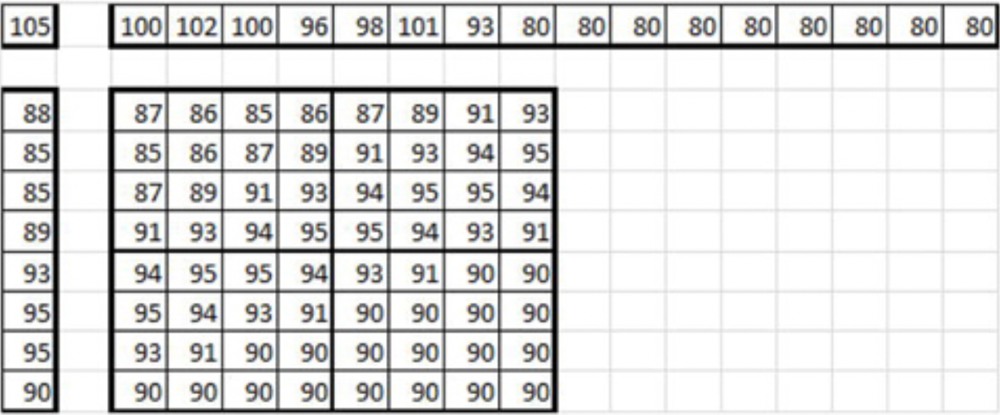

# VP9视频压缩技术

视频压缩标准VP9是VP8的后继产品，也是谷歌开发的开放标准。最新规范于2013年2月发布，目前可通过IETF的因特网草案[^9]获得。最终规格尚未批准。VP9视频编解码器是专门为满足因特网上视频消费需求而开发的，包括专业和业余制作的视频点播和会话视频内容。WebM媒体容器格式主要通过使用VP9编解码器来替换HTML5视频的免版税，开放视频压缩，该VP9编解码器替代了最初支持的VP8编解码器。

VP9草案包括许多增强功能和新的编码工具，这些编码工具已添加到VP8编解码器中，以提高编码效率。草案中描述的新工具包括更大的预测块尺寸，最大可达到64×64，各种形式的复合帧间预测，更多的帧内预测模式，八分之一像素运动矢量，8抽头可切换子像素插值滤波器，改进的运动参考生成和运动矢量编码，改进的熵编码，包括对各种符号的帧级熵自适应，改进的环路滤波，非对称离散正弦变换（ADST）的合并，更大的16×16和32×32 DCT，以及改进的帧-级别细分。但是，VP9​​目前正在开发中，VP9规范的最终版本可能与规范草案有很大差异，此处描述了其中的一些功能。

## 图片分区

VP9将图片划分为64×64超级块（SB），并按从左到右，从上到下的光栅扫描顺序进行处理。与HEVC相似，尽管8×8块大小是模式信息的最典型单位，但可以使用递归四叉树将超级块细分为最小4×4。与HEVC相比，VP9中没有切片结构。

人们希望能够并行执行编码或解码任务，或者使用多线程，以便有效地利用可用资源，尤其是在诸如智能手机之类的资源受限的个人设备上。为此，VP9通过frame_parallel_mode标志和基于两个或四个列的平铺提供帧级并行性，同时允许跨图块边界执行环路过滤。VP9中的平铺仅在垂直方向上完成，而每个平铺具有整数个块。相邻图块之间没有数据依赖性，并且可以按任何顺序处理帧中的任何图块。在除最后一个瓦片之外的每个瓦片的开始处，传输一个4字节的大小，指示下一个瓦片的大小。这允许多线程解码器通过向前跳到适当的图块来启动特定的解码线程。每帧有四个图块，便于在硬件和软件实现中实现数据并行化。

## 比特流功能

VP9比特流通常以WebM之类的容器格式提供，它是Matroska媒体容器的子集。容器格式对于随机访问功能是必需的，因为VP9并未为此提供起始代码。VP9位流从包含所有内部编码块的关键帧开始，这也是解码器重置点。与VP8不同，VP9中没有数据分区。所有数据类型都按照超级块编码顺序进行交织。进行此更改是为了方便硬件实施。但是，类似于VP8，VP9还使用8位非自适应算术编码（也称为bool编码）压缩比特流，对于该模型，概率模型是固定的，并且在帧解码开始之前先验地知道所有符号概率。每个概率都有一个已知的默认值，并作为1字节数据存储在帧上下文中。解码器维护四个这样的上下文，以及用于帧解码的比特流信号。一旦帧被解码，基于解码帧中某些符号的出现，可以使用新的概率分布更新上下文，以供将来的帧使用，从而提供有限的上下文适应性。

每个编码帧都有三个部分：

* 未压缩的报头：很少包含图像大小，环路滤波器强度等的字节。

* 压缩报头：布尔型编码的报头数据，包含帧的概率，用与默认概率值的差异表示。

* 压缩帧数据：重建帧所需的布尔编码帧数据，包括分区信息、帧内模式、运动矢量和变换系数。

VP9比特流除了提供具有合理复杂性的高压缩效率外，还包括旨在支持各种特定用例的功能，这些用例涉及通过因特网传输和消费视频。 例如，对于在不可靠的网络上以低延迟进行对话视频的通信，必须支持一种编码模式，即使在丢失任意帧的情况下，解码也可以继续进行而不会损坏。具体来说，即使帧缓冲区已损坏，算术解码器也应能够继续正确解码符号，从而导致编码器与解码器不匹配。

VP9支持帧级error_resilient_mode标志，以允许在编码器和解码器之间可能存在可管理的漂移的编码模式，直到关键帧可用或选择可用的参考图片来纠正错误为止。尤其是，在容错性能模式下，以下限制适用，而性能预期会有所下降：

* 在每一帧的开始，熵编码上下文的概率被重置为默认值，从而阻止了前向或后向更新的传播。

* 对于运动矢量参考选择，来自先前编码参考帧的同位运动矢量不能再包含在参考候选列表中。

* 对于运动矢量参考选择，在搜索参考帧缓冲区上，基于运动矢量参考候选的初始列表的排序被禁用。

VP9比特流不提供任何安全功能。尽管VP9不受外部对象和相关安全漏洞的影响，但必须通过双流之外的功能来确保完整性和机密性。

## 残差信号编码

如果一个块不是跳过的块（以8×8粒度表示），则为它编码并发送残差信号。与HEVC相似，VP9还支持不同大小（32×32、16×16、8×8和4×4）的整数转换，该整数转换近似于DCT。但是，根据内部残基的特定特性，垂直和水平变换通道之一或二者都可以是ADST。在位流中，转换大小经过编码，以使使用8×8转换的32×16块将会具有由一个8×8转换系数的4×2网格，和两个16×8色度残差组成，其中每个残差由一个8×8变换系数的2x1网格组成。

从左上角开始扫描变换系数，遵循“弯曲的之字形”模式向更高的频率扫描，而具有DCT/DST混合的变换块使用相应偏斜的扫描模式[^10]。但是，扫描模式并不简单，并需要进行表查找。此外，每个变换系数都是使用布尔编码进行编码的，并具有与之相关的几个概率，这是由各种参数（例如，块中的位置、变换的大小、相邻系数的值等）导致的。

反量化只是将亮度和色度的直流和交流系数的四个缩放因子之一进行简单的相乘，它们对于单帧保持不变；不允许进行块级QP调整。此外，VP9使用4×4 沃尔什·阿达玛变换在帧级别提供了无损模式。

## 帧内预测

VP9中的帧内预测类似于AVC和HEVC中的帧内预测，并且在与变换块分区相同的分区上执行。例如，具有8×8变换的16×8块将导致两次8×8亮度预测操作。有10种不同的预测模式：DC、TM（真实运动）、垂直、水平和六个角度预测，分别对应于27、45、63、117、135和153度角。 像其他编解码器一样，帧内预测需要两个一维数组，其中包含相邻块重构的左像素和上像素。对于大于4×4的块大小，水平阵列的后一半包含与前一半的最后一个像素相同的值 图3-19中给出了一个示例。

**图3-19.**亮度内部样本，D27_PRED模式

## 帧间预测

VP9中的帧间预测使用八像素运动补偿，提供了相对于其他大多数标准两倍的精度。对于运动补偿，VP9主要每个块使用一个运动矢量，但可选地允许每个块具有两个运动矢量的复合预测，从而产生两个预测样本，这些预测样本被平均在一起。复合预测仅在用作参考帧的不可显示帧中启用[^11]。VP9允许将这些不可显示帧背负于可显示帧，一起形成要在容器中使用的超帧。

VP9定义了三个8抽头滤波器系列，可以在比特流的帧或块级别选择：

* 8抽头常规滤波器：8抽头拉格朗日插值滤波器

* 8抽尖锐化滤波器：基于DCT的插值滤波器，通常在较锐利的边缘使用

* 8抽头平滑（非插值）滤波器：一种平滑非插值滤波器，在某种意义上，在整数像素对齐的位置处的预测是参考帧像素的平滑版本。

运动矢量指向三个可能的参考帧之一，这些帧称为Last（时间上前一帧），Golden（时间上任一帧）和AltRef（参考帧，不显示，质量高于普通帧）。参考帧以8×8的粒度应用-例如，两个4×8块（每个块具有各自的运动矢量）将始终指向同一参考帧。

在VP9中，运动矢量是从候选参考运动矢量的排序列表中预测的。使用共享相同参考图片的最多八个周围块来构建候选对象，然后使用来自前一帧的同位运动矢量的时间预测值。如果此搜索过程未填充列表，则会再次搜索周围的图块，但这一次引用不必匹配。如果此列表仍不完整，则将推断出（0，0）个向量。

与块相关，以下四个运动矢量模式之一会被编码：

* NEW_MV预测模式：此模式使用预测列表的第一项以及在比特流中传输的增量运动矢量。

* NEAREST_MV预测模式：此模式按原样使用预测列表的第一项。

* NEAR_MV预测模式：此模式按原样使用预测列表的第二个条目

* ZERO_MV预测模式：此模式使用（0，0）作为运动矢量值。

VP9解码器始终保持一列八张参考图片的列表，其中一帧将其中三张用于帧间预测。预测的帧可以选择将自身插入这八个插槽中的任何一个，以淘汰现有帧。VP9支持参考帧缩放；可以以与前一帧不同的分辨率对新的帧间帧进行编码，同时根据需要按比例放大或缩小参考数据。缩放滤镜是具有第16像素精度的8抽头滤镜。该功能在可变带宽环境中非常有用，例如通过I因特网进行视频会议，因为它允许快速，无缝地实时调整比特率。

## 环路滤波器

VP9引入了各种新的预测块和变换大小，它们需要附加的环路过滤选项来处理大量边界类型的组合。VP9还在环路滤波器中集成了平坦度检测器，该平坦度检测器可检测平坦区域并相应地改变滤波器的强度和尺寸。

VP9环路滤波器应用于解码后的图片。环路滤波器在超级块上运行，使垂直边缘平滑，然后使水平边缘平滑。超级块以光栅扫描顺序进行处理，而不考虑可能用信号通知的任何图块结构。这与HEVC环路滤波器不同，在HEVC环路滤波器中，帧的所有垂直边缘在任何水平边缘之前被过滤。VP9环路过滤中使用四种不同的过滤器：16宽、8宽、4宽和2宽，其中在边缘的每一侧分别处理八个、四个、两个和一个像素。根据在帧头中发送的阈值应用每个过滤器。尝试在以下条件下进行滤镜：边缘两边的像素应该相对平滑，并且边缘两边的亮度差异必须明显。满足这些条件后，将使用滤镜对边缘进行平滑处理。如果不满足条件，则尝试使用下一个较小的过滤器。8×8或4×4的块大小从8宽或更小的过滤器开始。

## 分割

VP9中的分割机制提供了一组灵活的工具，可以有针对性地使用这些工具，以在给定的压缩率下提高某些区域的感知质量。它是VP9的一项可选功能，允许块指定块所属的段ID（0至7）。帧头可以传达以下任何功能，适用于具有相同段ID的所有块：

* AltQ：属于具有AltQ功能的片段的块可以使用与其他片段中的块不同的逆量化比例因子。这在许多速率控制方案中很有用，特别是对于前景和背景区域中的不均匀位分布。

* AltLF：属于具有AltLF功能线段的块可以使用不同的平滑强度进行环路滤波。这对于特定的一组有针对性的目标平滑很有用。

* 模式：属于具有活动模式功能段的块，被当做具有相同的编码模式。 例如，如果在一个段中激活了跳过模式，则所有块都将没有残留信息，这对于帧的静态区域很有用。

* 参考：假定启用了参考功能的属于某个段的块均指向特定的参考帧（last，golden或AltRef），不必采用参考帧信息的常规传输。

* EOB：属于具有块系数结尾（EOB）标记编码功能段的块可以对属于该段的所有块使用相同的EOB标记编码。这样就无需分别解码EOB标记。

* 变换大小：也可以为段中所有的块指示块变换大小，这对于一个段可能是相同的，但允许在同一帧中使用不同的变换大小。

为了最小化信令开销，分割图跨帧进行了差分编码。细分与拼贴无关。

[^9]: A. Grange and H. Alvestrand, “A VP9 Bitstream Overview,” Internet draft, February 2013, retrieved from http://tools.ietf.org/html/draft-grange-vp9-bitstream-00.

[^10]: P. Kapsenberg, “How VP9 Works: Technical Details and Diagrams,” Doom9’s forum, October 8, 2013, retrieved from http://forum.doom9.org/showthread.php?p=1675961. 

[^11]: 通过使用没有残差的64×64块和指向该参考帧的运动矢量（0，0），可以从此类参考构建低成本的可显示帧。

