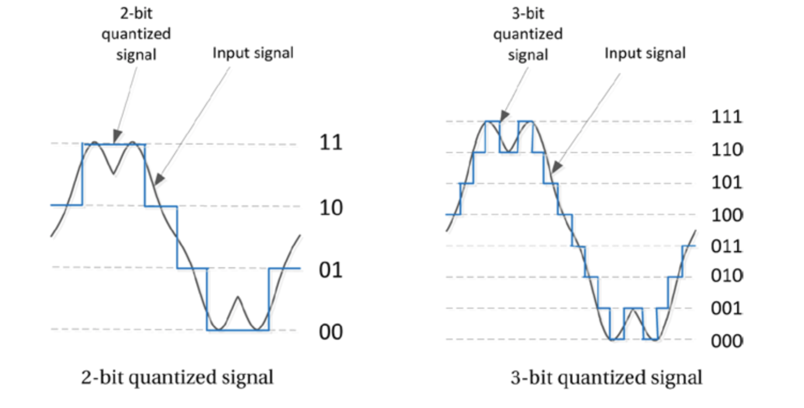
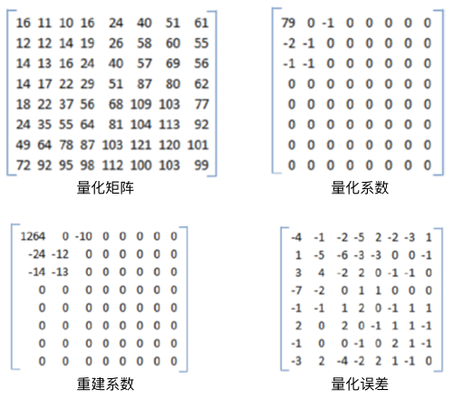

# Compression Loss: Quantization Noise
压缩损失以多种不同的方式表现出来并会导致某种视觉损失。本节将讨论最常见的压缩损失——量化噪声，以及和量化噪声相关的伪像。量化是将大量输入值映射到较小集合的过程，例如，将输入值四舍五入为某个精度单位的值。执行量化的设备或算法称为量化器。量化过程引入的舍入误差即量化误差或量化噪声。换句话说，量化误差就是输入信号和量化信号之间的差异。视频应用中有两种主要的量化噪声源：第一，模拟信号转换为数字格式时；第二，数字信号的有损压缩期间丢弃高频信息时。接下来将详细阐述如上的内容。

## Quantization of Samples
图像的数字化处理将传感器每个采样点的连续值亮度信息转换为不同灰度级的离散整数集。传感器的特性（例如动态范围和线性度）将会显著影响亮度测量和量化的整个过程。传感器可以处理的信号具备有限的范围，它们仅能处理处于某个区间内的光强度。真实传感器也是非线性的，但也可能存在一些区域，在传感器的这些区域的两端是非线性区域，而该区域内部或多或少是线性的。

A/D（*analog-to-digital*）转换器的量化位数决定了量化器输出的动态范围。$$n$$位的量化器可以表示从最小到最大的$$N = 2n$$个级别。8位量化器通常表示0到255之间编号的256个灰度级别，其中0表示黑色，255表示白色。更多的量化位数可以提供更精细的量化级别，因此可以产生更少的噪声，从而使得量化信号更接近原始信号。图4-1显示了2位4级和3位8级量化信号的对比。2位4级量化仅是输入信号的粗略近似，而3位8级量化信号则比2位4级量化更精准。

**图4-1.** 不同量化基数的对比

对于图像而言，像素亮度的真实输入与量化后的数字级别表示之间的差异表示该像素的量化误差（*quantization error*）。量化误差可以取正值或负值。对于均匀量化（*uniform quantization*）而言，量化级别是等间隔的，但是对于非均匀量化而言，量化间隔并非是等间隔的。如果量化级别以步长$$b$$等间隔，数字图像的量化误差可以近似为均匀分布，且量化误差的期望为0，方差为$$\frac{b^2}{12}$$。

均匀量化器通常是无记忆的，也就是说像素的量化级别在计算时会独立于其他像素。

## Frequency Quantization
在频率量化中，图像或视频帧通过变换（例如离散余弦变换，*DCT*）将图像数据转换为频域数据。对于8×8的像素块，DCT将产生64个变换系数。第3章中提到的有损压缩技术会使用相同大小的量化矩阵对变换系数执行量化操作。量化矩阵对于高频信息和低频信息的量化并非是线性的，一般会精细量化低频信息，对高频信息的量化则比较粗糙。实际上，大多数高频分量在量化后变为零，这一方面有助于压缩，但是另一方面会导致信息发生不可逆转地丢失，进而导致解压缩期间，无法根据量化系数回复原始值。原始像素块和重建像素块之间的差异表示引入的量化误差，图4-2展示了量化误差的过程。

$$
\boldsymbol{f}=\begin{bmatrix}
139&144&149&163&155&155&155&155 \\
144&151&153&156&159&156&156&156 \\
150&155&160&163&158&156&156&156 \\
159&161&162&160&160&159&159&159 \\
159&160&161&162&162&155&155&155 \\
161&161&161&161&160&157&157&157 \\
162&162&161&163&162&157&157&157 \\
162&162&161&161&163&158&158&158
\end{bmatrix}
$$

$$  
\boldsymbol{F} = \begin{bmatrix}
1260&-1&-12&-5&2&-2&-3&1 \\
-23&-17&-6&-3&-3&0&0&1 \\
-11&-9&-2&2&0&-1&-1&0 \\
-7&-2&0&1&1&0&0&0 \\
-1&-1&1&2&0&-1&1&1 \\
2&0&2&0&-1&1&1&-1 \\
-1&0&0&-1&0&2&1&-1 \\
-3&2&-4&-2&2&1&-1&0
\end{bmatrix} 
$$

对原始像素矩阵$$f$$执行DCT变换后得到$$F$$，对其进行量化如图4-2。

**图4-2.** 转换系数的量化过程

量化矩阵和输入到量化器的变换系数的大小一致。为了获得量化系数，变换系数的每一个元素需要除以对应的量化系数，然后对结果取整。例如，在图4-2中，通过舍入$$(1260/16)$$给出量化系数79。量化之后，位于左上角的低频系数得到保留，而高频系数则变为零，并在传输之前被丢弃。量化系数乘以相同的量化矩阵来重建变换系数。但是，重建的结果会包含量化误差，如图4-2所示。

通常，系数的量化取决于其相邻系数的量化方式。在这种情况下，在量化下一个系数之前会保存并考虑邻域上下文。这是具有存储器的量化器的一个例子。

实际上，量化系数矩阵中出现的大量零元素并非偶然。以这种方式设计的量化矩阵，可以从信号中去除HVS不太敏感的高频分量，从而在视觉感知没有明显降低的情况下，提升视频信号的压缩率。

## Color Quantization
颜色量化是用于减少图像中的颜色数量。由于HVS对颜色信息的损失不敏感，因此颜色量化是一种有效的压缩技术。此外，对于只能支持有限颜色的设备而言，颜色量化通常也是一种有效的手段。通常将颜色量化技术（最近邻颜色算法）与抖动（Dithering，量化误差的随机化技术）组合以产生比实际可用颜色更多的颜色，以及避免色带伪影（*color banding artifacts*）的现象。色带伪影主要因为连续变化的色调量化之后由于部分颜色缺失带来的色调突变。