# 常见的伪影
 本节将介绍几种经常出现在各种图像和视频压缩应用中的视觉误差（visual artifacts）。
 
## 模糊效应（Blurring Artifact）
图像模糊（*blurring*）指的是平滑图像的细节和边缘，模糊对于图像来说就是一个低通滤波器（*low-pass filter*）。模糊对象（*object*）看起来像是对象的镜头焦外成像，但是实际上模糊效果和镜头焦外成像是不同的。一般而言，用户更趋向于获取更清晰的图像，因此会极力避免模糊的产生。但是，有时候也会使用高斯模糊（*gaussian blurring*）来降低图像噪点或者增强图像在不同比例大小下的图像效果。通常，模糊会作为压缩之前的预处理操作，从而减少图像的高频信号来产生更有效的压缩。另外，边缘检测对于环境噪点非常敏感，因此，模糊在边缘检测算法中也很有用。图4-3展示了模糊的例子[^1]。

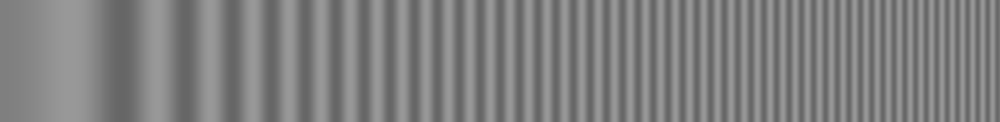

频率从左到右线性增加的单色光栅

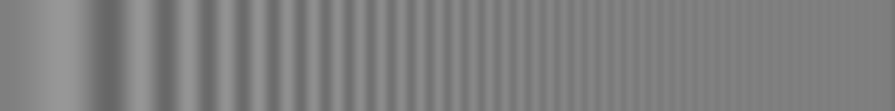

对如上的单色光栅的高斯模糊效果

**图4-3.**一个模糊频率斜坡（*frequency ramp*）的例子

从图4-3中可以看到，对于左边的低频率信号，模糊几乎没有任何效果，但是对右边的高频率信息，高斯模糊则由很明显的效果。

运动模糊出现在长时间暴光或场景内的物体快速移动的情况下。摄影机的工作原理是在很短的时间里把场景在胶片上暴光。场景中的光线投射在胶片上，引起化学反应，最终产生图片。这就是暴光。如果在暴光的过程中，场景发生变化，则就会产生模糊的画面。运动模糊通常是具有快速运动的运动内容中的伪影。然而，对于体育题材的视频内容，运动模糊常常会引起人们的不满。运动模糊会导致运动员在慢动作的场景下，无法确认其准确的位置，因此，运动模糊会带来一定程度上的不便利。可以采用平移相机以跟踪移动物体的方法来避免运动模糊，在这种情况下，运动物体会保持清晰但背景是模糊的。图形、图像或视频编辑工具也可能出于艺术原因产生运动模糊效果。当添加计算机生成的图像（*CGI, computed generated imagery*）到视频镜头时，会频繁的合成运动模糊从而模拟真实世界中存在的模糊或表现运动物体的速度感。图4-4展示了一个运动模糊的例子。

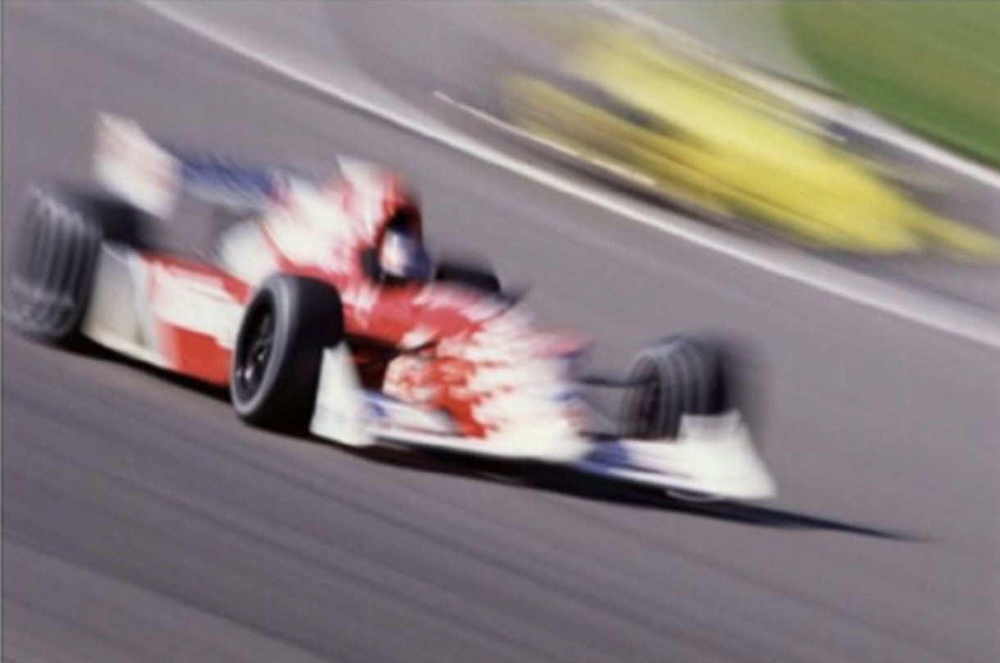

**图4-4.**运动模糊的例子

通过显示器的隔行扫描和工作室的电视电影处理可能会导致运动速度的不规则。另外，对于快速运动的物体，数字视频中的压缩失真（*compression artifacts*）也可能带来额外的模糊。LCD固有的采样-保持（*sample-and-hold*）工作模式与人眼跟踪效应的综合效果决定了LCD在显示运动画面时会存在运动模糊。对于LCD显示器而言，运动模糊是一个较为严重的问题。在LCD显示器中，可以通过控制背光减少运动模糊的影响。

## 块效应（Block Boundary Artifact）
基于块的有损编码方案，包括所有的主要视频、图像编码标准，以较低的码率编码块的边缘像素从而在块的边缘处引入了可见的伪像。在基于块的变换编码中，使用DCT或类似的变换将像素块映射到频域空间，并且在量化过程中会丢弃高频系数。码率越低，对编码块的量化越粗糙，从而产生模糊的、低分辨率的图像块。在极端情况下，编码块只剩下代表数据平均值的DC系数，因此对该编码块的重建图像只是一个单色区域。

块效应伪像是对各图像块进行独立量化变换系数的结果。相邻的图像块分别量化系数，从而导致重构图像块的边界不连续。图像块边界的不连续性通常是可见的，尤其是在天空，人脸等平坦的颜色区域中。这这些平坦的颜色区域中几乎没有任何细节可以掩盖图像块边界的不连续性。 压缩算法通常执行去块（*deblocking*）操作以平滑重构的块边界，甚至使用没有此伪像的参考帧来执行去块操作。图4-5显示了块效应伪像的示例。

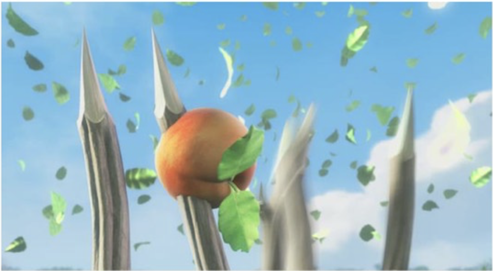

*原始图像*

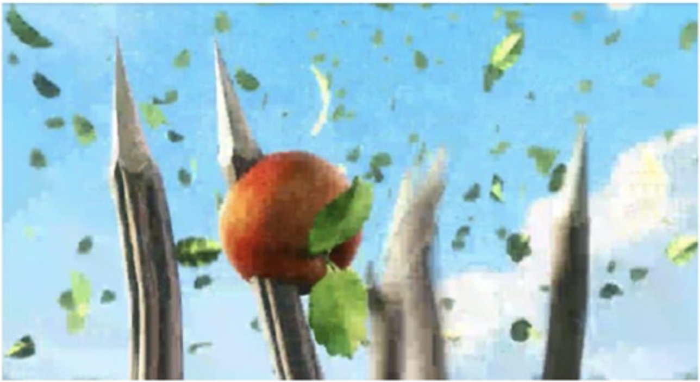

*重构的存在明显的块效应伪像的图像*

**图4-5.** 块边界效应伪像的例子

块边界伪像非常普遍，以至于经常使用许多名称来对其进行描述。尽管不连续性可能会（也可能不会）和视频/图像编码标准中定义的宏块的边界对齐，但是宏块（*macroblocking*）是此伪像的常用术语。其他名称包括平铺（*tiling*），镶嵌（*mosalicing*），缝（*quilting*）和棋盘格（*checkerboarding*）。

## 振铃效应（Ringing Artifact）
振铃是指因为输入图像中存在的剧烈变化而导致的输出信号产生的不必要的振荡。图像处理中，需要对图像进行滤波处理，若选用的频域滤波器具有陡峭的变化，则会使滤波图像产生振铃。所谓振铃，就是指输出图像在灰度剧烈变化处或轮廓处产生的震荡而导致的重影或回声效果，就好像钟被敲击后产生的空气震荡一样。振铃是由于众所周知的吉布斯（*Gibb‘s*）现象引起的，即滤波器在不连续点附近的脉冲响应的振荡行为，其中输出的比相应的输入值高（*overshoots, higher value*）或小（*undershoots, lower value*），并且幅度（*magnitude*）不断减小直到达到稳态为止。输出信号以渐弱的频率振荡。图4-6给出了一个振铃效应的例子。

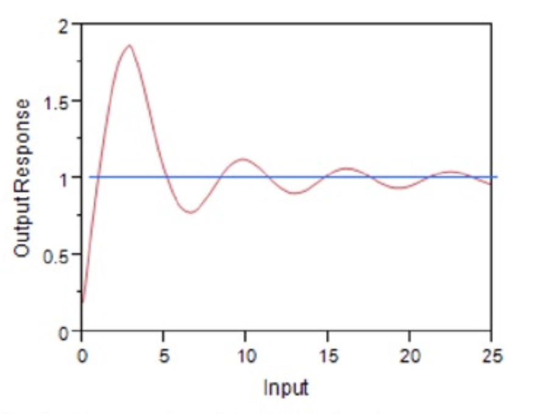

*吉布斯现象的振铃输出*

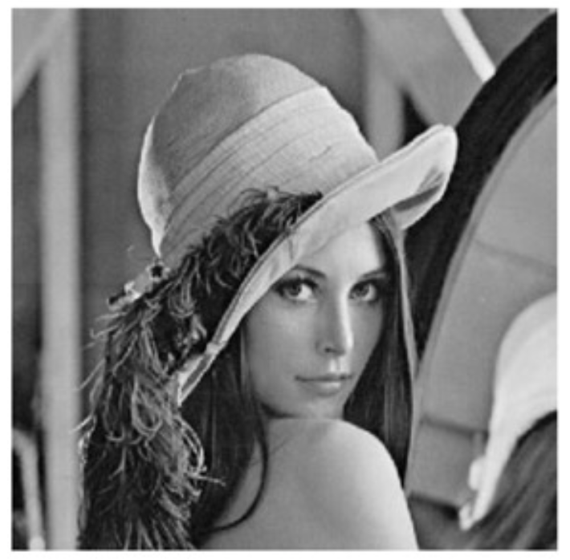

*原始图像*

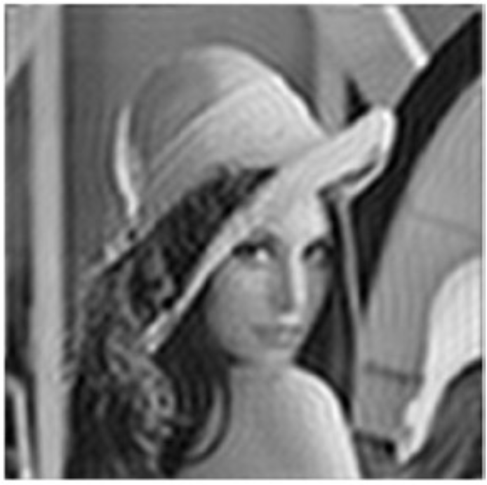

*包含振铃伪像的图像*

**图4-6.** 振铃伪像的例子

## 混叠效应（Aliasing Artifacts）
让我们考虑一个时变信号$$x(t)$$及其采样信号$$x(n)= x(nT)$$，采样周期$$T>0$$。当$$x(n)$$为2倍的下采样时，其他所有采样都将被丢弃。在频率（$$\omega$$）域中，信号$$X(e^{j\omega})$$的傅立叶变换被扩展了2倍。在这种情况下，变换后的信号通常可以与其移位后的副本重叠。在这种重叠的情况下，原始信号无法从其下采样版本中明确恢复，因为重叠区域同时代表了转换信号的两个副本。这种重叠的效果称为混叠。图4-7显示了下采样（包括混叠）的变换域效果。

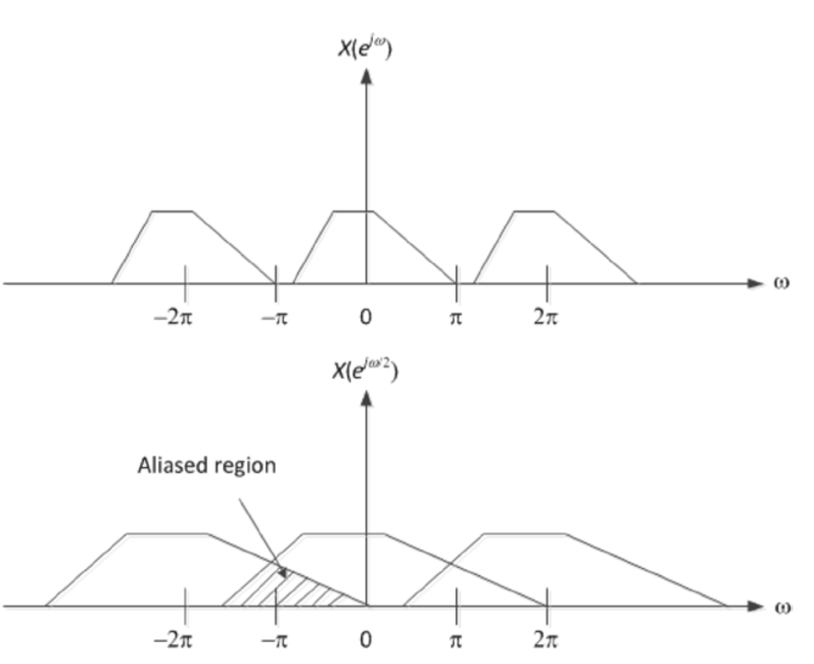

**图4-7.** 变换域的下采样导致的混叠效应

通常，混叠是指对抽样信号的模棱两可的重构而导致的伪影或失真。混叠可能发生在实时采样的信号中，例如数字音频，这被称为时间混叠。混叠也可能发生在空间采样信号（例如，数字图像或视频），在这种情况下称为空间混叠。

当采样具有有限持续时间的实际信号时，总是会发生混叠。这是因为这些函数的频率内容没有上限，导致它们的傅立叶变换表示始终与其他变换函数重叠。另一方面，具有受限频率内容（带宽受限）的函数具有无限的持续时间。如果以高于奈奎斯特采样率的速度采样，则原始信号就可以从采样信号中完全恢复。从图4-7可以明显看出，如果将原始信号限制在$$|\omega|<\frac{\pi}{M}$$，其中*M*是下采样倍数。在这种情况下，可以使用上采样器从下采样的版本中恢复原始信号，然后进行滤波。

实际的数字信号处理中，信号的采样和其他处理过程由不同模块完成，他们对于信号的采样率需求可能不同。对于抽样后的信号$$x(nT)$$，抽样频率$$f_s$$的改变需要使用上采样和下采样来完成。

上采样（$$L=2$$）又称为信号插值，即5在原信号序列$$x(n)$$的两个点之间插入$$L$$个0，等效于在其频域上做了频谱压缩。下采样（$$M=2$$）又称为信号抽取，即在原信号序列$$x(n)$$中每隔M个点抽取一个点，等效于在其频域上做了频谱扩展。

#### 锯齿效应（Jaggies）
有一种常见的混叠伪影被称为锯齿（*jaggies*），其会在数字图像中的平滑直线或曲线上产生可见的阶梯状线条。这些阶梯或台阶是像素规则的、正方形布局的结果。随着图像分辨率的提高，该伪像会变得越来越不可见。同样，抗锯齿（*anti-aliasing*）滤镜可用于减少锯齿边缘的可见性，而锐化（*sharpening*）则会提高这种可见性。

图4-8显示了混叠伪像（例如锯齿和摩尔纹图案）的例子。

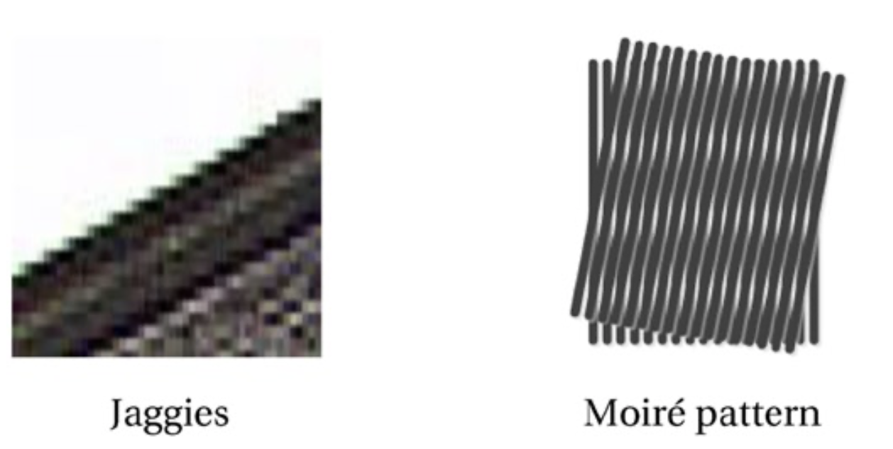

**图4-8.** 混叠伪影的例子

#### 摩尔纹（$$Moir\acute{e}$$ pattern）
由于精细的常规图案的下采样，出现了莫尔纹的混叠现象。摩尔纹是各种数字成像和计算机图形技术产生的图像中所不希望存在的伪像。摩尔效果是明显不同的视觉感知，这是由两个相似图案的不精确叠加引起的。在图4-8中，摩尔效果可以看成是起伏的图案，而原始图案则包括紧密间隔的直线网格。

## 闪烁效应（Flickering Artifacts）
在视频显示期间的足够长的时间内（例如，大约100毫秒），可以察觉到亮度中断现象，该现象称之为闪烁。闪烁是一种令人不悦的闪光效果。当以较低的刷新率驱动旧显示器时（例如CRT，阴极射线管），就会发生闪烁现象。由于液晶显示器（*LCD*）中，用于每个像素的快门保持稳定的不透明性，因此即使刷新图像也不会闪烁。

#### 抖动（Jerkiness）
抖动是一种类似闪烁的伪像，描述了对视频中的单个静止图像的感知。 可以发现，感觉到闪烁和抖动的频率取决于许多条件，包括环境照明条件。对于以24 FPS或更高的帧率正常播放视频而言，无法感知到抖动。 但是，在视觉通信系统中，如果解码器延迟则会导致视频帧被视频解码器丢弃，或者由于网络错误导致解码失败，此时则将继续显示前一帧。直到成功解码下一个无错误的帧之后，显示屏上的场景才会突然更新。 此时，就会导致可见的抖动现象。

#### 电视电影转换抖动（Telecine Judder）
电视电影转换抖动是另一种类似闪烁的伪像。为了将24 FPS的电影转换为30 FPS的视频，通常需要做电视电影转换（*telecine*）或采用$$2:3$$的下拉（*pulldown*）。该过程将每四帧电影帧转换为五帧隔行扫描的视频帧。某些DVD或蓝光播放器，或录像机可以检测电视电影转换，并应用反向电视电影转换过程重建原始的24 FPS的视频内容。图4-9显示了电视电影转换的过程。

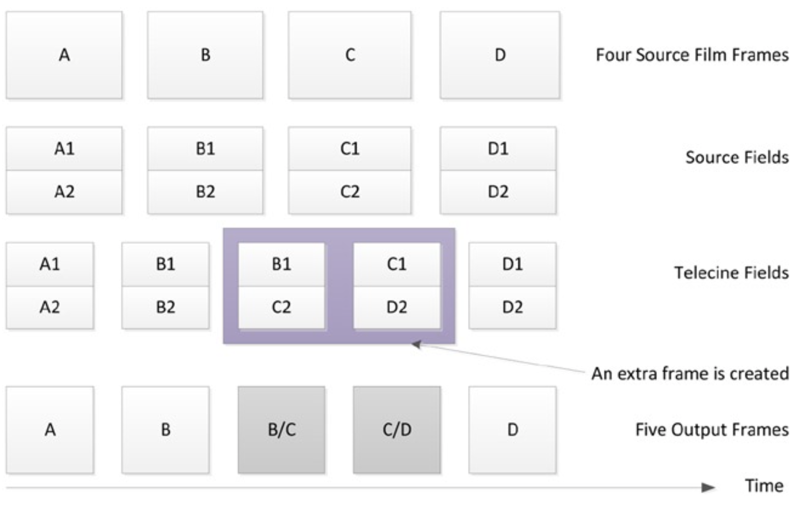

**图4-9.** 电视电影转换过程

需要注意的是，电视电影转换处理创建了两个新的帧B/C和C/D，它们并不属于原始的视频帧。因此，与原始胶卷相比，电视电影处理会在视频信号中产生少量的错误。这曾经导致在NTSC制式的电视上观看电影时的体验问题，即电影看起来不像在电影院中观看时的那样平滑。尤其是在相机缓慢、稳定的运动时，该问题尤为明显。

## 其它图像伪像（Other Image Artifacts）
在压缩视频中，还存在其它类型的可视误差，接下来将对其进行简单介绍。

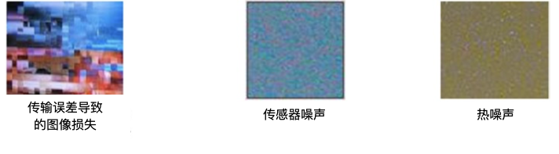

**图4-10.**各种图像噪声的示例

#### 传输错误导致的数据损坏
压缩比特流中的传输错误会导致在重建信号时产生数据损坏。传输错误还会破坏比特流的解析，导致图像的部分解码或解码的图像存在丢失块。在严重错误的情况下，解码器会在短时间内继续对损坏的图片进行更新，从而产生重影图像效果（*ghost image effect*）。重影效果会一直持续到下一个无错误的独立压缩帧到来为止。在露天电视信号中，重影是一种比较常见的效果。

#### 图像噪声
每个像素的相机传感器包含一个或多个光敏光电二极管用于将入射光转换成电信号，电信号则被处理成图像的像素的颜色值。然而，这个过程并不总是完全可重复的，并且会存在一些统计差异。此外，即使没有入射光，传感器的电活动也可能产生一些信号。图像噪声则来源于这些非期望的信号和差异。这种噪声随每个像素和时间而变化，并随温度而增加。胶片颗粒也会导致图像噪声。数字图像中的噪声在均匀表面中最明显，例如在天空和阴影中的单色颗粒和彩色波。热像素噪声是另一种类型的噪声。热像素噪声因为持续一秒以上的长时间曝光而出现，并且显示为略大于单个像素的彩色点。然而，在现代相机中，热像素噪声越来越少。

[^1]: https://aty.sdsu.edu/bibliog/latex/scan/blur.html.
