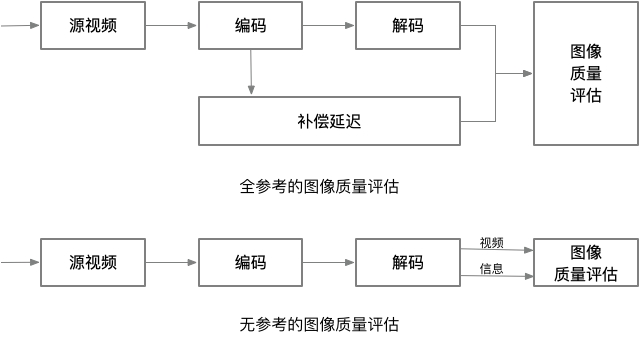

## Objective Video Quality Evaluation Methods and Metrics
视频质量评估（*VQA, Video quality assessment*）旨在设计一套自动评估视频质量的算法。这些自动评估算法可以与人类的主观评估在感知上保持一致。自动评估算法可以跟踪视频质量的指标。因为这些指标不需要人工现场试验，因此这些指标是可自动化的，并且可以重复执行来获得结果。然而，这些算法并非总是很完美，仅仅试图预测人类的主观体验而已。客观评估算法可能会因某些不可预测的内容而失败。因此，客观质量评价不能取代主观质量评价，客观质量评价只是作为质量评估的工具而已。ITU-T P.1401[^1]为各种媒体类型的客观质量评估提供了算法评估的框架。

在ITU-T P.1401中，客观质量评估的统计指标[^2]需要涵盖三个主要方面——准确性（*accuracy*），一致性（*consistency*）和线性相关性（*linearity*），这三个方面的指标计算需要和主观评估结果对应起来。其中，可以用预测误差来（*prediction error*）计算准确性，利用离群点率（*outlier ratio*）或者残差分布（*residual error distribution*）来计算一致性，利用皮尔森相关系数（*Pearson correlation coefficient*）来计算相关性。

算法预测结果残差[^3]的均方根误差（*RMSE, root mean square error*）可以用如下的公式计算。

$$
RMSE \ of \ \boldsymbol{P}_{error}=  \sqrt{\frac{1}{N-1} \sum_{i=1}^{N}\big(MOS(i)-MOS_{predicted}(i) \big)^2} \tag{式4-1}\label{式4-1}
$$

$$\ref{式4-1}$$中，$$N$$是样本的数量，$$N-1$$用于确保RMSE的无偏差估计。

残差（$$MOS-MOS_{predicted}$$）的分布通常符合二项分布的特征。低于某个预定义的阈值（通常该阈值需要满足具备95%的置信区间）的残差的概率的期望为$$\boldsymbol{P}_{th}=\frac{N_{th}}{N}$$，标准差为$$\sigma_{th}=\sqrt{\frac{P_{th}(1-P_{th})}{N}}$$，其中$$N_{th}$$表示残差低于指定阈值的样本数。

客观视频/图像质量指标在视频应用中扮演着各种不同的角色，特别是如下的角色：

* 用于质量的动态监控和调整。例如，网络数字视频服务器可以基于实时的视频质量评估来适当的地分配、控制和折衷视频流资源。
* 用于优化视频处理系统的算法和参数。例如，在视频编码器中，质量度量可以促进预滤波和码率控制算法的最佳设计。在视频解码器中，可以帮助优化重建算法、错误消除算法以及后期滤波（*post-filtering*）算法。
* 用于视频处理系统和算法的基准测试。
* 用于比较两个不同的视频系统解决方案。

### Classification of Objective Video Quality Metrics
可以根据视频质量评估算法需要的参考信息的数量将客观视频质量评估方法分成三类：完全参考（*FR, full reference*），半参考（*RR, reduced reference*）和无参考（*NR, no reference*）。其中，FR方法可进一步划分为如下几类：

* 基于误差灵敏度的方法（*Error sensitivity based approaches*）
* 基于结构相似性的方法（*Structural similarity based approaches*）
* 基于信息保真度的方法（*Information fidelity based aproaches*）
* 时空方法（*Spatio-temporal approaches*）
* 基于显著性的方法（*Saliency based approaches*）
* 网络感知方法（*Network aware approaches*）

接下来的章节将会具体讨论如上的评估方法，并且在介绍的时候会增加对应的具体例子。

#### Full Reference（全参考）
数字视频信号会经历很多处理步骤。在这些过程中，视频质量可能已被各种需求（压缩，速度或其他标准）所折中，从而使得用户可以获得可用的失真信号。在客观质量评估中，经常会测量失真信号的保真度。为了精确测量发生了多少退化，需要对参考信号（假定参考信号具有完美的质量）进行信号保真度测量。但是，参考信号也并不总是万能的。

全参考（*FR*）[^4]指标度量失真视频相对于参考视频的视觉质量劣化程度。FR要求参考视频没有质量损失并且以非压缩的形式提供，同时失真信号和参考信号需要具备精确的空间和时间对齐，并且具备相同的亮度和颜色标准。只有这样，才可以直接比较视频中的每一帧的每个像素。

一般以某种合理的方式计算参考信号和失真信号之间的距离来确定信号的保真度。FR质量评估方法试图利用HVS的重要生理、心理视觉特征进行建模，并使用该模型来评估信号保真度，进而实现客观质量预测和用户感官之间的一致性。随着保真度的增加，感知质量也会随之提高。FR在视频质量分析方面非常有效，并且广泛用于视频质量分析和基准测试。但FR要求质量评估期间对参考信号的可访问性，这种要求在实践中可能无法实现。这可能会限制FR的应用。

#### Reduced Reference（半参考）
当参考信号不能完全可用时，也可以设计模型和评估标准来客观评估视频质量。该领域的研究产生了各种使用部分参考信号的半参考（RR）[^5]方法。RR需要从参考/失真的测试视频中提取很多特征。提取的特征构成了比较两个视频的基础，因此RR不需要完整的参考信号。RR即避免了在没有任何参考信息的情况下所必须进行的假设操作，又保证了参考信息数量的可管理性。

#### No Reference（无参考）
无参考（NR）指标不依赖于显式参考视频，其仅分析失真的测试视频。因此，NR指标不受对齐问题的影响。然而，NR方法的主要挑战是区分当前信号是失真信号还是实际视频信号。因此，NR指标必须对视频内容和失真类型给出假设。

图4-11给出了FR和NR的流程图。

**图4-11.**基于参考的的分类举例：全参考和无参考算法流程图

王等人在论文中提出了一种NR测量算法[^6]。该算法将模糊效应和块效应视为JPEG压缩过程中产生的最重要的噪声，并建议提取可反映这些噪声相对大小的特征。该算法然后将提取的特征进行组合，从而生成质量预测模型，接下来使用主观实验结果对该模型进行训练。算法的提出者希望训练之后的模型也适用于其它图像的评估。虽然类似的算法可以不使用任何参考而仅根据可用的图像内容进行评估，但在有可用的参考信号时，最好还是使用FR方法进行评估。接下来的讨论将集中在各种 FR方法。

在所有条件下设计与感知视觉质量一致的客观度量算法是一个难题。许多可用的指标可能无法解释损坏图像的所有的失真类型，也无法解释图像的内容以及失真的强度。但这些指标提供了与人类主观感受相对一致的结果。因此，客观质量度量仍然是一个非常活跃的研究领域。接下来将介绍各种不同的FR质量评估算法。

[^1]: ITU-T P.1401, [Methods, Metrics and Procedures for Statistical Evaluation, Qualification and Composition of Objective Quality Prediction Models](https://www.itu.int/itu-t/recommendations/rec.aspx?rec=11688). 

[^2]: ITU-T P.1401, 7.5 Statistical evaluation metrics, P14.

[^3]: 残差：观测值与拟合值的偏离；误差：即观测值与真实值的偏离。

[^4]: ITU-T J.247: [Objective perceptual multimedia video quality measurement in the presence of a full reference](https://www.itu.int/rec/T-REC-J.247/en). 

[^5]: ITU-T J.246: [Perceptual visual quality measurement techniques for multimedia services over digital cable television networks in the presence of a reduced bandwidth reference](https://www.itu.int/rec/T-REC-J.246/en). 

[^6]: No-reference Perceptual Quality Assessment of JPEG Compressed Images.

