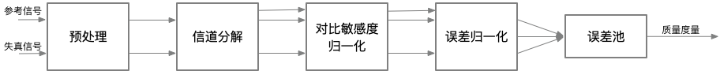

# 基于误差灵敏度的方法
当图像或视频帧经过有损处理时，就会产生失真的图像或视频帧。有损处理过程引入的误差量或失真量决定了视觉质量下降的程度。许多质量评估度量基于失真图像和参考图像之间的误差评估视频质量。在FR中，最简单、最广泛使用的度量指标是均方误差（*MSE, mean squared error*）。峰值信噪比（*PSNR, peak signal-to-noise ratio*）就是简单地通过均方误差（MSE）来定义。这些算法易于计算，具有明确的物理意义，并且在优化领域具备很好的数学便利性。但是，它们的结果与感知的视觉质量之间的匹配程度不高。

在基于误差灵敏度的图像或视频质量评估中，通常假设感知质量的损失与误差信号的可见性直接相关。MSE就是这个概念最简单的实现，MSE客观地量化了误差信号的强度。但是具有相同MSE的两个失真图像可能是不同类型的错误，并且，在这些错误中，其中一些错误比其它的错误更明显。在过去的四十年中，已经开发出了许多利用人类视觉系统（*HVS*）特征的质量评估方法。这些模型中的大多数都会修改MSE，以便根据误差信号的可见性对误差信号的不同方面进行加权。这些模型也基本上都基于一个通用框架。接下来将介绍该通用框架。

## General Framework
图4-12描述了基于误差灵敏度的图像或视频质量评估方法的通用框架。对于大多数基于误差敏感度的质量评估模型而言，尽管具体细节可能有所不同，但是基本上都可以用类似的框图来描述。

**图4-12.**基于误差灵敏度的评估方法的通用框架

如图4-12，通用框架一般包括如下步骤：
* **预处理（*Pre-processing*）**：预处理会消除已知的失真并准备图像，以便在失真图像和参考图像之间进行公平的比较。例如，两个图像都经过适当的缩放和对齐。必要的情况下，还需要执行更适合于HVS的颜色空间转换或伽马校正。此外，可以用低通滤波器来模拟眼睛光学系统的点扩散函数（*PSF,  point spread function*）[^7]。另外，可以使用非线性点操作（*point operation*）[^8]修改图像来模拟人眼的光适应（*light adaptation*）[^9]现象。
* **信道分解（*Channel Decomposition*）**：通常将图像分解为对特定空间频率、时间频率以及方向敏感的子带[^10]或信道。复杂的方法试图在初级视觉皮层（*primary visual cortex*）[^11]中尽可能的模拟神经反应，而其他方法仅简单使用离散余弦变换（*DCT*）或小波变换(*wavelet transforms*)进行信道分解。
* **对比敏感度归一化（*Contrast Sensitivity Normalization*）**：对比敏感度函数（CSF）[^12]描述了HVS对视觉刺激中存在的不同空间和时间频率的灵敏度。通常用线性滤波器实现CSF的频率响应。很多早期的方法会在信道分解之前根据CSF对信号进行加权，但是最近的方法使用CSF作为每个信道的基本灵敏度归一化因子。
* **误差归一化（*Error Normalization*）**：图像的不同分量可能在空间、时间位置，空间频率等方面非常接近，因此一个图像分量可能会减小或掩盖另一个分量的可见性。当计算并归一化每个信道中的误差信号时，需要考虑这种掩蔽效应（*masking effect*）。归一化过程通过空间变化的视觉门限（*visibility threshold*）[^13]对信道中的误差信号进行加权。对于每个通道，基于通道的基本灵敏度以及空间邻域中的参考或失真图像系数的能量确定视觉门限。归一化化过程仅利用差别感觉阈限（JND, just noticeable difference）[^14]表示错误。有的方法还会考虑对比度响应的饱和度的影响。
* **误差池（*Error Pooling*）**：模型的最后阶段会将归一化的误差信号组合成单个值。为了获得组合值，通常计算如$${4-2}$$的明可夫斯基范数（*Minkowski norm*）。其中，$$e_{i,j}$$为第$$i$$个频率通道的第$$j$$个空间系数的归一化错误值，$$\beta$$为1~4的一个常量。
 
  $$
  (4-2) \ E({e_{i,j}})=\bigg(\sum_{i}\sum_{j}|e_{i,j}|^{\beta}\bigg)^{\frac{1}{\beta}}
  $$

## Limitations
尽管基于误差灵敏度的方法通过模拟HVS的特性来估计误差信号的可见性，但是这些模型中的大多数都是基于受限刺激和简单刺激表征的线性或拟线性算子。实际上，HVS是一个复杂且高度非线性的系统。因此，基于错误敏感性的方法需要利用一些假设条件，因此也导致了以下的限制：

* **质量定义（*Quality definition*）**：基于误差敏感度的图像或视频质量评估方法仅跟踪图像保真度，较低的保真度并不总是意味着较低的视觉质量。 误差信号的可见性转换为质量下降的假设可能并不总是有效的。 有些扭曲是可见的，但并不那么令人反感。 通过全局增加亮度值来增亮整个图像就是一个这样的例子。 因此，图像保真度仅与图像质量有一定的相关性，而不是完全正比的相关性。
* **模型泛化（*Generalization of models*）**：许多误差敏感模型都是基于实验来估计误差门限，然而实验中刺激（*stimulus*）的误差几乎是不可见的。 这些阈值用于定义误差敏感度量，例如对比敏感度函数。 然而，在典型的图像或视频处理中，感知失真发生时，其误差值一般会远远高于实验给定的的阈值。因此，心理物理学（*suprathreshold psychophysics*）[^15]中的近阈值模型（*near-threshold models*）的泛化模型一般不是很精确。
* **信号特征（*Signal characteristics*）**：大多心理物理学（*psychophysical*）实验使用相对简单的图案，例如斑点，条形或正弦光栅。例如，经常利用全局正弦图像的阈值实验来获取CSF。然而，实践中的自然图像与简单图案的特征并不相同。因此，简化模型的适用性可能会在实践中受到限制。
* **依赖关系（*Dependencies*）**：错误池（*error pooling*）会因为其使用的假设（不同信道和空间位置的错误信号是独立的）而轻而易举的受到质疑。对于诸如小波变换的线性信道分解方法，自然图像的信道内和信道间小波系数之间存在强依赖关系。转换（*transformation*）和掩蔽模型（*masking models*）的优化设计会减少这种统计和感知的依赖性。但是，此类设计对VQA模型的影响尚未确定。
* **认知交互（*Cognitive interaction*）**：众所周知，诸如眼球运动之类的交互式视觉处理会影响感知质量。 此外，认知理解会对感知质量产生巨大影响。例如，对于不同的指令，用户可能会给同一图像打出不同的分数。对图像的先验知识和偏见也可能会影响图像质量的评估。因为认知交互难以理解、难以量化，大多数基于误差敏感度的评估方法都不会考虑认知交互的影响。

[^7]: [点扩散函数（PSF, point spread function）](https://blog.csdn.net/qq254612999/article/details/50509793) 描述了一个成像系统对一个点光源（物体）的响应。PSF的一般术语就是系统响应，PSF是一个聚焦光学系统的冲击响应。在大多情况下，PSF可以认为像是一个能够表现未解析物体的图像中的一个扩展区块。函数上讲，PSF是成像系统传递函数的空间域表达。

[^8]: [点运算](https://baike.baidu.com/item/%E5%9B%BE%E5%83%8F%E8%BF%90%E7%AE%97/4857590)指的是对图像中的每个像素依次进行同样的灰度变换运算。

[^9]: 人刚从暗处走到亮处的时候，最初的一瞬间会感到强光耀眼发眩，眼睛睁不开，什么都看不清楚，要过几秒钟才能恢复正常，这就是[光适应现象。](https://baike.baidu.com/item/%E5%85%89%E9%80%82%E5%BA%94%E7%8E%B0%E8%B1%A1/22251703)

[^10]: [子带编码技术](https://baike.baidu.com/item/子带/5920794)，是将原始信号由时间域转变为频率域，然后将其分割为若干个子频带，并对其分别进行数字编码的技术。

[^11]: [初级视皮层（V1）](https://baike.baidu.com/item/初级视皮层/3168345)又被称为纹状皮层, 由6层细胞构成, 发达的第4层又被分为 A、B、C 三个亚层。位于Brodmann 17区，其输出信息有两条通道，分别为背侧流（Dorsal Stream）和腹侧流（Ventral Stream）。

[^12]: [对比敏感度函数(CSF, contrast sensitivity function)](http://dict.youdao.com/w/eng/%E5%AF%B9%E6%AF%94%E6%95%8F%E6%84%9F%E5%BA%A6%E5%87%BD%E6%95%B0/)是反映人眼辨认平均亮度下两个可见区域差别的能力指标。

[^13]: [视觉门限](https://baike.baidu.com/item/%E8%A7%86%E8%A7%89%E9%98%88%E9%99%90/4044716)：光刺激必须达到一定的数量才能引起感觉。能引起感觉的最低限度的光通量，称为视觉的绝对阈限。同时人眼的视觉阈限又与空间和时间因素有关。

[^14]: [差别感觉阈限](https://baike.baidu.com/item/差别感觉阈限/5817313)是指刚刚能引起差别感觉的刺激的最小差异量。也称为最小可觉差(just noticeable difference)，简称JND。

[^15]: [心理物理定律（Psychophysical Law）](https://baike.baidu.com/item/%E5%BF%83%E7%90%86%E7%89%A9%E7%90%86%E5%AE%9A%E5%BE%8B/3245341)是关于物理连续体上的变量和相应的感官反应之间的函数关系及其数量化的描述。这些定律的目的是解释感官系统的活动和预测感觉行为。心理物理定律描述的现象主要有两类，一是对刺激探察力或阈限的测量，二是对阈限刺激分辨能力的测量。
