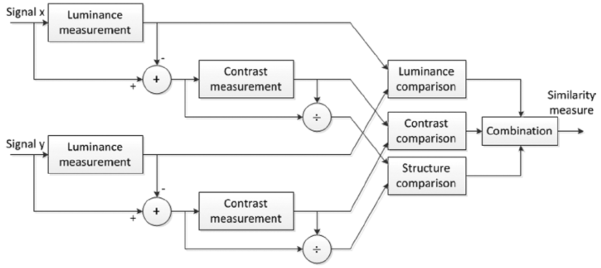

# Structural Similarity Based Approaches（基于结构相似性的方法）
图像是一种高度结构化的信号。图像像素之间（特别是空间上相邻的像素）存在很强的依赖性。像素之间的依赖关系包含镜头中对象结构的重要信息。基于误差敏感的方法中使用明可夫斯基范数度量距离，因此不考虑信号的基础结构。即使可以利用线性变换对图像信号进行分解（如基于误差灵敏度的大多数质量测量所做的那样），但是这种分解并不会消除像素之间的强依赖性。基于结构相似性的质量评估方法试图找到更直接的方法来比较参考信号和失真信号的结构。人类视觉对视野中的结构信息能够做出快速反应。利用HVS的这种特性，基于结构相似性的方法使用度量结构信息变化的方式来近似感知图像的失真，例如：通用图像质量指数（*UIQI,  Universal Image Quality Index*）[^25]和结构相似性指数（*SSIM, Structural Similarity Index*）[^26]。为了更深入的理解，下面将详细讨论SSIM。

## Structural Similarity Index
用于评估图像感知质量的客观方法尝试利用HVS的各种已知属性来测量失真图像和参考图像之间的可见差异。人类视觉感知系统高度适应从场景中提取结构化信息。在这种假设下，引入了基于结构信息的退化的质量评估方法。

图像中的结构信息被定义为表示场景中对象结构的那些属性，这些属性与亮度和对比度无关。由于亮度和对比度会发生变化，因此结构相似性指数（SSIM）仅考虑局部亮度和局部对比度。由于这三个部分相对独立，因此图像亮度或对比度的变化不会影响图像的结构。

基于结构相似性指标的质量评估系统的系统图如图4-13所示。

**图4-13.** SSIM评估系统的流程图

如图4-13所示，该系统由两个非负空间对齐的图像信号$$x$$和$$y$$组成。 如果其中一个信号具有完美的质量，则相似性度量可以用作度量第二个信号质量的定量测量。该系统把相似性测量的任务分解为三个部分：亮度比较、对比度比较、结构比较。

亮度估计为图像的平均强度（*mean intensity*）[^27]：$$\mu$$。亮度比较函数$$l(x,y)$$是关于两个图像$$x, \ y$$的平均强度$$\mu_x,\ \mu_y$$的函数。对比度估计为图像像素的标准差：$$\sigma$$。对比度比较函数$$c(x,y)$$可以近似为比较两个图像的像素标准差$$\sigma_x, \ \sigma_y$$。为了进行结构比较，首先将信号除以其自身的标准差来对图像进行归一化，使得两个图像都具有单位标准差。记下来利用归一化信号的$$\frac{x-\mu_x}{\sigma_x}, \ \frac{y-\mu_y}{\sigma_y}$$来计算结构比较函数$$s(x,y)$$。最后，结合这三个不同的结构产生一个整体的相似性度量结果：

$$
S(x,y)=f\big(l(x,y), c(x,y), s(x,y)\big) \tag{式4-6}\label{式4-6}
$$

$$S(x,y)$$需要满足如下的条件：
* 对称性：$$S(x,y)=S(y,x)$$
* 有界性：$$S(x,y) \le 1$$
* Unity maximum：$$S(x,y)=1$$当且仅当$$x=y$$；对于离散信号而言，$$S(x,y)=1$$，当且仅当$$x_i=y_i, \forall i=1, \dots, N$$。

亮度比较函数$$\ref{式4-7}$$所示：

$$
l(x,y) = \frac{2\mu_x\mu_y + C_1}{\mu_x^2+\mu_y^2 + C_1} \tag{式4-7}\label{式4-7}
$$

其中，$$C_1$$为常数，其目的是为了避免$$\mu_x^2+\mu_y^2$$趋于0时的不稳定性。并且，$$C_1 = (K_1L)^2$$，$$L$$为图像像素值的动态范围（8-bit的灰度像素而言，为255），$$K_1 \ll 1$$为一个很小的常数。从本质上看，$$\ref{式4-7}$$与韦伯定律[^28]是一致的。韦伯定律广泛用于模拟HVS中的光适应或亮度掩蔽。简而言之，韦伯定律指出HVS对绝对亮度变化不敏感， 而对相对亮度变化敏感。如果$$R$$表示与背景亮度相比的相对亮度变化，则可以用$$\mu_y=(1+R)\mu_x$$来表示失真信号的平均强度。此时，$$\ref{式4-7}$$可以重写为：

$$
l(x,y)=\frac{2(1+R)+\frac{C_1}{\mu_x^2}}{1+(1+R)^2+\frac{C_1}{\mu_x^2}} \tag{式4-8}\label{式4-8}
$$

当$$C_1 \ll \mu_x^2$$时，$$l(x,y)=f(R)$$。

对比度比较函数如$$\ref{式4-9}$$所示：

$$
c(x,y)=\frac{2\sigma_x\sigma_y+C_2}{\sigma_x^2+\sigma_y^2+C_2} \tag{式4-9}\label{式4-9}
$$

其中，$$C_2$$为常数，且$$C_2 = (K_2L)^2$$。

结构比较函数的定义如$$\ref{式4-10}$$。

$$
s(x,y)=\frac{\sigma_{xy} + C_3}{\sigma_x\sigma_y + C_3} \tag{式4-10}\label{式4-10}
$$

对于离散信号而言，可以用下式来估计$$\sigma_{xy}$$：

$$
\sigma_{xy}=\frac{1}{N-1}\sum_{i=1}^N(x_i-\mu_x)(y_i-\mu_y) \tag{式4-11}\label{式4-11}
$$

最后，结合$$\ref{式4-8}，\ref{式4-9}，\ref{式4-10}$$来计算信号$$x, y$$之间的SSIM值：

$$
SSIM(\boldsymbol{x,y})=[l(x,y)]^\alpha[c(x,y)]^\beta[s(x,y)]^\gamma \tag{式4-12}\label{式4-12}
$$

$$\alpha, \beta, \gamma > 0$$， 并且用来调整三个分量的重要程度。

一般而言，会使用$$\alpha = \beta = \gamma = 1, \ C_3=\frac{C_2}{2}$$的简化形式：

$$
SSIM(\boldsymbol{x,y})=\frac{(2\mu_x\mu_y+C_1)(2\sigma_{xy}+C_2)}{(\mu_x^2+\mu_y^2+C_1)(\sigma_x^2+\sigma_y^2+C_2)} \tag{式4-13}\label{式4-13}
$$

UIQI是当$$C_1=C_2=0$$时的一种特种的SSIM。正因如此，当$$\mu_x^2+\mu_y^2$$或者$$\sigma_x^2+\sigma_y^2$$无限接近于0的时候，UIQI会产生不稳定的结果。

[^25]: Zhou Wang, A.C. Bovik: a universal image quality index.

[^26]: Zhou Wang, A.C. Bovik, H.R. Sheikh, E.P. Simoncelli: image quality assessment: from error visibility to structural similarity. 

[^27]: intensity image：强度图，表示单通道图像像素的强度或值的大小。在灰度图像中intensity image指的就是图像的灰度。在RGB颜色空间中intensity image可以理解为是R通道的像素灰度值，或者G通道的像素灰度值，或B通道的像素灰度值，也就是RGB颜色有三个intensity image。在其他颜色空间类似，就是说每个通道图像的像素值。

[^28]: [韦伯定律](https://baike.baidu.com/item/韦伯定律/11033274)：德国生理学家E.H.韦伯通过对重量差别感觉的研究发现的一条定律，即感觉的差别阈限随原来刺激量的变化而变化，而且表现为一定的规律性。刺激的增量(△I)和原来刺激值(I)的比是一个常数(K)，用公式表达即K=△I/I，这个常数叫韦伯常数、韦伯分数或韦伯比率。