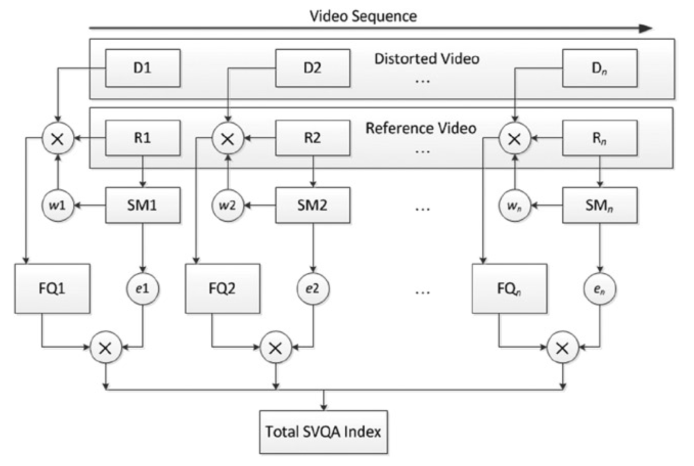

## Saliency Based Approaches（基于显著性的方法）
适用于单个图像的质量评估方法通常也用于视频。 然而，这些方法没有考虑视频序列的运动信息。这导致对视频质量评估而言，这些用于评估单个图像质量的方法表现很差。另外，大多数VQA算法忽略了人类视觉注意机制，这是HVS的一个重要特征。

视觉注意力机制实质上是一种生物机制，这种机制能够从外界复杂的环境中选出重要的、所需要关注的信息，并逐步排除相对不重要的信息。通过这种方式能够将十分复杂的外界视觉场景进行简化和分解，进而在接下来对重要的信息进行进一步处理。这种机制的优势在于它能够使得我们在十分复杂的外界视觉场景环境中，可以十分迅速的注意所需要关注的重要的信息和物体。在图像理解和分析中，人类视觉系统的视觉注意使得人们可以在复杂的场景中选择少数的感兴趣区域作为注意焦点（*FOA, Focus Of Attention*），并对其进行优先处理，从而极大地提高视觉系统处理的效率。在日常生活中，我们会常常感受到视觉注意机制的存在。比如说我们会轻易的发现，墙壁上的小坑和黑点，白色打印纸上的纸张缺陷，蓝色车牌上的车牌号码等等。[^35]

人眼的注意力通常会聚焦于与其相邻区域不同的、具有较高对比度或显著区域的边缘。例如上文提到的：我们可以轻易的发现，墙壁上的小坑和黑点。利用人眼注意力的这一特点，基于显著性的视频质量评估方法采用不对称地方法处理显著区域中发生的扭曲（显著区域和非显著区域区分对待）。SVQA就是一种这样的方法[^36]。

### Saliency-based Video Quality Assessment
在基于显著性的视频质量评估（*SVQA*）方法中，使用称为四元数傅里叶变换的相位谱（*PQFT, phase spectrum of quaternion Fourier transform*）的快速频域方法从参考图像或视频帧中提取空间显著图（*saliency map*）。 当对图像相位谱进行逆傅里叶变换时，很容易识别出图像的显著区域。可以使用显著图来调整其他VQA的客观评估标准，例如PSNR，MSSIM，VIF等。和时空方法类似，SVQA也从相邻帧确定时间权重。

给定一个参考图和其对应的失真图，可以用PQFT算法提取参考图像的显著图（*saliency map*）。然后，利用显著图对原始索引进行加权处理，进而确定改进的质量评估指数——基于显着性的指数（S指数）。例如，对于显著区域中的第$$i$$个像素，其亮度值为$$p_i$$，其显著性权重$$w_i$$的定义如下：

$$
w_i=\frac{p_i+b}{\frac{1}{M*N}\sum_{i=1}^{M*N}{(p_i+b)}} \tag{式4-17}\label{式4-17}
$$

其中，$$b$$为一个非常小的常数，其目的在于保证$$w_i>0$$。$$M，N$$分别表示图像的宽和高。从公式可以看出，该权重的计算也会考虑图像的非显著区域。但是显著区域的权重会更大。利用这些权重，基于显著性的PSNR算法（*SPSNR, saliency-based PSNR*）可以定义为：

$$
\begin{array}{1}
SPSNR(x,y)=10log\frac{255^2}{SMSE(x,y)}, \\
SMSE(x,y)=\frac{1}{M*N}\sum_{i=1}^{M*N}(x_i-y_i)^2w_i
\end{array} \tag{式4-18}\label{式4-18}
$$

因此，显著区域中的像素的失真比其他区域中的像素更重要。 基于显著性的MSSIM（*SMSSIM*）和基于显着性的VIF（*SVIF*）也以类似的方式定义。

由于SVQA不仅处理图像信号，还处理视频信号，因此需要考虑以下因素：

1. HVS对运动信息敏感，但对背景信息不敏感。因此，运动物体的失真比背景的失真更重要。SVQA在定位运动物体时需要区分固定摄像机和移动摄像机。
2. 由于视频帧是实时播放的，因此在观看视频时，人眼能注意到的区域比观看固定图像时要小得多。需要在帧内权重中考虑这个特性。
3. 由于运动掩蔽效应，在大规模场景变化期间或物体高速运动期间，视觉灵敏度会被抑制。因此，帧应根据运动掩蔽进行不同的加权。需要在帧间权重中考虑这个特性。
4. 考虑到视频序列的时空特性，最终质量指标需要综合考虑视频的空间域和时域中的显着性权重。

在SVQA中，帧内权重使用PQFT来计算具有非零运动的像素的显著性图。非零运动表示为两个相邻视频帧之间的图像差异。这样，就首先解决了关于运动物体的第一个需要考虑的因素。在较短的时间间隔中，允许显著图具有正方形的处理区域，从而解决了第二个需要考虑的因素。 由于基于运动遮蔽来计算帧间权重，因此还解决了加权的第三个问题。 最后，在SVQA中会同时考虑帧内权重和帧间权重，从而解决需要考虑的第4个问题。图4-14展示了SVQA的框架。

**图4-14.** SVQA的框架图

根据图4-14所示，SVQA的整体流程如下：
1. 参考视频和失真视频序列分解成视频帧。对于失真视频，每一个视频序列包含$$D_1$$~$$D_n$$的$$n$$张图像。对于参考视频而言，则为$$R_1$$~$$R_n$$的$$n$$张图像。如图4-14的上部分所示。
2. 在相机移动时，画面的所有像素都在移动，因此需要定义一个二元函数来检测这种运动。如果同一像素在相邻帧之间的亮度差超过某个阈值，则认为发生移动。如果所有的像素都在移动，则可以认为是相机在移动。否则，认为运动对象在静态背景中移动。帧的运动信息和三个颜色通道信息的加权组合构成帧的四元数（*quaternion*）。
3. PQFT利用运动信息计算每一个参考视频帧的显著图（*SM*），$$SM_1, \dots, SM_n$$。
4. 基于$$SM$$来计算视频帧的帧内权重：$$(w_1, \dots, w_n)$$。
5. 利用基于显著的度量指标（例如SPSNR，SMSSIM，SVIF）来计算第$$i$$帧的质量$$FQ_i$$。
6. 基于$$SM$$计算视频帧的帧间权重：$$(e_1, \dots, e_n)$$。
7. 利用$$\ref{式4-19}$$计算整个视频的质量，式中，$$n$$为视频帧的数量。
    $$
    SVQA=\frac{\sum_{i=1}^{n}(FQ_ie_i)}{\sum_{i=1}^{n}e_i} \tag{式4-19}\label{式4-19}    
    $$

[^35]: 视觉注意机制理论分析, https://wenku.baidu.com/view/0bfdeeab453610661fd9f460.html

[^36]: New Strategy for Image and Video Quality Assessment.

