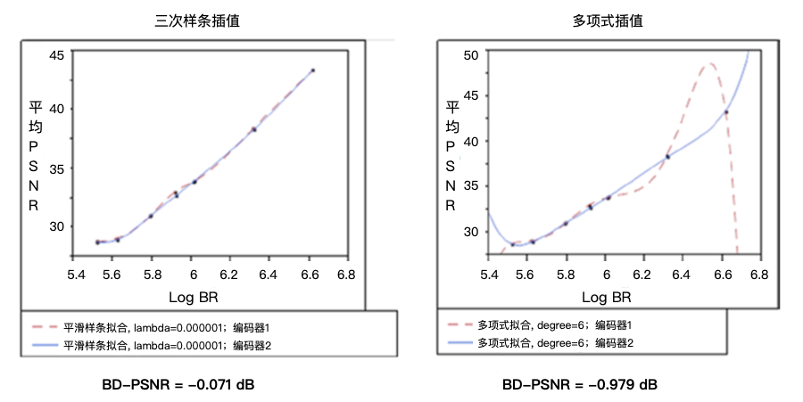

# 客观编码效率指标
测量编码效率是另一种指标，主要用于视频编码应用中权衡视觉质量和码率成本。本节将讨论用于客观确定编码效率的流行的BD(*Bjontegaard delta*)指标。

## BD-PSNR, BD-SSIM, BD-Bitrate
*Bjontegaard delta PSNR*（BD-PSNR）[^40]是编码器相对于参考编码器的编码效率的客观测量。Gisle Bjontegaard于2001年4月在视频编码专家组（*VCEG*）会议上提出BD-PSNR方法。BD-PSNR考虑两种编码方案在实现特定质量时需要的比特数方面的相对差异。BD-PSNR计算一个区间上的两个码率-失真（*R-D, rate-distortion*）曲线之间的平均PSNR差异。因为BD-PSNR考虑了在实现特定视觉质量（*质量可以由PSNR来表示*）下的成本（*例如，所使用的比特位数*），因此，BD-PSNR是视频视觉质量的良好指示。在绘制R-D数据点时，可以使用$$log_{10}(bitrate)$$，从而产生更直的R-D曲线和更均匀的数据点分布。

BD-PSNR使用三阶对数多项式来拟合给定的R-D曲线，PSNR中的重建失真如下：

$$
(4-22) \ D_{PSNR}=D(r)=a + br + cr^2 + dr^3
$$

其中，$$r=log_{10}(R), \ R$$为输出的码率，$$a, b, c, d$$为拟合参数。

该模型可以非常好的拟合R-D曲线，并且对于奇异点（*singular points*）也不会产生任何问题。利用从实际编码中获取的四个R-D数据点来求解式$${4-22}$$，从而确定四个拟合参数$$a, b, c, d$$。因此，该等式可用于插值[^41]两条R-D曲线（该曲线从两个编码器中获取），并且两条曲线之间的$$\Delta PSNR$$可以用$${4-23}$$得到。

$$
(4-23) \ BD-PSNR=\frac{1}{r_H-r_L}\int_{r_L}^{r_H}\bigg(D_2(r)-D_1(r)\bigg)dr 
$$

其中，$$r_H = log_{10}(R_H), r_L=log_{10}(R_L)$$分别为输出码率范围的最大值和最小值。$$D_1{r}, D_2{r}$$分为为两条R-D曲线。

类似的，可以使用$${4-24}$$来表示关于SNR的码率函数。

$$
(4-24) \ r=a + bD + cD^2 + dD^3 
$$

其中，$$r=log_{10}(R), \ R$$为输出码率，$$a, b, c, d$$为拟合参数，$$D$$为PSNR定义的质量失真。因此，BD-bitrate可以用$${4-25}$$表示。

$$
(4-25) \ BD Bitrate = \frac{1}{D_H-D_L} \int_{D_L}^{D_H}(r_2-r_1)dD 
$$

因此，BD-PSNR可以同时包含如下的两点：

1. 整个码率区间中的平均PSNR差异
2. 整个PSNR区间中的平均码率差异

如果用SSIM而不是PSNR来表示失真，则可以用相同的方式获得BD-SSIM。BD-PSNR/BD-SSIM计算取决于基于一组R-D数据点的插值多项式。

#### 优势
BD度量具有以下优点：与单独使用R-D曲线相比，BD能够更准确地表示质量差异。在大量测试的情况下，BD度量可以很容易的给出各种参数下的两个编码方案之间的差异。此外，BD度量可以将来自多个测试的结果合并到单个图表中，同时显示两个编码方案之间的视频质量差异。这种对比可以有效地传达两个编码方案之间质量对比的整体情况。

#### 限制
BD指标在比较两种编码方案时非常有用。然而，对于超高清（*UHD*）视频序列，BD度量可能会给出非预期的结果[^42]。这些非预期的行为主要由于多项式曲线拟合和视频序列中的高频噪声。当使用高次多项式时，标准多项式插值容易受到龙格现象（*Runge’s phenomenon*）[^43]的影响。即使仅有四个数据点（对于三次多项式而言），一些插值曲线也会发生可能导致BD-PSNR评估不准确的振荡现象。

用样条曲线（*splines*）[^44]替代插值法可以降低由龙格现象引起的误差，同时仍然可以通过测量的速率-失真数据点提供精准的拟合曲线。在有的视频样本中，使用分段三次样条插值将BD-PSNR计算的精度提高了近1 dB（和多项式插值的结果相比）。

当多项式插值发生振荡时，得到的BD-PSNR可能会显着偏斜。图4-15显示了两个编码样本的rate-PSNR曲线中的多项式插值问题。图表显示了使用多项式插值和三次样条插值的差异，同时还显示了使用两种方法时的各自的PSNR值。

**图4-15.**多项式插值在R-D曲线中的震荡的例子

图4-15中，两个编码器的码率和平均PSNR非常相似，也显示出基于多项式插值的BD-PSNR并不能精准的评估两个编码器之间的差异。

另外，BD-PSNR没有考虑编码复杂性，这对于实际视频应用来说是一个关键问题，特别是对于那些计算能力，存储资源和电源都有限的移动设备而言。可以通过广义的BD-PSNR（*generalized BD-PSNR*）度量来解决这些限制。关于广义的BD-PSNR，我们将在下一节中介绍。

## 广义BD-PSNR
广义BD-PSNR（*GBD-PSNR*）[^45]是通过将BD-PSNR从R-D曲线拟合推广到速率-复杂度-失真（*R-C-D, rate-complexity-distortion*）的表面拟合而开发出的编码效率度量。GBD-PSNR涉及编码复杂度的测量，R-C-D表面拟合，以及计算两个R-C-D表面之间的PSNR差异。

通常，编码复杂性是多维的并且需要考虑若干因素，包括计算复杂度，数据高速缓存大小，存储器访问带宽，存储复杂性，指令高速缓存大小，并行性和流水线。但是，很难在实践中同时考虑所有的因素。广泛使用的替代方案是在给定平台上评估编码时间。这种方案不仅可以用来表示计算复杂性，而且还部分地反映了其它维度（例如编码过程中的存储器访问）的复杂性。

为了计算R-C-D曲面拟合，定义R-C-D函数如下：

定义$$4-1$$： 码率-复杂度-失真函数$$D(R,C)$$是失真$$D$$的下限，从而使得在给定$$(R,C)$$对下，三元组$$(R,D,C)$$仍然位于信源的$$(R,C,D)$$空间区域中。

因此，$$D(R,C)$$函数在$$R$$坐标和$$C$$坐标中均为非增函数。与R-D凸函数类似，R-C-D函数也是凸的。基于这些属性，可以使用指数模型来逼近$$D(R,C)$$。为了保持BD-PSNR的向后兼容性，同时在准确度和拟合复杂度之间获得良好的折衷，$$D(R,C)$$可以逼近为：

$$
(4-26) \ D(R,C)=a_0r^3 + a_1r^2 + a_2r^1 + a_3 + a_4c^2 + a_5c 
$$
其中，$$a_0, ..., a_5$$为拟合参数，$$r=log(r), c= log(C)$$，$$R$$为输出的码率，$$C$$为编码复杂度，$$D$$为PSNR中的失真。

为了利用该等式拟合R-C-D曲面，需要从际编码中获取至少六个$$(R,C,D)$$三元组数据点。然而，在实践中，更多的$$(R,C,D)$$数据点将带来更好的准确度。通常使用20个数据点来拟合这样的曲面。

和BD-PSNR类似，两个R-C-D曲面之间的平均PSNR差异可以用下式计算得出：

$$
(4-27) \ \Delta P_{GBD}=\frac{\int_{r_L}^{r_H}\int_{c_L}^{c_H}\big(D_2(r,c)-D_1(r,c)\big)dc\ dr}{(r_H-r_L)(c_H-c_L)}
$$

其中，$$DP_{GBD}$$为广义BD-PSNR（*GBD-PSNR*），$$D_1(r,c), D_2(r,c)$$为两个R-C-D曲面的拟合函数，$$r_H, r_L, c_H, c_L$$构成R-C空间的有界区域并且分别为$$R_H, R_L, C_H, C_L$$的对数形式。

由于某些算法的复杂性，两个R-C-D表面可能没有R-C交叉点。在这种极端情况下，GBD-PSNR是未定义的。

#### 限制
有些时候，GBD-PSNR可以覆盖的编码复杂度的范围是有限的。当两个编码器的编码复杂度差异很大时，会导致两个R-C-D曲面仅存在相对较小的重叠区域时，此时就会发生这种情况。

此外，编码复杂性取决于平台和实现。尽管GBD-PSNR在不同平台上显示出良好的一致性，但在不同的平台上，GBD-PSNR值仍然略有差异。

[^40]: B.Bjontegaard: Calculation of Average PSNR Differences between RD curves. 

[^41]: 在离散数据的基础上补插连续函数，使得这条连续曲线通过全部给定的离散数据点。插值是离散函数逼近的重要方法，利用它可通过函数在有限个点处的取值状况，估算出函数在其他点处的近似值。

[^42]: On the Calculation of PSNR and Bit Rate Differences for the SVT Test Data. 

[^43]: 在《计算方法》和《计算机图形学基础》中讲到插值（线性插值、抛物线插值、高次lagrang插值）的拟合度，在三种自由曲线的图形中，是上升趋势。我们总以为次数越高精度越高。实际上，当点数n增大（次数m=n-1也增大）时，会在两端产生激烈的震荡，出现函数不收敛的现象，即所谓的龙格现象。在数值分析中，高次插值会产生龙格现象。即在两端处波动极大，产生明显的震荡。

[^44]: 所谓样条曲线(Spline Curves)是指给定一组控制点而得到一条曲线，曲线的大致形状由这些点予以控制，一般可分为插值样条和逼近样条两种，插值样条通常用于数字化绘图或动画的设计，逼近样条一般用来构造物体的表面。

[^45]: Rate-Complexity-Distortion Evaluation for Hybrid Video Coding. 