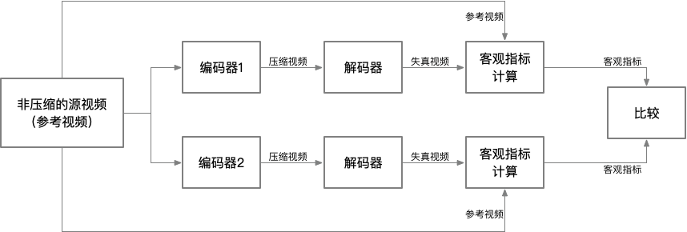

# Objective Measurements and Their Applications
客观测量在自动化环境中非常有用。例如，自动化比较两个视频编码器的质量。图4-16展示了使用全参考的客观视频质量指标进行编码器比较的流程图。

**图4-16.**一个典型的全参考的编码器比较方案

对于使用全参考的客观视频质量指标的应用而言，需要考虑如下的几个因素：

* 原视频和失真视频需要在时间维度上对齐，这样才能在相同的视频帧之间比较质量。
* 为了避免解码期间的变数，需要使用相同的解码器解码压缩的视频。
* 为了保证比较的公平性，编码器的参数必须一致或者尽可能的一致。
* 假定在编码过程不进行预处理。尽管可以在编码器之前使用预处理步骤，但在这种情况下，对于每个编码器而言，必须使用相同的预处理器。

需要注意的是，如上的方案可以利用自动化的优势，并使用大量视频剪辑来比较不同编码器，进而挖掘出各种工作负载复杂度下的不同编码器的优缺点。在不考虑网络或信道错误的情况下，这种利用源信号来比较编码器是相对公平的。在实际应用中（例如，对两个不同的移动设备上的视频拍摄器而言，计算客观质量之前会存储和解码其记录的视频），也应该尽可能在一致的环境（例如，对比过程中使用到的无线网络环境应该具备相似的丢包率或误码率）中进行编码器的质量比较。

客观视频质量测量也被广泛应用于确定视频应用中的丢帧现象。例如，如果逐帧跟踪源视频和失真视频之间的PSNR，则可以检测到失真视频中的帧丢失。在低失真的环境中，产生的压缩视频应该完美地匹配源视频。此时的PSNR应该是25 dB~40 dB之间的数字，该数值取决于引入错误的各种信道的有损特性。然而，在丢帧的情况下，会用错误的帧与源视频帧进行比较，此时将获得非常低的PSNR值，从而来指示存在帧丢失的情况。包含频繁的场景变化的视频会夸大这种丢帧检测的效果。

可以应用相同的概念来检测视频中的突发的低质量帧（帧被损坏或帧存在其他伪影）。网络错误或编码器问题，可能会导致帧损坏。但是，自动化环境中的PSNR或其它客观测量的突然下降，可能意味着此处就是发生帧损坏的位置。

