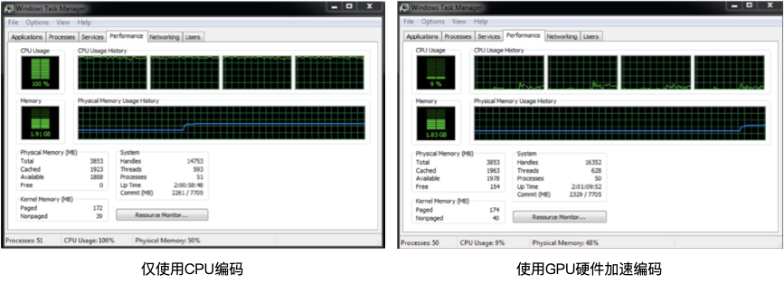

# Resource Specialization

除了最大化资源利用率之外，还可以使用专用资源来提高性能。该领域的具体改进具体如下。

## 专用媒体指令集 
现代CPU都具有增强指令集（*enhanced instruction sets*），其中就包括具有并行能力的专用媒体指令[^2]。例如，可以使用128位寄存器的单指令多数据流（*SIMD，single instruction multiple data*）[^1]计算像素矢量（该矢量具有8个16位的像素数据）的绝对误差和（*SAD，sum of absolute difference*）。SIMD仅需要加载一次数据以及一个并行操作就能完成该SAD的计算。而传统的顺序计算方法则需要加载16次数据，并进行8次减法运算，8次绝对值运算以及8次加法运算。对于诸如运动估计之类的编码任务，这种媒体指令在提升计算密集型任务的运算速度中发挥着重要作用。

## GPU加速
视频编码任务已经可以在多核CPU上执行。视频编码等计算密集型任务的运行通常会使得所有CPU核的较高的利用率。对于更高分辨率的视频，CPU可能会出现负载过载的情况，进而导致无法实时完成这些任务。很多研究工作在各种共享内存和分布式内存平台上采用并行化技术来解决实时编码的问题，我们将在下一节中对其讨论。很容易发现，仅通过CPU的方法，根本无法获得理想的可扩展的编码解决方案。

最近的处理器，如Intel Core和Atom处理器，通过使用集成的图形硬件处理器为视频编码和处理任务提供硬件加速。专用硬件单元针对某些任务进行了特殊优化。而通用计算单元可以针对各种任务进行编程，因此通用该计算单元更灵活。英特尔的图形硬件处理器是固定功能和可编程单元的组合，从而可以实现速度、灵活性、可扩展性之间的平衡。对于运行这些图形硬件的系统，还需要优化系统的电量消耗，从而在降低耗电量的情况下提供高性能。因此，只要确保输入视频数据的实时处理，使用硬件加速来处理视频编码和任务就实现了性能和功率的完美平衡。

图5-1显示了典型的编码过程中使用和不使用GPU加速时的CPU利用率信息。从图中可以明显看出，采用GPU加速不仅使CPU可用于处理其他任务，而且还提高了编码本身的性能。在此示例中，编码速度从小于1 FPS上升到超过86 FPS。

**图5-1.** 使用GPU加速前后，CPU利用率的对比

[^1]: [SSE指令](https://baike.baidu.com/item/SSE/1190064):包括70条指令，其中包含单指令多数据浮点计算、以及额外的SIMD整数和高速缓存控制指令。其优势包括：更高分辨率的图像浏览和处理、高质量音频、MPEG2视频、MPEG2加解密，语音识别占用更少CPU资源，更高精度和更快响应速度。

[^2]: [MMX指令](https://baike.baidu.com/item/MMX/1152883)：MMX是MultiMedia eXtensions（多媒体扩展）的缩写，是第六代CPU芯片的重要特点。MMX技术是在CPU中加入了特地为视频信号(Video Signal)，音频信号(Audio Signal)以及图像处理(Graphical Manipulation)而设计的57条指令，因此，MMX CPU极大地提高了电脑的多媒体（如立体声、视频、三维动画等）处理功能。