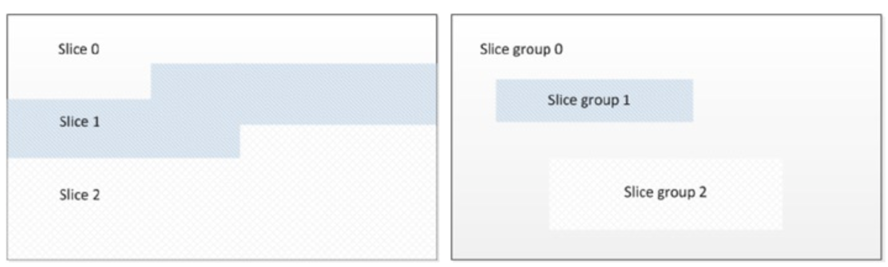
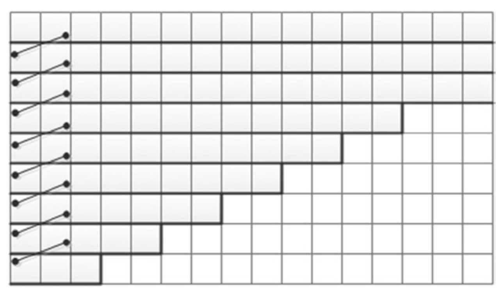

# Independent data units
为了促进并行能力和性能优化，视频编码算法通常会利用帧级（*frame-level*）独立性或帧级组（*group of frame-level*）独立性，或者将视频帧分解成独立的数据单元（切片（*slices*），切片组(*slice groups*)，瓦片（*tiles*）[^1] 或波前（*wavefronts*））。

由于运动补偿的依赖性，因此对于帧级而言，几乎没有并行性。并且即使并行化，由于帧复杂度的变化，编码和解码时间的波动也会很大，从而导致资源利用率的不平衡。另外，依赖结构（*dependency structure*）还可能会导致总体延迟随着帧级并行化而增加。

视频帧由一个或多个切片组成。切片是通常以光栅（*raster*）扫描顺序处理的一组宏块（*macroblocks*）。图5-2显示了划分为多个切片或切片组的视频帧。

**图5-2.** 视频帧划分为切片或切片组

切片主要是为了防传输错误带来的质量损失。由于切片被定义为独立的数据单元，除非有其它切片会用丢失的切片作为参考，否则切片的丢失是局部的，不会影响到其他切片。利用切片的独立属性，切片可以并行计算从而提高性能。在使用AVC编码器的实验中发现，与每帧一个切片相比，每帧四个切片可以提升5％~15％的性能，其中性能提升的幅度取决于编码参数。为了保持数据单元的独立，可能会增加每帧数据的空间冗余。因此，切片并行可能会导致明显的编码效率损失。这种编码效率损失可能会表现为视觉质量的损失。例如，在先前的AVC编码器实验中，与每帧单个切片相比，每帧四个切片导致视觉质量损失约为0.2dB~0.4dB，其中，质量损失的多少取决于编码参数。并且，如果编码器接收到每帧只有一个切片的视频序列，依赖于多切片并行处理的编码器则无法获得应有的性能提升。

H.264之后的标准中，可以将图像分成矩形瓦片：即由垂直和水平边界划分的编码树块组。与切片边界类似，瓦片边界会打破解析和预测的依赖性，从而可以独立处理瓦片。但是，诸如去块滤波器（*deblocking filtering*）的环路滤波器（*in-loop filters*）仍然可以跨越瓦片边界。瓦片允许图片分区形状，从而使得瓦片的像素点比切片具有更高的相关性，并且瓦片没有切片的头部开销。因此，与切片相比，瓦片具有更好的编码效率。但是，由于沿着瓦片边界的依赖性的破坏以及在每个瓦片开始时CABAC编码的概率性重置，与切片类似，编码效率会随着瓦片的数量增加而降低。

H.265标准中，引入波前（*wavefront*）来并行处理编码树块的行，每行在处理上一行的第二块之后再开始用可用的CABAC概率执行编码。这中处理过程产生了不同类型的依赖关系，但与切片和瓦片相比仍然具备独特的优势——在行边界处没有打破编码依赖性。图5-3展示了波前技术的例子。

**图5-3.** 适合并行处理的波前技术：对于每一行的起始宏块，CABAC的概率从上一行的第二块宏块获取

CABAC概率由前一行的第二个块而来，因此不需要改变光栅扫描顺序。与非并行比特流相比，波前提升了编码效率并且仅导致非常小的速率-失真（*rate-distortion*）差异。但是，波前依赖性意味着无法同时开始处理所有行。这导致了并行化的低效率，并且这种效率折损在多CPU中更为突出。

然而，通过重叠连续图像的执行可以降低波前并行处理的效率损失[^2]。Chi等人的实验结果表明：在3.33 GHz的12核CPU系统上解码3840×2160视频序列，重叠波前提供了近11倍的加速，而常规波前和瓦片分别提供了9.3倍和8.7倍的加速。

[^1]: 视频编码方案支持将图片划分为被称为瓦片单元的较小矩形单元。能够分别通过单独的编码器和解码器对每一个瓦片单元独立地进行编码和解码。瓦片单元的主要目的是允许图片的并行处理以便降低实现成本和复杂性。

[^2]: C. C. Chi, M. Alvarez-Mesa, B. Juurlink, G. Clare, F. Henry, et al.: Parallel Scalability and Efficiency of HEVC Parallelization Approaches.

