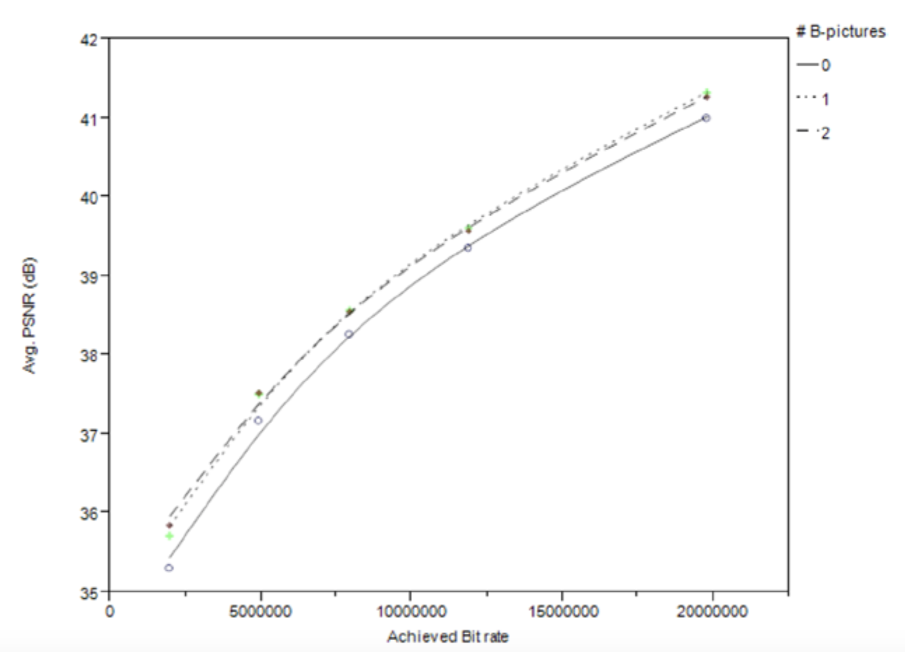
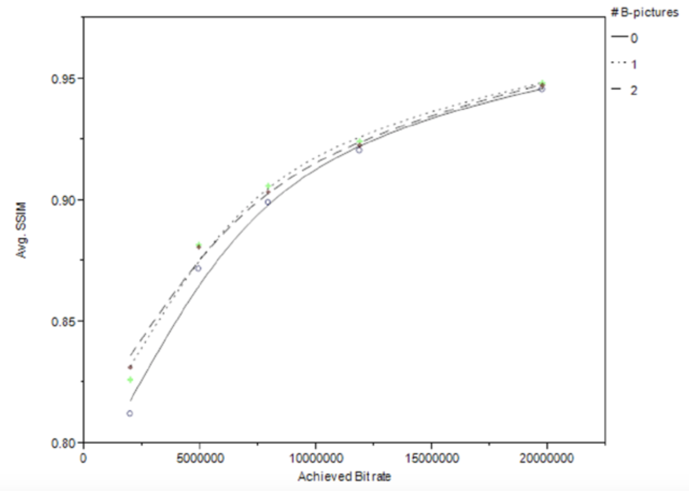

# GOP结构
编码I帧、P帧、B帧的计算量不同，因此编码不同类型帧的编码时间不同。因此，帧的组合模式——通常称为图像组（GOP，group of pictures）结构，是影响编码速度的重要因素。在H.264之前的标准中，由于运动估计及其相关的复杂性的原因，I帧的编码速度最快，B帧的编码速度最慢。然而，在H.264以及更新的标准中，由于帧内预测的原因，编码I帧可能也需要花费很长时间。

根据视频内容的差异，使用H.264标准中的B帧可以在相同质量的情况下降低多达10％的码率。使用B帧时，内存访问频率的变化在-16%~+12％之间，因此B帧对性能的影响因视频序列而异。图5-4显示了另一个实验的结果，该实验对不使用B帧，使用一个B帧，使用两个B帧时获得的质量进行对比。由实验可知，使用更多的B帧会获得更好的质量。根据经验，B帧可能使单个处理单元的编码过程更慢。但B帧具备有效地并行化能力，因为除非用B帧作为参考帧，否则B帧通常不依赖于另一个B帧。

**图5-4.** B帧对1280×720的H.264编码的视频质量的影响