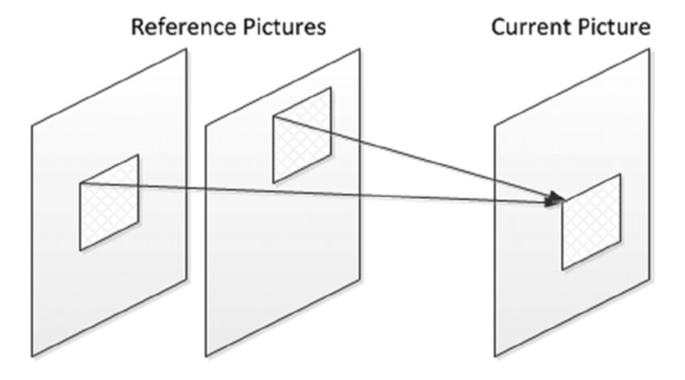

# Multiple reference pictures
很容易找到一个参考帧，从而可以产生比另一个参考帧更好的块匹配并因此降低运动预测成本。例如，在涉及遮挡区域的运动预测中，使用紧邻的先前或紧接的未来图像的规则模式对于某些宏块而言可能不会产生其最佳匹配。此时，可能需要在不同的参考帧中搜索该宏块的可见位置。有时，与单个参考帧相比，多参考帧会给出更好的运动预测——在与参考帧的特定网格不对齐的不规则对象的运动期间就是这种情况。图5-5显示了多参考帧的示例。

**图5-5.** 多参考帧的运动补偿预测

在H.264及更新的标准中，为了满足多种预测的需要，引入了多参考帧特征，从而提高视频的视觉质量。但是，在多个参考帧中执行搜索时会产生明显的性能成本。如果多参考帧中的搜索可以并行完成，则与单参考帧的运动预测相比，多参考帧可以在降低一定程度的性能的同时提供更高的视觉质量。