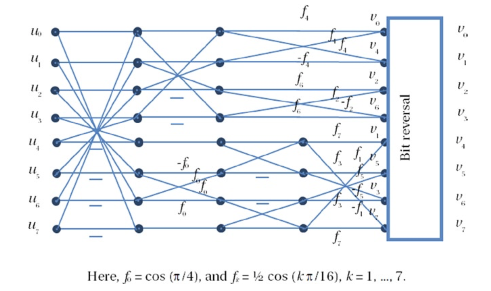

# Fast Transforms
快速变换使用因子分解和其他算法操作来降低所需的算术运算的计算复杂度。快速傅里叶变换（*FFT,  Fast Fourier Transform*）就是其中之一，FFT可以以$$O(N \log N)$$的时间复杂度完成离散傅立叶变换（*DFT*）算法的复杂度为$$O(N^2)$$的运算。规模越大的数据集，FFT带来的时间节省会越明显。实际上，FFT使得实时计算傅里叶变换成为现实，从而使得许多实际应用得以实现。此外，快速变换倾向于使用整数运算来替代浮点数运算，从而实现更有效地优化。一般而言，类似DCT的快速变换不会引入误差，因此快速DCT不会对视觉质量产生额外影响。然而，由于算术运算量的减少，功耗增加通常也不再是一个重要问题。

快速DCT或其变体普遍应用于视频编码标准。H.264以及更新的编码标准中，变换与量化通常一起执行以避免算术精度的损失。尽管如此，由于视频数据量较大，因此可以采用数据并行方法来并行化变换并提升计算性能。下面的例子用以说明数据并行方法。

考虑如下图所示的DCT第一阶段的蝶形运算[^1]，可以用$$\ref{式5-1}$$来表示：

$$
\begin{array}{21}
(u^{'}_{0}, u^{'}_{1}, u^{'}_{3}, u^{'}_{2}) = (u_0, u_1, u_3, u_2) + (u_7, u_6, u_4, u_5)\\
(u^{'}_{4}, u^{'}_{7}, u^{'}_{5}, u^{'}_{6}) = (u_3, u_0, u_2, u_1) + (u_4, u_7, u_5, u_6)
\end{array}
\tag{式5-1}\label{式5-1}
$$

假设每个输入$$u_k$$为16位整数，可以将类似的四个输入数据重新排列成64位宽的向量寄存器，如图5-6所示。对于需要执行运算的数据元素而言，必须要执行重排列操作。这样就可以并行提供64位宽的加法和减法操作，从而有效地将这部分操作的速度提升4倍。同样，可以利用更宽位数的向量寄存器来进一步提高性能。

**图5-6.** 8点DCT中用于数据并行的数据重组

[^1]: 蝶形运算，2点DFT运算称为蝶形运算，而整个FFT就是由若干级迭代的蝶形运算组成，而且这种算法采用原位运算，故只需N个存储单元。

