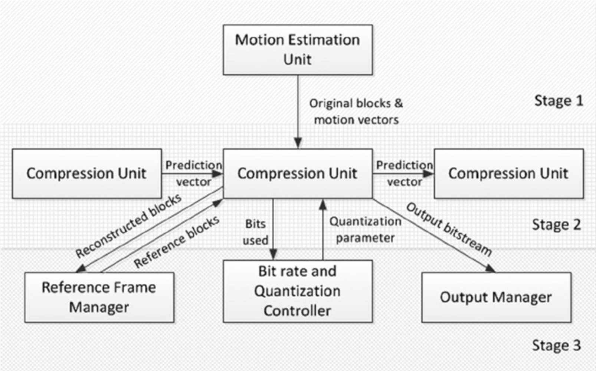

# Task Parallelization
视频编码任务的并行化方法最早是在1991年针对光盘交互式应用程序而引入的[^1]。该方法利用了多指令多数据（*MIMD，multiple instruction multiple data*）的优势。视频编码器划分为多个任务，每个任务分配给计算机的一个或多个处理器处理。该计算机具有100个节点的消息传递并行能力，并且节点由数据处理器、内存、通信处理器和I/O接口组成。这种任务并行化方法较为松散，在给定时间内，某些处理器运行不同算法的任务，而其它处理器则执行相同算法的任务。在更高的级别上，任务被分为两个阶段：用于预测和内插的运动估计阶段，其中在每个帧中搜索运动矢量；以及视频压缩，确定要使用这些运动矢量中的哪一个。

运动估计阶段的并行化本身并不是任务并行的。运动估计阶段的并行化涉及到为每个处理器分配帧以及相关的参考帧。此过程不可避免地需要将参考帧复制到几个合适的处理器上，从而产生性能开销。同样，在所有处理器执行某些任务之前，必须先读取许多帧。视频压缩阶段并没有独立的帧，因此需要并行处理帧的几个部分。由一组处理器组成的压缩单元重复接收要编码的连续块集。压缩单元的任务是模式决策，DCT，量化和可变长度编码。压缩单元产生的比特流发送到运行在单独处理器上的输出管理器，该输出管理器将来自所有压缩单元的片段组合在一起，并将结果发送到主机。压缩单元重建自己产生的结果比特流的一部分以获得参考帧。

请注意，量化参数取决于先前处理的所有块中的数据缩减量，仅依靠一个处理器无法计算量化参数。因此，必须使用专用处理器来计算量化参数，并将参数发送到适当的压缩单元，然后从每个压缩单元收集压缩数据的大小以进行进一步的计算。通常会基于先前的运动矢量对运动矢量进行差分编码，因此会引入额外的复杂度。但是，独立工作的压缩单元无法访问先前的运动矢量。因此，为了解决这个问题，压缩单元必须将比特流中使用的最后一个运动矢量发送给压缩下一个数据块的压缩单元。 图5-7显示了任务并行化方法的通信结构。

**图5-7.** 并行任务的通信结构

不管使用哪种视频编码标准或算法，该想法都可以用于视频编码。但是，可以进一步改进该思想以减少通信开销。例如，在系统中，处理器可以在环境中标识自己，并且可以将其处理器的编号作为标签附加到它们所处理的数据上。这些标签随后可以由合适的目的处理器删除，并且目的处理器可以根据需要轻松地重新排列数据。重要的是要了解：因为由于帧级别的依赖性，许多任务都依赖于其他任务，因此在任务并行化方法中必须进行适当的任务调度。

[^1]: F. Sijstermans and J. Meer, “CD-I Full-motion Video Encoding on a Parallel Computer.