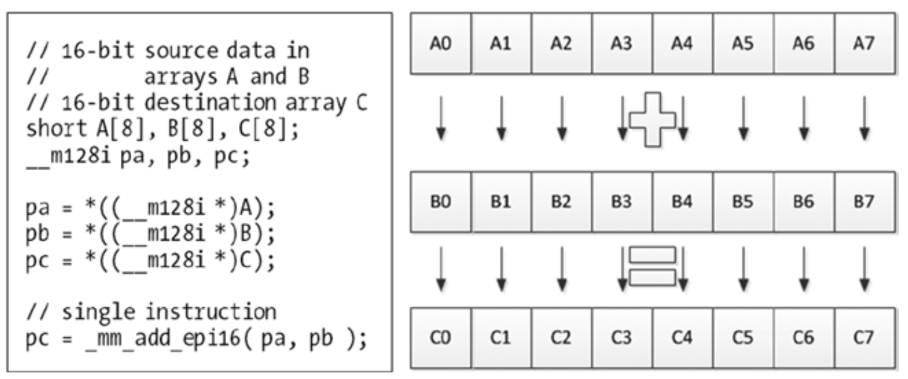

# Data Parallelization
如果可以将数据划分为独立的单元，则可以以最小的通信开销并行处理。视频数据具有这样的特征。有几种常见的数据并行化执行模式，包括单指令多数据（SIMD），单程序多数据（SPMD），多指令多数据（MIMD）等。

SIMD是处理器支持的技术，SIMD允许同时操作多个数据点。SIMD提供了数据级的并行性，并且比标量处理更有效。例如，某些循环操作在连续的迭代中是独立的，因此一组指令处理不同的数据集。在开始执行下一条指令之前，通常需要在多个数据集上执行同一指令的执行单元之间进行同步。

SIMD特别适用于在大量数据点上执行相同操作的图像和视频应用程序。例如，在亮度调整中，将相同的值添加到一帧中的所有像素（或从中减去）。实际上，这些操作非常普遍，以至于大多数现代CPU设计都包含针对SIMD的特殊指令集，以提高多媒体应用的性能。图5-8显示了SIMD技术的例子：对两个16位短整数的源数组$$A$$和$$B$$的每个元素同时做加法运算，并将对应的结果写入目标数组$$C$$。使用SIMD技术，可在一个时钟周期内完成对128位宽的数据的加法操作。

**图5-8.** SIMP示例

过程或任务级并行化通常在MIMD执行模式下执行，其中SPMD是一种特殊情况。在SPMD中，程序被分成较小的独立过程或任务，并且这些任务在具有潜在的不同输入数据的多个处理器上同时运行。与任务中的指令级相反，通常需要在任务级进行同步。通常可以在利用消息传递实现同步的分布式内存计算机体系结构中找到SPMD模式的实现。对于视频编码应用，Akramullah等人提出了一种类似的SPMD方法[^1]。

[^1]: S. M. Akramullah, I. Ahmad, and M. L. Liou, “A Data-parallel Approach for Real-time MPEG-2 Video Encoding.
