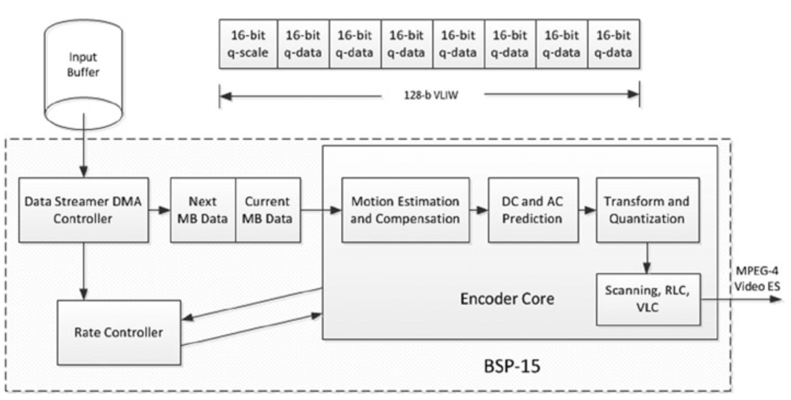

# Instruction Parallelization
编译器将视频算法的高级实现转换为低级机器指令。但是，有些指令并不依赖于先前的指令，因此，可以安排无依赖相关性的指令同时执行。 因为可以并行评估指令，因此指令之间的潜在重叠构成了指令并行化的基础。例如，考虑如下的代码：

```
R4 = R1 + R2
R5 = R1 – R3
R6 = R4 + R5
R7 = R4 – R5
```

在如上的例子中，指令1和2之间或指令3和4之间没有依赖性，但是指令3和4取决于指令1和2的完成。因此，指令1和2以及指令3和4可以并行执行。通常基于编译器的优化和硬件技术来实现指令的并行化。但是，不确定的指令（*indefinite instruction*）的并行化是不可能的。并行化通常受数据依赖性，过程依赖性和资源冲突的限制。

精简指令集计算机（RISC）处理器中的指令有四个阶段可以重叠，以实现每个周期接近一条指令的平均性能。这些阶段是：指令获取，解码，执行和结果写回。通常同时获取和解码两个指令$$A$$和$$B$$，但是如果指令$$B$$对指令$$A$$具有写后读取依赖性，则$$B$$的执行阶段必须等待直到对A的写入完成。因此，在一次执行一条指令的标量处理器中，每个周期不能实现一条以上的指令。但是，超标量处理器利用指令并行化来一次执行多个不相关的指令。例如，$$z = x + y$$和$$c = a * b$$可以一起执行。在这些处理器中，硬件用于检测并并行执行独立指令。

作为超标量处理器的替代方法，超长指令字（VLIW）处理器体系结构利用了指令并行化的优势，并允许程序显式指定要并行执行的指令。这些架构采用积极的编译器，可以在每个周期的一个VLIW中调度多个操作。在这样的平台上，编译器负责查找和调度并行指令。在实用的VLIW处理器（如Equator BSP-15）中，集成的缓存很小——32KB的数据缓存和32 KB的指令缓存通常作为处理器内核和内存之间的桥接（*bridges*）。连续传输数据非常重要，这样就可以避免等待时间。

为了更好地理解如何在视频编码中利用指令并行性，考虑在VLIW平台上实现视频编码器的示例[^1]。图5-9给出了编码系统的通用结构的框图。


**图5-9.** VLIW平台上的视频编码器的框图

图5-9中，宏块以流水线方式处理，同时它们在编码器核心的各个流水线级中经历不同的编码任务。DMA（*direct memory access*）控制器（通常称为数据流处理器）有助于预取必要的数据。使用双重缓冲技术来连续提供流水线级。该技术以交替方式使用两个缓冲区——当主动使用一个缓冲区中的数据时，下一组数据将加载到第二个缓冲区中。处理活动缓冲区的数据后，第二个缓冲区将成为新的活动缓冲区，并开始对其数据进行处理，而数据处理完毕的缓冲区则将被新数据重新填充。这种设计有助于避免可能存在的性能瓶颈。

需要特别注意，把适当的数据存储到缓存中非常重要，以便可以最大化地利用数据高速缓存和指令高速缓存。为了最大程度地避免缓存未命中的情况，流水线中每个阶段的指令必须满足指令高速缓存的要求，而数据必须满足数据高速缓存的要求。可以重新安排程序，以便编译器可以生成满足指令高速缓存要求的指令。同样，仔细考虑数据预取将保持数据高速缓存处于满额的状态。例如，可以以某种方式存储量化的DCT系数，以帮助某些帧内预测模式下的数据预取，此时，在给定时间内仅需要七个系数（从上一行或从左列）。系数具有（-2048，2047）的动态范围，每个系数需要13 bits，但一般用16位有符号实体表示。七个这样的系数将适合于两个64位寄存器，其中一个16位插槽不能占用。注意，可以将与该流水线级相关的16位元素（例如量化器缩放比例或DC缩放比例）与量化系数打包在一起，以填充寄存器中的空闲插槽，从而实现更好的缓存利用率。

[^1]: S. M. Akramullah, R. Giduthuri, and G. Rajan, “MPEG-4 Advanced Simple Profile Video Encoding on an Embedded Multimedia System.