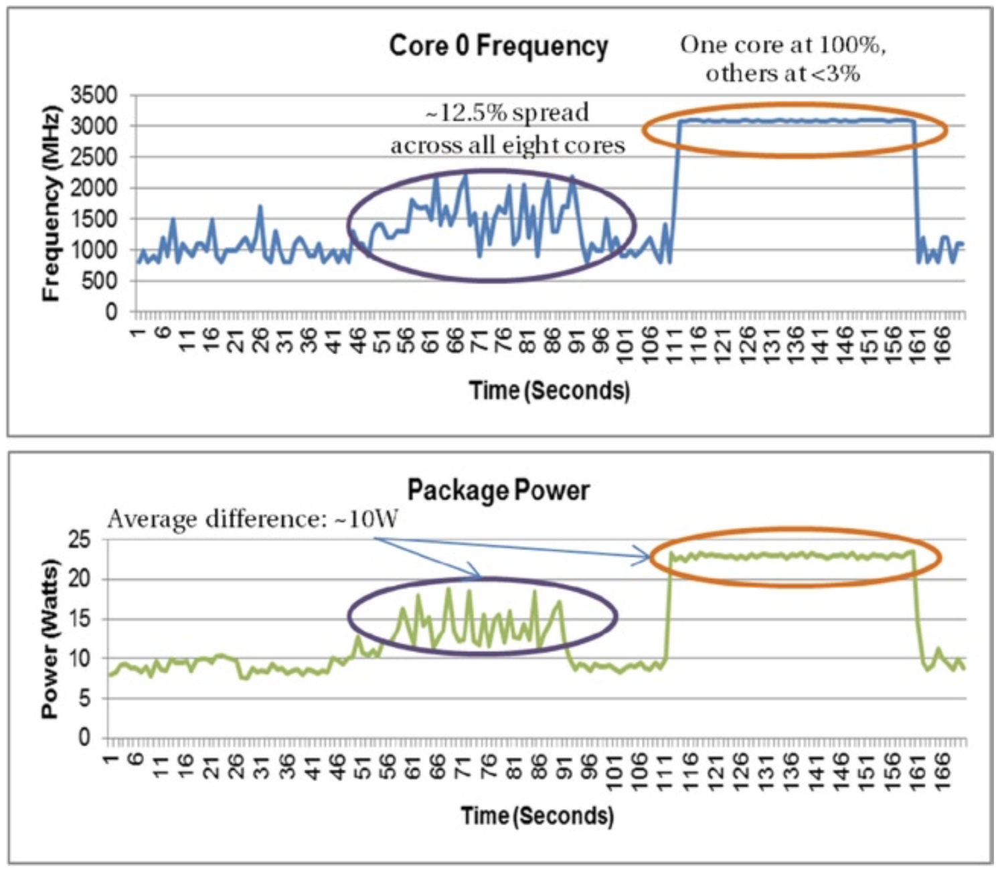

# 超频
尽管不建议这样做，但通过修改系统参数可以使处理器的运行速度超过其额定的时钟频率，一般称该操作为超频。尽管可以提高速度，但出于稳定性目的，超频可能还必须在更高的电压下运行。因此，大多数超频技术会导致功耗增加，并会产生更多的热量。如果处理器要保持功能正常，则必须予以散热。这又增加了风扇噪声和冷却的复杂度。相反，部分制造商会降低电池供电设备的处理器的频率，以延长电池寿命。超频技术也可以应用于芯片组，独立显卡或内存。

超频会让系统超出当前系统组件的能力。由于增加了散热要求，系统的可靠性会降低，并且组件存在潜在损坏的风险。超频的受众主要是发烧友和业余爱好者，而不是专业用户。

成功的超频需要对电源管理有充分的了解。正如我们将在第6章中看到的那样，现代处理器中的电源管理非常复杂。电源管理需要处理器硬件和操作系统协才能实现。在此过程中，会根据当前工作负载动态调整处理器核的频率。在这种情况下，将某个内核推至100％的频率可能会对功耗产生不利影响。图5-10的例子说明了这一概念，其中工作负载运行在四核（八个逻辑核）的英特尔第二代酷睿处理器。

**图5-10.** 将某个内核推至100％的频率对功耗造成的影响

在多核处理器中，如果将一个CPU内核的频率提高到100％，而将其他CPU的内核空闲，则会导致更高的功耗。在图5-10的例子中，与使用全部八个CPU核相比，单个CPU核以100％的频率运行会消耗多达~10瓦的功率，并且所有CPU核的平均频率分布为~12.5％。

最新的具有集成显卡的Intel处理器允许采用硬件加速的视频编码器可以在必要时自动达到处理器的最大频率，然后在完成任务后将其保持在空闲状态。第6章将讨论该机制的详细信息。在现代处理器的功耗受限的环境中，最好将频率调整留给硬件和操作系统。