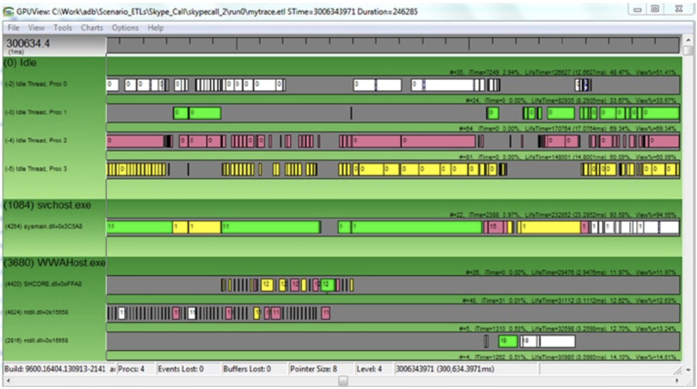
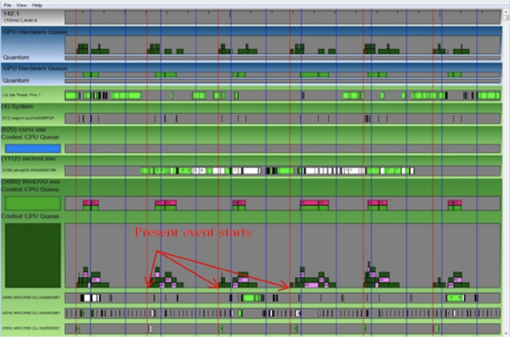
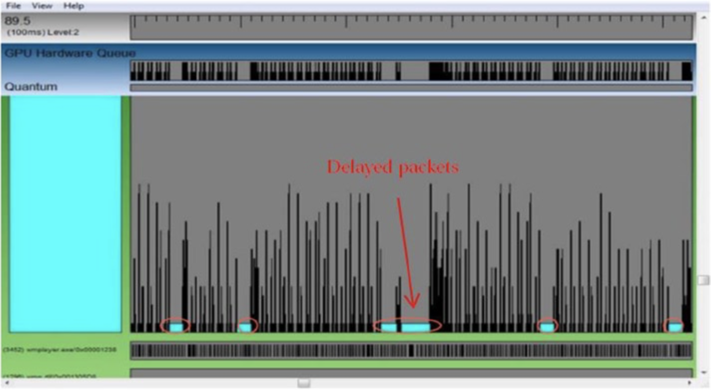
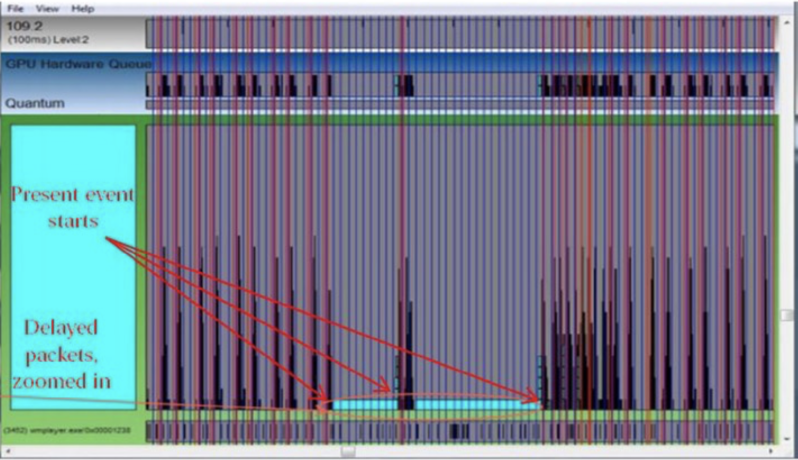

# Tools and Applications
大量的可用于性能测量的工具可以说明性能测量的重要性。有的性能分析工具支持采样和基于编译器的应用程序性能分析，有时还具有上下文相关的调用图功能。有的工具则支持基于硬件事件的非侵入式且开销较低的采样和分析。还有的工具会利用现代微处理器提供的硬件性能计数器。部分工具可以发现与数据局部性、缓存利用率、线程交互等特性有关的性能问题。在本节中，我们简要讨论了适用于视频应用程序（尤其是GPU加速的应用程序）的性能测量的流行工具。第6章简要介绍其它的流行工具，例如Windows Perfmon，Windows Xperf和Intel Graphics Performance Analyzer。

## VTuneAmplifier
VTune Amplifier XE 2013是Intel开发的流行的性能分析器[^1]。VTune支持各种编程语言的性能分析，包括C，C ++，FORTRAN，Assembly，Java，OpenCL和OpenMP 4.0。VTune为热点（*hotspot*），调用树，线程，锁，等待，DirectX，内存带宽等信息采集了丰富的性能数据，并为满足各种性能调整需求提供所需要的数据。

热点分析提供了一份使用CPU时间较高的函数的有序列表，用以指示可带来最大收益的性能调整的位置。热点分析还可以利用锁和等待分析来对多线程进行调整。这使用户能够快速查找信息来确定并行程序的性能降低的原因，这些可查找的信息包括：线程在锁等待上的时间，而线程在等待期间未充分利用CPU。诸如热点、锁定、等待之类的分析文件（*profiles*）都使用了可在Intel和兼容处理器上运行的软件数据收集器。该工具还提供高级热点分析。英特尔处理器的片上（*on-chip*）性能监视单元（*PMU，Performance Monitoring Unit*）通过采样硬件事件实现以极低的开销提高数据收集能力。因此，高级热点分析可以用PMU来识别很小的性能瓶颈并发现快速函数的性能瓶颈。此外，该工具还支持高级硬件事件分析文件，例如内存带宽分析、内存访问和分支错误预测，从而可以帮助发现调优机会。最新的版本还支持可选的堆栈样本集合，以标识程序的调用顺序。此外，该工具还支持在不重启应用的情况下分析远程系统。

## GPUView
GPUView由Matthew Fisher和Steve Pronovost开发，GPUView是一种用于确定GPU和CPU性能的工具。后来，将GPUView合并到Windows Performance Toolkit中，并作为Windows SDK的一部分下载[^2]。GPUView用于DMA（*直接内存访问*）缓冲区处理以及视频硬件上所有其它视频处理过程的性能分析。对于GPU加速的DirectX应用程序，GPUView是一种功能强大的工具。可以用GPUView了解CPU上完成的工作与GPU上完成的工作之间的关系。GPUView使用ETW（*Windows事件跟踪，Event Tracing for Windows*）机制对系统和应用程序的性能以及资源使用情况进行详细测量并分析。数据收集过程包括：启用跟踪捕获，运行需要性能分析的测试应用程序的场景，停止数据捕获。数据收集最终会将数据保存在ETL（*事件跟踪日志，event trace log*）文件中。GPUView可以在同一台或不同计算机上分析ETL文件并以图5-11所示的图形格式显示ETL信息。

**图5-11.** 使用GPUView分析不同线程的活动

GPUView在硬件加速视频应用程序的分析和调试中非常有用。例如，如果视频播放应用程序存在掉帧现象，则会对用户体验造成负面影响。在这种情况下，使用GPUView检查事件跟踪可以帮助我们确定问题的原因所在。图5-12给出了正常播放视频的事件跟踪的例子，其中工作负载按固定间隔均匀分布。图5-12中的蓝色垂直线显示正常的vsync，红色垂直线显示当前事件。

**图5-12.** 正常播放视频的事件跟踪

图5-13展示了同一视频播放应用程序的事件轨迹，但是当帧显示截止时间到期时，播放程序会丢弃视频过期的视频帧。与图5-12中所示的正常模式相比，此轮廓看上去大不相同。在放大版本中，当前事件行是可见的，从中可以不难理解，当应用程序将视频数据包发送到GPU进行解码时，时常会出现长时间的延迟。因此，使用GPUView可以轻松识别并解决问题的根本原因。

缩小的播放分析文件

放大的播放分析文件

**图5-13.** 掉帧情况下的事件跟踪信息

[^1]: The latest version of VTune Amplifier for Systems (2014) is now part of Intel System Studio tool suite at: https://software.intel.com/en-us/intel-system-studio.

[^2]: Available from http://msdn.microsoft.com/en-us/windows/desktop/aa904949.aspx.