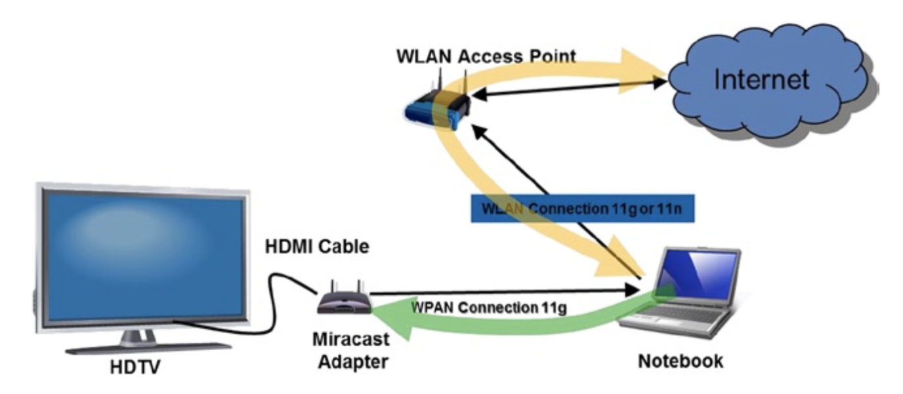
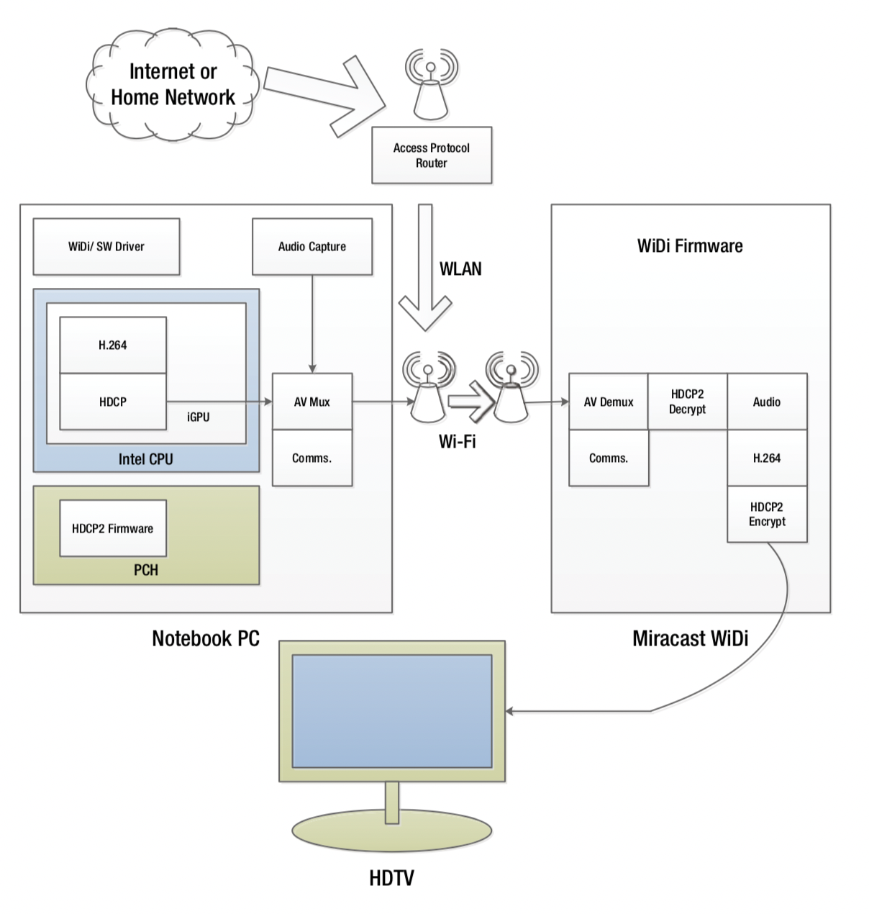
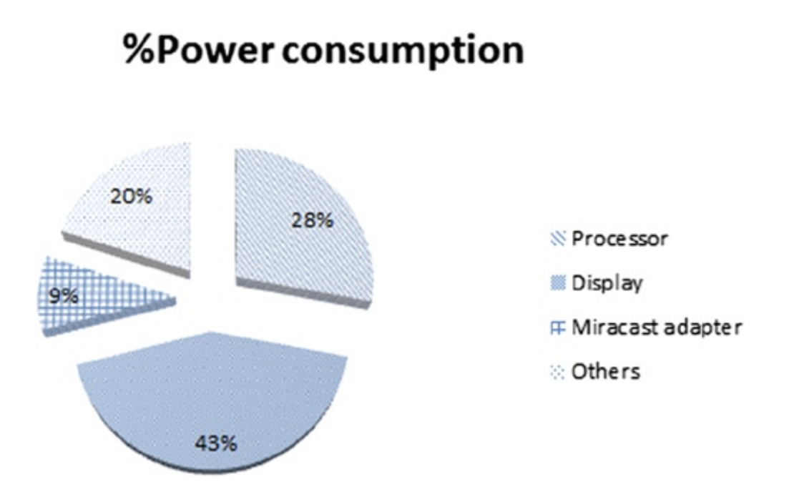

# 媒体应用

多媒体应用通常属于高耗电类型应用。随着对越来越多的功能的需求，对功耗的要求日益提高。某些场景下，应用程序可能需要同时开启多个进程。用作娱乐平台的移动设备，通常运行游戏和视频这两种主要类型的应用程序。2D和3D视频游戏是最受欢迎的，但这些设备也需要运行许多其他应用程序支持。如：
* 静态图像拍摄
* 静态图像预览/取景器
* 无线投屏或Miracast：克隆模式或扩展模式
* 基于浏览器的视频流
* 录像和双机码流录制
* 视频回放
* 音频播放
* 浏览互联网
* 可视电话和视频聊天
* 视频会议
* 视频转码
* 视频电子邮件和彩信
* 视频上传到互联网
* 视频编辑
* 增强现实
* 生产类应用

以上应用大多数是通过特殊的软件程序实现的，如果硬件平台支持，则应用可能会受益于硬件加速，以此获得更好的用户体验。

硬件平台支持如英特尔处理器，通过集成图像处理器，在应用程序进行图像处理时可进行硬件加速。这种集成处理器既可以用作通用计算平台，又可以满足特殊应用的需求。将图形单元集成到中央处理器后，移动设备可以省去体积更大的视频硬件卡，和定制的视频处理器，从而保持适合移动应用的小尺寸。

在许多移动设备上，多媒体应用程序的某些组合被用户同时使用。例如，当用户正在浏览Internet时，音频播放可能会继续，或者视频播放可能会同时进行视频录制。其中一些应用程序使用通用的硬件模块来实现视频编解码器和处理任务的硬件加速。从系统资源调度和利用的角度出发，弄清楚这些硬件模块的并行操作是非常有意思的事情。

这种复杂系统行为，如多方视频会议，以及通过Miracast Wireless Display传输视频。经过Wi-Fi认证的Miracast是
一种行业标准的解决方案，无需电缆或网络连接即可在设备之间无缝显示多媒体。它使用户可以通过大屏幕电视上的智能手机查看图片，或通过平板电脑上的家用有线电视盒观看直播节目。连接功能是使用Wi-Fi Direct的设备内部功能，因此不需要单独的Wi-Fi访问[^1]。

图6-1显示了Miracast应用程序的使用模型。

图6-1.通过Miracast传送视频

 

为了更好地了解视频应用程序的功耗，让我们详细分析一种多媒体的使用：Miracast Wireless Display.2上的视频传输[^2]。

Wireless Display（WiDi）是最初为实现以下目的而开发的英特尔技术：
与Miracast相同的目标。现在Miracast已成为行业标准，自3.5版以来，它已在英特尔（R）无线显示（TM）中得到支持。此应用程序的目标是提供一种具有高级内容功能的无线显示解决方案，该解决方案允许PC用户或手持设备用户通过与远程显示器的无线链接来远程显示视听内容。换句话说，笔记本电脑或智能手机会通过无线局域网从Internet接收视频，或者使用本地摄像头捕获视频。使用本地播放应用程序在设备上播放视频。然后，用于Miracast无线显示的特殊固件将捕获设备的屏幕并执行硬件加速的视频编码，以便通过Wi-Fi数据交换技术将压缩的比特流发送到Miracast适配器。适配器将位流解码为HDMI格式，然后通过HDMI电缆连接将其发送到显示设备。

端到端框图如图6-2所示。

图6-2.Miracast无线显示端到端框图

 

在图6-2中，主要的功耗硬件模块是CPU，PCH，集成GPU中的视频编解码器，硬件加速的内容保护模块，内存，笔记本的本地显示器以及远程HDTV显示。Miracast无线显示适配器主要运行无线显示固件，并且消耗较少的电量。 本示例中的典型功耗分布如图6-3所示。

图6-3.Miracast无线显示应用程序中按组件的典型功耗分布

 

如图6-3所示，显示器通常消耗大部分功率，在此示例中，显示器消耗的功率约为处理器的1.5倍。 Miracast适配器本身消耗的电量适中-在此示例中，大约占应用程序总功耗的9％。由于此应用程序的复杂性，应在性能需求和功耗之间保持谨慎的平衡，以便可以进行适当的优化和折中，以获得令人满意的用户体验。

另一个常见的多媒体应用是视频播放以及关联的音频。 Agrawal等人3提供了对该应用程序的详细分析[^3]。在这里，我们仅注意到通过执行媒体播放的硬件加速，总体功耗从〜20W降低至〜5W，同时功耗曲线也发生了变化显着。媒体回放管道中的各种任务都可以通过硬件加速来提高性能，因为这些任务从CPU转移到了具有更好功率性能特性的专用固定功能硬件上。

通过对这些应用程序的分析，可以确定哪些模块是电源优化的主要候选对象。例如，可以通过将诸如色彩空间转换之类的任务从显示单元迁移到GPU来实现一些功耗优化。某些英特尔平台具有这些功能，可以实现高水平的功耗优化。本章稍后将详细讨论各种功率优化技术。

[^1]: 详情请见 (www.wi-fi.org/discover-wi-fi/wi-fi-certified-miracast). 
[^2]: 详情请见 (www.ssl.intel.com/content/www/us/en/architecture-and-technology/intel-wireless-display.html). 
[^3]: A. Agrawal, T. Huff, S. Potluri, W. Cheung, A. Thakur, J. Holland, and V. Degalahal, [Power Efficient Multimedia Playback on Mobile Platform,] Intel Technology Journal 15, no. 2 (2011): 82–100.
