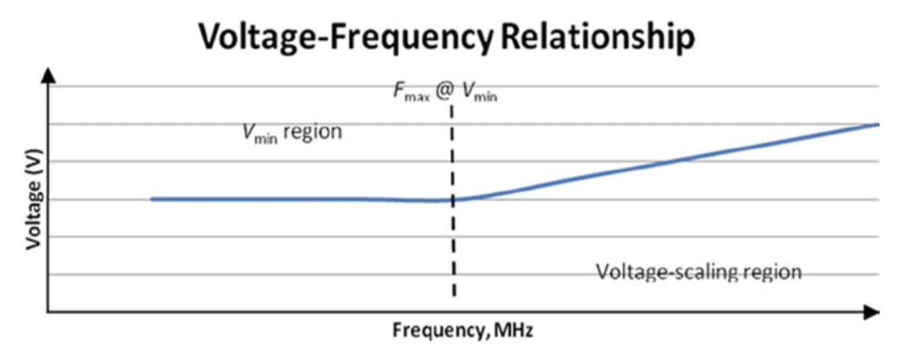
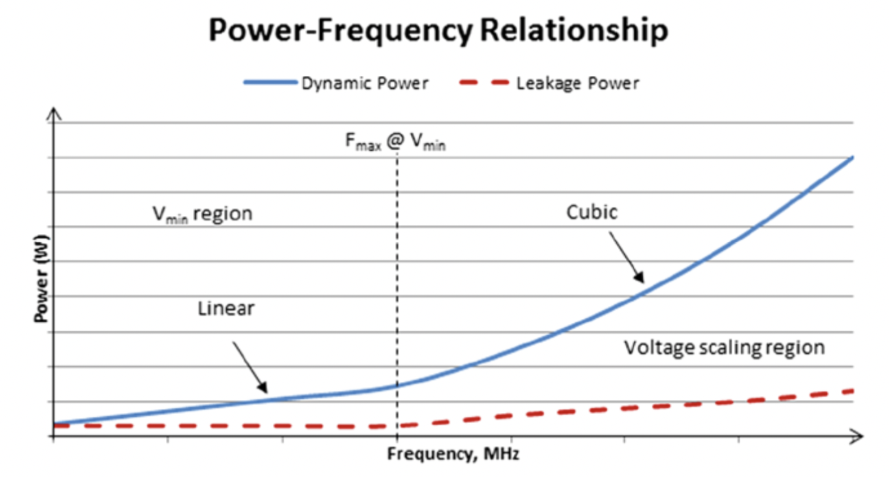

# 电压-频率曲线

了解处理器电压和频率之间的关系至关重要，因为CPU和集成GPU都遵循这种关系以便扩展。 操作系统请求的P状态实际上是V-F曲线上的特定操作点。
如图6-4所示，电压与频率的关系曲线倾向于有一个拐点，在该拐点处，电压开始随频率成比例变化。

图6-4. 典型处理器的电压-频率关系

 

到目前为止，无论频率如何变化，都需要一个最小电压Vmin来使电路工作。 最小电压Vmin时的最大频率Fmax是处理器部分可以以Vmin工作的最高频率。
如图6-5所示，这是功率效率最佳的地方。 将频率增加到超过Fmax要求增加电压供应，以使电路能够工作。 在电压标度区域，所需的电压标度与频率呈合理的线性关系。 该区域提供了降低功率的机会，如稍后所述。

图6-5显示了典型处理器中的功耗与频率的关系以及功耗优化的方向。

图6-5. 频率功率关系和优化

 

在Vmin区域，功率下降的速度不如频率快。 当动态功率随频率下降时，泄漏功率保持恒定。 另一方面，在电压定标范围内，功率的增加速度远快于频率，因为电压定标大致呈线性随着频率 动态功率随V2f上升而泄漏功率随V3大致上升。 泄漏功率仅取决于少量的泄漏电流，并且相对于频率遵循与电压曲线几乎相同的模式。