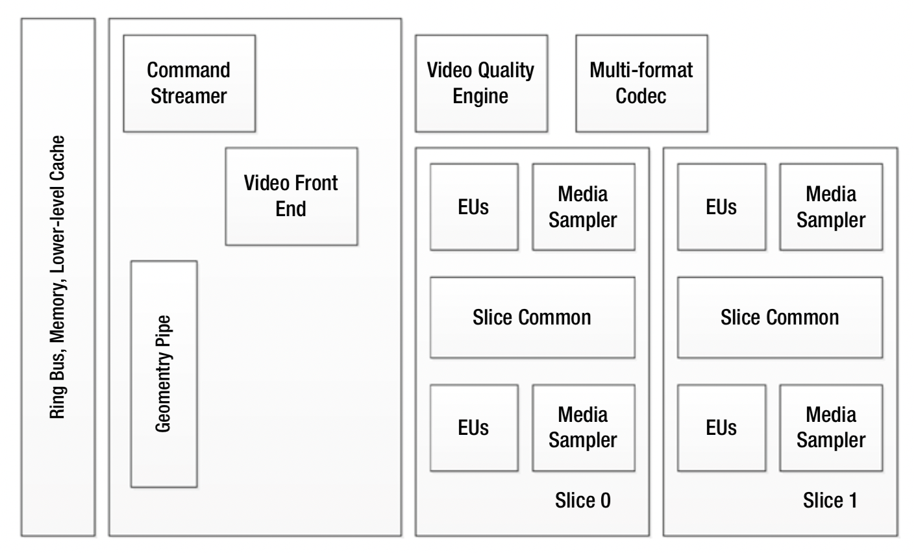

# 架构优化

在处理器体系结构级别优化电源效率的技术包括：
* 硬件-软件分区
* 动态电压和频率缩放
* 电源门控
* 时钟门控
* 切片门
* 使用低级缓存

## 软硬件分区
优化硬件和软件交互的方法已经发生了范式转变。较早的方式是通过消除执行瓶颈来获得性能。例如，如果CPU是图形应用程序的瓶颈，那么主要的性能和性能调整方法就是使用更好的CPU或调整CPU代码以最大化图形性能。但是，处理器架构师很快意识到，仅消除执行瓶颈是不够的。从功耗的角度来看，也禁止以最大的性能同时运行系统的所有子部分，因为各种组件都在争夺它们在功率分配中的占比。

这种实现带来了两个优化方向：（a）可以将一个子部分中节省的功率应用于另一子部分； （b）未使用的功率可以应用于Turbo行为。因此，要考虑整个系统的电源管理以及在CPU，图形和其他子系统之间切换电源的考虑。因此，软硬件交互的新理念不仅旨在消除性能瓶颈，但还要继续进行调整以提高效率并节省成本
力量。例如，现在将重点放在设计目标上，包括：
* 减少CPU处理
* 优化驱动程序代码以使用最少的CPU指令来完成任务
* 简化设备驱动程序接口以匹配硬件接口，以最大程度地减少命令转换成本
* 对某些任务使用专用硬件，并采用平衡的方法执行任务
固定用途的硬件通常使用最少数量的门电路来实现，这些门电路用于切换状态或在状态之间切换以执行某些特定任务。由于动态功耗是要切换的门数量的函数，并且切换次数越少意味着动态功耗就越小，因此与通用硬件相比，在专用固定功能硬件上执行相同任务是有益的可能无法为该特定任务使用最佳数量的开关门电路。显然，如果任务的性质发生变化，则无法使用专用硬件，因为它通常不够灵活，无法适应使用方式的变化。在这种情况下，可以通过牺牲任务的灵活性以及通常通过迁移工作负载来实现节电
从通用硬件到固定功能硬件。硬件-软件分区的仔细设计对于以这种方式节省功率是必要的，并且非可编程任务可以从通用执行单元迁移到固定目的硬件。例如，使用为该任务明确设计的GPU硬件运行的视频处理算法通常比运行与CPU上运行的软件相同的算法消耗更少的功率。

## 动态电压和频率缩放
为了降低功耗，可以使用动态电压和/或频率缩放功能以可能降低性能的价格来更改CPU内核电压，时钟速率或两者。可替代地，可以以更高的功耗为代价来实现更高的性能。但是，正如前面的P状态讨论中所提到的，随着CPU技术的发展，此过程变得越来越复杂，并且有许多促成因素，例如
多个CPU内核和GPU，热状态等。另一方面，动态电压和频率缩放之外的新技术正在涌现以应对挑战。

## 电源门控
处理器可以通过不向未使用的电路部分供应电流来有选择地关闭内部电路的电源，从而降低功耗。这可以通过硬件或软件来完成。此技术的示例包括Intel Core和AMD CoolCore，在多处理器环境中，在给定的时间仅某些核心处理器（或这些处理器中的部分电路）处于活动状态。
电源门控通常比时钟门控对设计的影响更大，并且可能导致门控状态进入和退出等待时间更长。通常在节省的功率和所涉及的延迟之间考虑架构上的折衷。另一个重要的考虑因素是用于电源门控电路的面积（如果实现）
在硬件上。例如，在细粒度的功率门控中，可以将开关晶体管合并到标准单元逻辑中，但是它仍然具有较大的面积损失，并且每个单元难以独立进行电压控制。另一方面，在粗粒度电源门控中，网格型睡眠晶体管通过共享的虚拟电源网络在本地驱动单元，并以牺牲灵敏度为代价来节省面积。
为了从功率门控状态快速唤醒，有时保留寄存器可用于关键应用。这些寄存器总是上电，但是它们具有特殊的低泄漏电路，因为它们保存了功率门控模块主寄存器的数据，从而可以快速重新激活。

## 时钟门控
时钟门控是一种流行的技术，它通过使用较少的开关逻辑并通过关闭不必要的时钟电路来减少动态功耗，从而节省了在给定时间切换无用状态所需的功率。时钟门控可以用RTL代码实现，也可以手动插入设计中。
时钟门控有几种形式，从手动到全自动，可以结合使用，也可以分开使用，具体取决于优化情况。一方面，由驱动程序软件执行手动时钟门控，其中驱动程序根据需要管理和启用空闲控制器使用的各种时钟。另一方面，在自动时钟门控中，硬件可以检测到空闲或无工作状态，并在不需要时关闭给定时钟。例如，在特定板上，内部总线可能使用自动时钟门控，因此它会暂时关闭，直到处理器或DMA引擎需要使用它时，而该总线上的其他外围设备如果未使用则可能会永久关闭。或在该板上不受支持。

## 切片门控
当前的英特尔处理器，例如第四代核心处理器架构
或更高版本具有集成的图形处理单元，该图形处理单元除了具有用于特定任务的固定功能硬件外，还具有可编程执行单元（EU）的阵列。欧盟与媒体采样器一起按切片排列。例如，某些第四代核心SKU具有40个EU，分布在两个等效片之间，每个切片包含20个EU，并且位于两个不同的电源域中。图6-6显示了典型的英特尔第四代核心处理器图形执行单元的切片结构。

图6-6. 英特尔第四代核心处理器图形执行单元分片结构

 

由于硬件加速的多媒体任务需要图形硬件中的许多不同硬件资源，因此某些媒体任务可能会对切片内部的硬件资源（例如EU或媒体采样器）以及切片外部的硬件提出不同的要求，例如作为视频前端或视频质量引擎。对于某些需要基于切片的资产进行相对较少工作的媒体工作负载，处理器可以关闭一个切片以节省泄漏功率。例如，对于某些媒体工作负载，需要的EU少于20个，因此驱动程序软件可以关闭一个片的电源，而不会影响性能。这是切片门控，也称为切片关闭。切片门控的优势在于，它可以在各种任务中最大化功率效率。

## 使用低级缓存
通过使用低级缓存和设计算法以有效方式利用这些缓存，可以显着降低内存能力。除非使用内存受限的系统，否则视频应用程序通常是计算绑定的，而不是内存绑定的。因此，算法可以利用存储器带宽减少方法的优势，从而降低功耗。例如，在英特尔核心架构中，缓存按层次结构排列，其中同时使用了低级缓存和三级缓存。由于较低的内存访问成本，因此可以实现功耗优化。