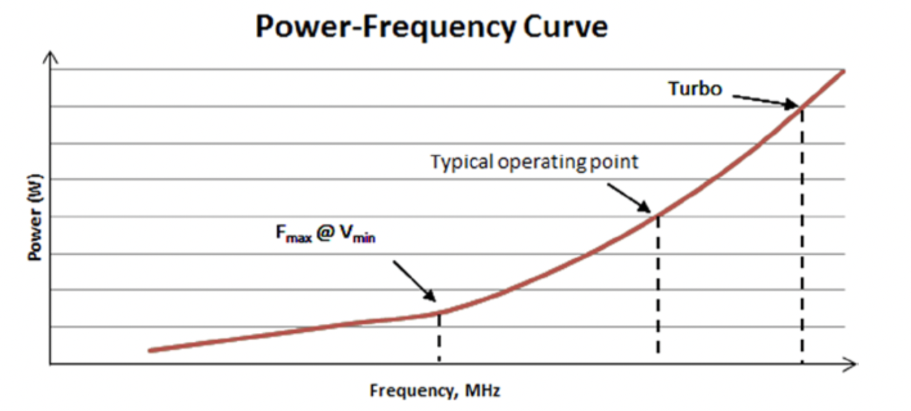

# 系统集成优化

可以在系统集成期间优化软件堆栈中各个层之间的交互，以产生更节能的解决方案。 操作系统，图形驱动程序，诸如英特尔媒体软件开发套件（SDK）之类的中间件以及应用程序可以在这种优化中相互配合。 由于这些层通常是由不同的公司开发的，因此很自然地期望这种交互会导致效率低下。 为了提高层间效率，可以考虑采用以下方法进行系统集成优化：
* 减少层数。
* 增进对各层作者的理解关于彼此的能力和局限性。
* 重新定义图层的边界。
但是，由于缺少此类根本方法，并且在这些方法可用之前，仍可以在各个级别上进行系统集成优化，其中一些方法如下。

P-F曲线上的系统工作点
图6-7在最小的工作点（在Vmin时为Fmax）和最大的工作点（以Turbo频率运行）相比，在工频曲线上显示了典型的系统工作点。

图6-7. 典型系统工作点

 

如图6-7所示，在功率曲线的电压缩放范围内，调整系统的工作频率对于节省功率很重要。只要满足性能要求，就有可能偶尔以较低的频率运行系统并节省功率。从功耗的角度来看，最佳工作点是Fmax（Vmin）;但是，此频率可能不足以用于某些应用。在另一方面，从性能的角度来看，最佳工作点是在Turbo频率范围内。根据资源利用配置文件，可以
知名的图形驱动程序来确定如何调整处理器的频率，并且有可能在Turbo和常规工作频率之间动态移动。
随着操作系统管理电源，某些系统提供了各种电源策略，范围从低功耗低性能到高性能高功率。另外，BIOS提供了一些灵活性来设置系统频率。最终用户可以利用这些电源策略将系统工作点调整到适当的水平；例如，使用节电策略可以降低工作频率，从而节省功耗。

# 智能调度
硬件-软件分区的级别通常在体系结构优化的范围内。 但是，系统级优化也应仔细考虑仅在架构设计中未涵盖的节能机会。 例如，在软件层和专用硬件单元之间调度和迁移任务是可以提供这种节能机会的方式。

操作系统为CPU执行任务调度，而图形驱动程序可以为GPU调度和管理任务。智能调度和
CPU和GPU之间的负载共享是一个活跃的研究领域，中间件和应用程序层也可能对此做出重要贡献。因此，重要的是找到最有效的处理位置。例如，仅对CPU工作进行多线程操作可能不够，并且就每次操作的焦耳效率而言，每秒的操作效率可能较低。
要完成从CPU到更省电的专用硬件模块的此类任务迁移，需要执行堆栈各层的合作。为了便于调度，有时需要将系统的一部分划分为几个较小的块。例如，可以与三个运行时环境（例如OpenGL运行时，Direct3D 11运行时和Direct3D 9运行时）进行交互的共享用户模式驱动程序（UMD）可以重新定义并分为三个组件： OpenGL UMD，D3D 11 UMD和D3D 9 UMD。这将有助于特定的硬件访问以及与运行时环境的交互；它将使系统更适合于电源门控。
类似地，内核模式驱动程序针对每次调用重复执行的一些固定工作可能会移至硬件本身。可以在英特尔第四代核心处理器体系结构中找到此类系统级优化的示例，其中使用此类系统级优化可使流行的3D游戏应用程序的CPU功耗降低2.25W[^17]。

# 减少占空比
通过并行化系统中的基本活动任务（例如，CPU中的任务），
GPU，内存和I / O子系统-整体非核心工作周期可以最小化。这将使相关功率子域仅在需要时才用于所需操作，并且仅在最短时间内保持活动状态，否则将其关闭。功率子域包括各种传感器，PLL，存储器接口互连总线等，可以对其进行单独控制以最大程度地降低功耗。
此外，为了在更高效的工作点上运行，可以通过沿电压-频率曲线移动并使用来减少处理器的占空比。
在较长时间进入空闲状态之前，请在较短的时间内提供较高的频率和较高的功耗。对于整个持续时间，这通常会导致较低的功耗。相反，对于相同的频率，可以使用较低的电压设置来节省功率，因为​​功率与电压的平方成正比。占空比减少通常是通过图形内核模式驱动程序在系统集成优化级别完成的。
图6-8描绘了占空比减少算法的效果，该算法的重点是在较短的时间内使用较高的频率来完成视频应用程序的任务，而CPU则在较长时间处于空闲状态。在此示例中，CPU利用率降低了约20％。

图6-8. 占空比减少对CPU利用率的影响

 

[^17]: Blythe, "Technology Insight."