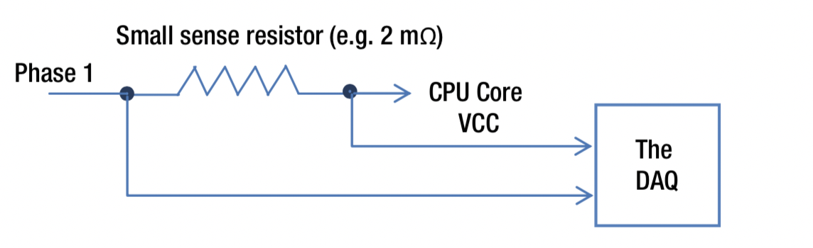
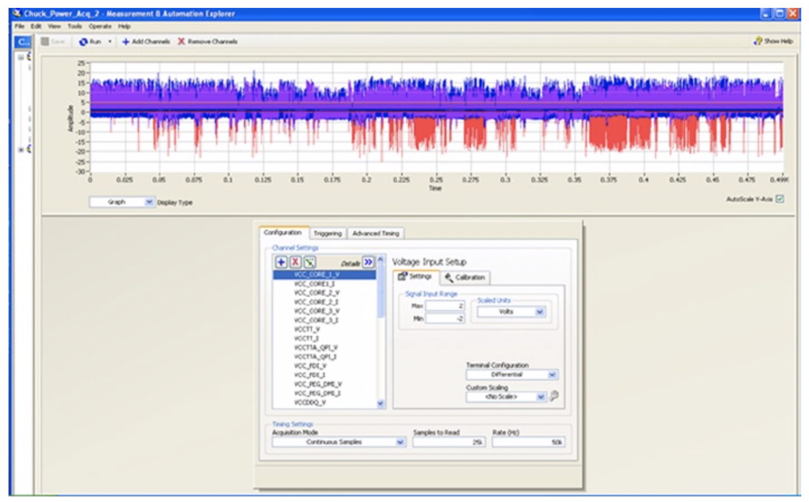
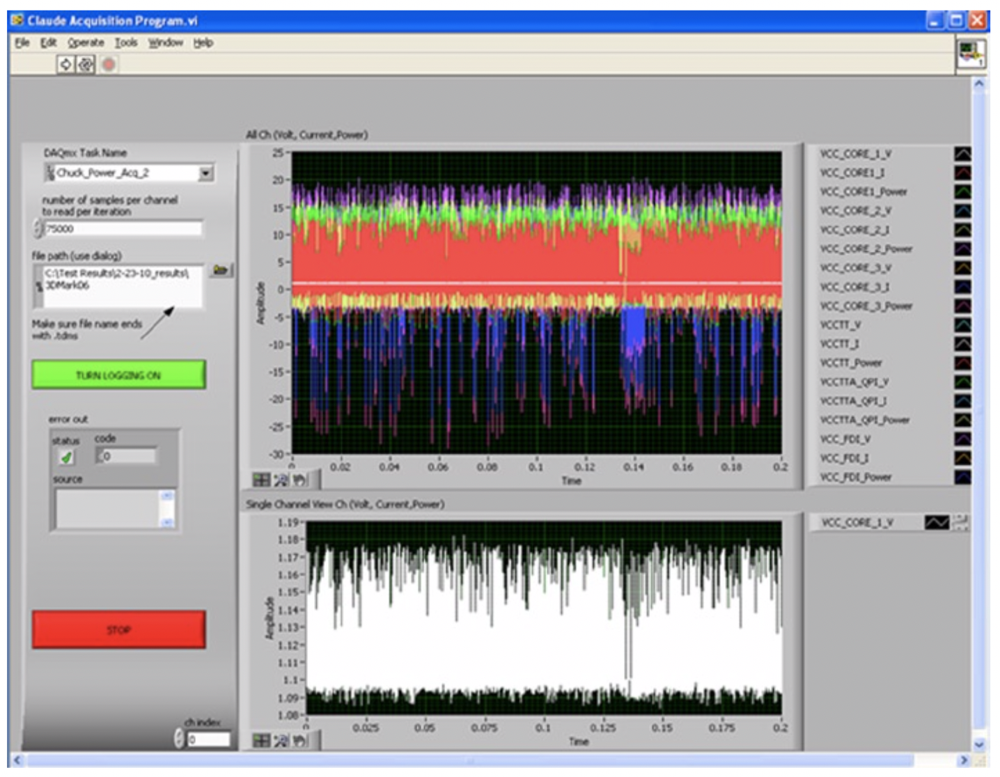

# 功率测量方法

在计算系统中，功率是在各种系统级别和母板级别进行测量的。 特别是，这适用于CPU封装功率，内存功率和显示功率测量。 根据电源的类型，这种测量有两种类型：交流电源和直流电源。

# 交流功率测量
对于系统交流功率或壁式功率测量，通常将交流功率计连接在电源和被测系统之间。 价格
此测量设备的精度可能会有所不同，具体取决于精度和精度要求。 简单，低成本的设备通常具有几个缺点，包括范围小，采样率低和不精确，无法与其他设备（如AC / DC转换器或数据采集系统）一起使用，分辨率低以及无法测量小功率变化。 另一方面，它们易于使用，几乎不需要设置时间。
对于系统级和母板测量而言，交流功率测量是不合适的，因为这些方法无法深入了解系统的功耗。

# 直流功率测量
尽管可以使用示波器和万用表测量直流电，但是最简单，最准确，最精确的直流电测量方法是使用自动数据采集系统（DAQ）。 DAQ将模拟信号作为输入，并使用专用软件将其转换为数字数据序列，以进行进一步的处理和分析。通常，DAQ可以支持多个输入通道，并且可以通过标准的串行或USB端口与数据分析计算机接口。它们能够处理非常高的数据速率，并且能够测量微小的电压差，因此非常适合自动功率测量。
电阻上的功耗可以表示为：
$$
P = V2 / R
$$
其中V是以伏特为单位的电压，R是以欧姆为单位的电阻，P是以瓦特为单位的功率。通过电路的电流由V与R之比确定。
黑盒电路的最大功率，通常做法是与黑盒串联增加一个具有低电阻r的非常小的检测电阻，该电阻具有较大的电阻R，因此电路的总电阻约为等于R。在这种情况下，黑盒所需的功率可以在公式6-3的修改版本中进行近似估算：
$$
P = \frac{ v \times \Delta v}{R}
$$

其中DV是检测电阻两端的压降，V是通道输入相对于地的电位。
由于电压是两点之间的电势差，因此对于每个电压测量，都需要两个输入：一个代表接地或参考电势，另一个代表非零电压。在单端测量中，参考是由DAQ自己的接地提供的，并且输入通道电压仅测量非零电压。与为每个通道使用单独的接地相比，单端测量的精度可能较低，但是它们具有使用更快的采样或更多输入通道的优势。
DAQ可以将电压形式的通用模拟信号作为输入。模拟信号在转换为电压形式之前可能最初是使用传感器捕获的，或者它们可能已经以电压形式存在。在后一种情况下，一个简单的低电阻检测电阻可以用作传感器。
为了测量某个系统或母板组件的功率，通常会安装适当的电源轨，以使检测电阻器串联在电源轨上。如图6-9所示，当电流流过检测电阻器时，会产生压降DV，可以通过DAQ对其进行测量，其中使用了非常小的检测电阻器（例如2毫欧的电阻）。

图6-9. 电源track中的功率测量设置

使用DAQ随附的专用软件（例如National Lab LabView），可以对数据进行分析和汇总以提供一段时间内的测量功率.

# 功率测量注意事项
在测量功率时，通常会考虑以下因素：
* 被测处理器部件的TDP。
* 数据采集系统的准确性和准确性；DAQ和相关软件用于将模拟电压信号实时转换为数字数据序列以及进行后续处理和分析的功能。
* 从一组测量到另一组测量的环境温度，散热和冷却变化；为了避免因环境因素而导致的每次运行之间的差异，通常会进行三轮测量，并考虑中间测量值。
* 单独注释适当的电源轨以节省电能，同时以1KHz的典型采样率（即每1毫秒采样一次）记录所有电源轨上的功耗，并且具有与热相关的测量窗口在1-5秒之间作为移动平均线。
* 识别操作系统后台任务和电源策略；例如，当没有媒体工作负载在运行并且处理器显然处于空闲状态时，CPU可能仍在忙于运行后台任务；另外，操作系统的节能策略可能已经调整了CPU的高频限制，需要仔细考虑。
* 考虑一段时间内的平均功率为了消除电源瞬变中的突然尖峰，并且仅考虑稳态功耗行为。
* 包括综合设置和常用场景的基准； 为高端用途考虑的适当工作负载，以便系统的各个部分有机会达到其潜在极限。
* 考虑使用最新的可用图形驱动程序和媒体SDK版本，因为在驱动程序和中间件级别可能进行了功耗优化；此外，使用新的图形驱动程序可能会导致功耗或性能下降，例如对GPU内核，内存，PLL，电压调节器设置和超频（turbo）设置的潜在更改。

# 工具与应用
功率测量工具包括专用和精确的测量系统（例如DAQ）以及不太精确的基于软件的工具和应用程序。 我们考虑一个专门的DAQ系统，并介绍几种功能各异的软件工具。

# 直流功率测量系统示例
直流功率测量系统的一个示例是基于National Instruments *
基于PXIe 6363 PCI-express的DAQ和相关的LabView Signal Express软件应用程序，用于信号分析。 PXIe 6363的信号捕获带宽为每秒125万个样本，每个电压输入通道的A / D转换分辨率均为16位。该输入电压可编程至低至±1V，因此很容易放大低压信号。同样，对于当今的低功耗设备，还提供具有更高输入电压的较新版本的PCIe DAQ。
通常，将2毫欧的电流检测电阻与所有感兴趣的电源轨串联使用，例如，CPU封装，内存DIMM和显示器，其峰值，平均值和最小直流功耗为测量。而且，将监视运行时CPU和GPU的频率以确定适当的涡轮运行。每次运行时都会自动校准电源设置，以检测环境温度可能导致的检测电阻和测试线束变化。
为了捕获并计算以瓦特为单位的功率，必须测量每个电源轨的电压和电流。这是通过在每个电压轨上使用与输入电源串联的电流检测电阻器来实现的。电流检测电阻两端的电压降是一个小幅度信号，与流经检测电阻的电流量直接相关。每个电源轨的电压（正极和负极）和电流检测电阻的输出（正极和负极）通过可拆卸的TB-2706接线盒模拟输入模块直接连接到PXIe 6363。
使用LabView Signal Express记录并绘制测得的功率，以生成详细而全面的功率性能曲线。该应用程序可捕获并处理来自PXIe 6363 DAQ模块的电压和电流测量结果，并只需将测得的电压和感测电流相乘即可计算以瓦特为单位的功率。

该应用程序还支持各种统计测量，例如用于详细信号分析的移动平均值，峰值，平均值和最小功率。 图6-10描绘了用于功率测量系统的LabView配置界面的示例。 在该界面中，可以选择感兴趣的电压通道。 

图6-10. 用于功率测量的LabView数据采集设置

然后，图6-11显示了进行功率测量时LabView界面的示例。 顶部和底部窗口分别显示来自所有输入通道和单个通道（通道0）的电压，电流或功率信号。

图6-11. 电源数据采集正在进行中
