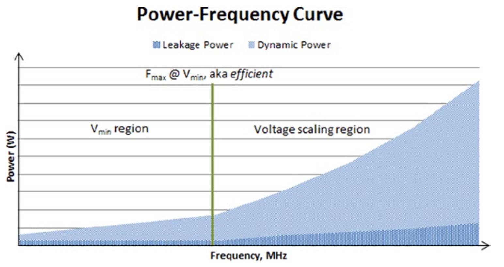

# 低耗电设备的优先级

在过去几十年中，根据众所周知的摩尔定律，计算机的计算速度和密度经历了指数级增长。由于增长最终会受到电量和设备物理极限的限制，这种增长趋势将会结束。但就目前而言，个别计算机元件的耗电尚未达到极限。移动计算设备，如智能手机、笔记本电脑和平板电脑，或者家用娱乐电子产品，如机顶盒、数码相机、带调制解调器，基本上都遵循同样的趋势，因此仍然存在耗电优化的空间。

另一方面，无论是家用电器的电子控制器，还是家庭能源管理系统，或者是车载信息娱乐设备，还是复杂的医疗设备，对于许多低功率嵌入式系统而言，移动设备的耗电增加正变得普遍。这就要求，设备不仅做到尽量省电，而且必须做到“始终开启，始终可用”。

因此，在消费者永不满足的需求和激烈竞争的推动下，移动设备制造商持续提供的功能越来越多、越来越快，这些都需要更加省电以便扩展电池寿命。此外，小型的可穿戴计算设备的出现（如智能耳机和智能手表）需要极其低耗电的处理器。例如，一块表面积小至1600平方毫米的智能手表，需要超过一周的电池续航时间，这些都引领着物联网（IoT）的发展。

设计人员的目标是在降低成本的同时降低包装、制造、操作和可靠性的成本，同时还需要支持日益复杂的设计。这种雄心勃勃的目标通常会随着每两年引入更精细的几何形状的新硅工艺技术的出现而实现。然而，由于栅极二极管和结二极管泄漏的增加，每一代工艺都会导致更高的功耗泄漏（*power leakage*）。尽管动态功耗随几何尺寸而减小，但不断增长的导线密度抑制了这种降低。因此，仅动态功耗的简单缩减不足以用于下一代应用。对于越来越复杂的应用程序，越来越多的性能要求对电池电量提出了苛刻的要求。这要求更积极的管理泄漏功耗和有功功耗。

通常，低功耗设备从一种工艺几何过渡到另一种较小几何的优先级包括：

* 降低动态功率。这是可能的，因为对于较小的几何形状，动态电容和电压通常都会降低。
* 保持总静态泄漏功耗。对于硬件架构师来说，这是一个重点关注的领域。因为由于工艺技术的原因，对于较小的几何形状，泄漏功耗往往会增加。因此有必要在该区域进行优化以维持泄漏功耗。
* 将有功泄漏和动态功率占比保持在一个较小的比例范围（例如10%~15％）。同样，决不允许出现泄漏功率决定功耗的情况。

让我们回顾一下第6章介绍的功耗-频率关系。图7-1显示了相对于频率的动态功耗和泄漏功耗。

**图7-1.** 功耗-频率关系图。低功耗设计的目标是将泄漏功耗保持在动态功耗的10％~15％

从图7-1可以明显看出，存在一个有效频率。当低于该频率时，电压和频率缩放无法实现良好的功耗降低。在此$$V_{min}$$区域中，电压仅随频率线性缩放，因此泄漏电流以及因此带来的泄漏功耗成为进一步降低功耗的决定因素。还必须指出，电压不能任意降低，因为将电路驱动到活动状态存在最小电压。但是，在有效频率点之上，由于电压随频率呈三次方关系缩放，因此可以实现良好的电压缩放。在该功耗相对较高的区域中，可以通过简单的电压-频率折衷来降低功耗。

图7-2给出了移动、低功耗平台架构的例子。电源管理和优化对于架构的每个模块：系统级芯片（*SOC，system-on-a-chip*），存储模块，输入和输出（I/O）模块，传感器和摄像头，控制器和通信模块，都是必不可少的。在典型的现代SoC中，存在专用电路用于热控制和电源管理，例如电源管理控制器（PMC），后面的内容会对其进行讨论。

**图7-2.** 移动平台架构的例子