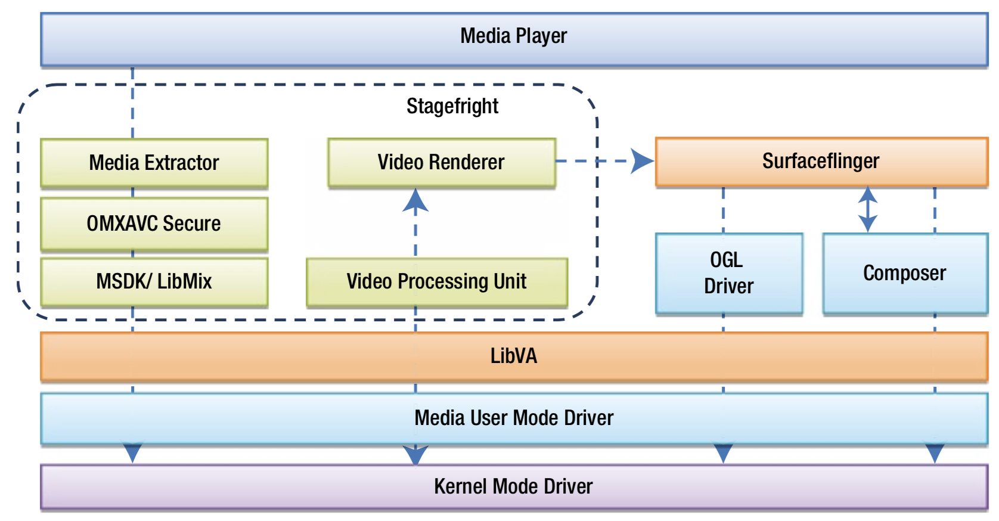
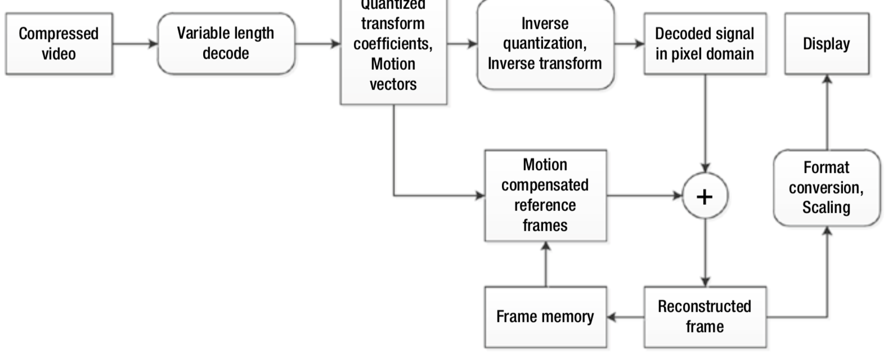
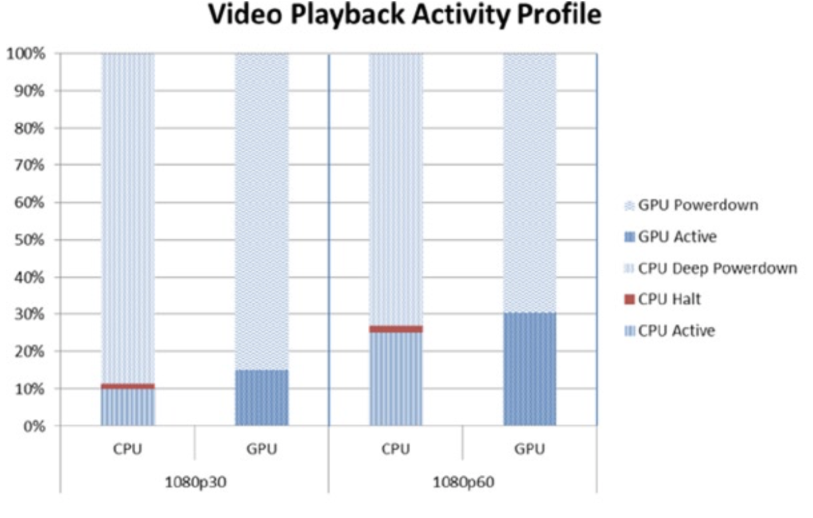
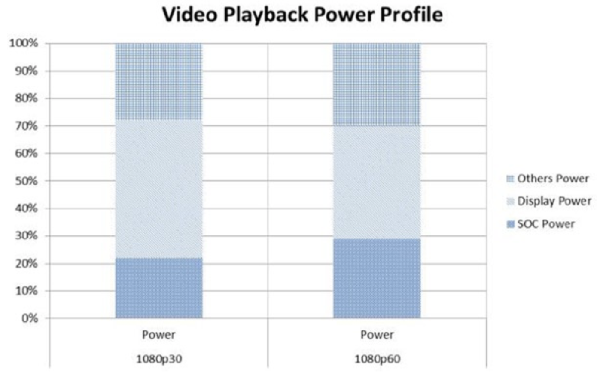

# Video Playback and Browsing
无论是播放本地视频还是播放互联网的视频流，视频播放都是低功耗设备上最流行和最具知名度的媒体使用模式。可以用单独的应用程序或浏览器播放来自互联网的视频内容。数字视频一般以各种压缩、编码格式存在，因此视频播放涉及到视频解压缩操作。视频在显示设备上播放之前，需要先解码视频。如果视频的分辨率与显示设备的分辨率不同，则需要调整解码视频的大小以匹配显示设备的分辨率。

仅使用CPU进行视频解码和播放是一种非常复杂且耗时的操作。一般会用硬件加速获得更高的性能和更低的功耗，因此优化的硬件单元会专用于类似视频解码这种复杂且耗时的操作。在现代处理器中，使用硬件加速播放视频已成为常态。对于低功耗平台而言，硬件加速至关重要。

图7-3展示了Android系统的视频播放模型的软件堆栈。Media Extractor（媒体提取器）分流（*demultiplexes*）视频媒体文件中的视频数据和音频数据。分流之后的数据输出到相应的Open MAX（OMX）解码器，OMX将视频码流输出到LibMix库开始解码操作。媒体驱动器驱动硬件解码器进行实际的视频解码。解码后的视频缓冲区将发送到Android的音视频同步（AVsync）模块。AVSync比较视频缓冲区的PTS和音频时钟，并将缓冲区排队到Surfaceflinger，以便在适当的时间将缓冲区数据显示在显示器。

**图7-3.** Android系统上视频播放的软件栈

图7-4给出了视频播放中的解码过程的流程图。解码过程通常由国际标准研究小组定义，所有兼容的解码器都必须实现特定的编解码器格式。为了获得一定的性能和功耗要求，必须在各种硬件和软件级别上进行仔细的优化。尤其是在低功耗平台上，更需要进行仔细的软件、硬件优化。 优化方法包括：在专用硬件上执行重复操作，优化内存加载/存储/复制，高速缓存一致性，调度，各种硬件功能单元中的任务负载平衡，优化后处理，选择性地进入节能状态等等。

**图7-4.** 视频解码的流程图

图7-5给出了AVC播放1080p30和1080p60视频的性能结果文件。在基于英特尔架构的低功耗平台中，根据帧率的不同，播放1080p的视频通常需要10%~25％的CPU消耗以及15%~30％的GPU消耗。虽然显示单元消耗了平台50%的功率，但SoC的功耗为20%~30％。明显的功耗损有：稳压器（〜15％），内存（〜5％），平台的其它部分。

**图7-5.** 播放不同帧率的视频的功耗图