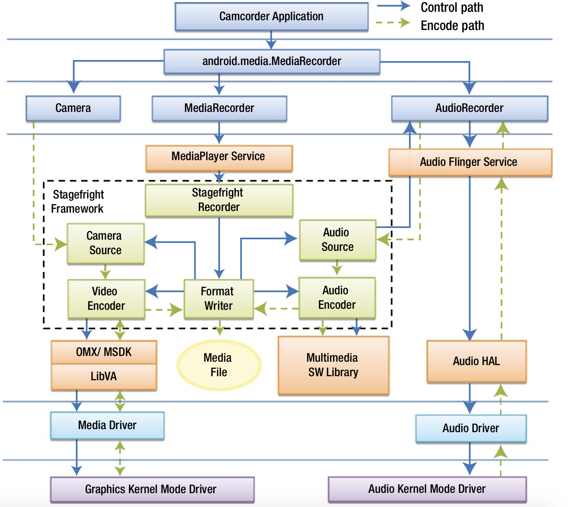
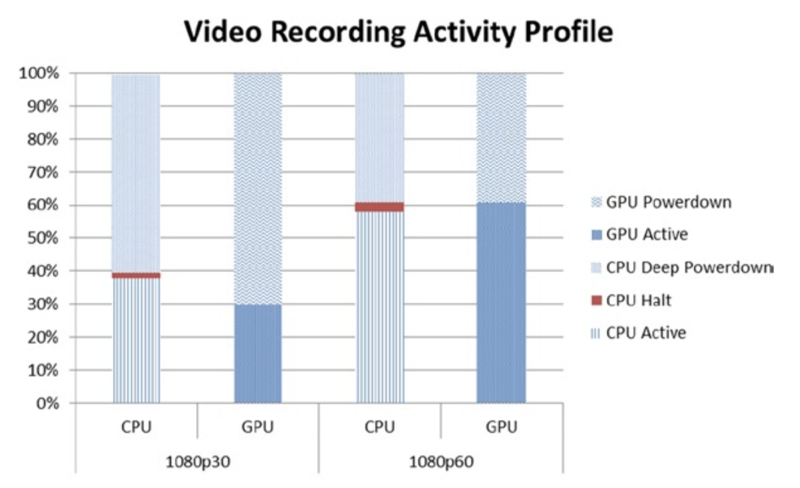
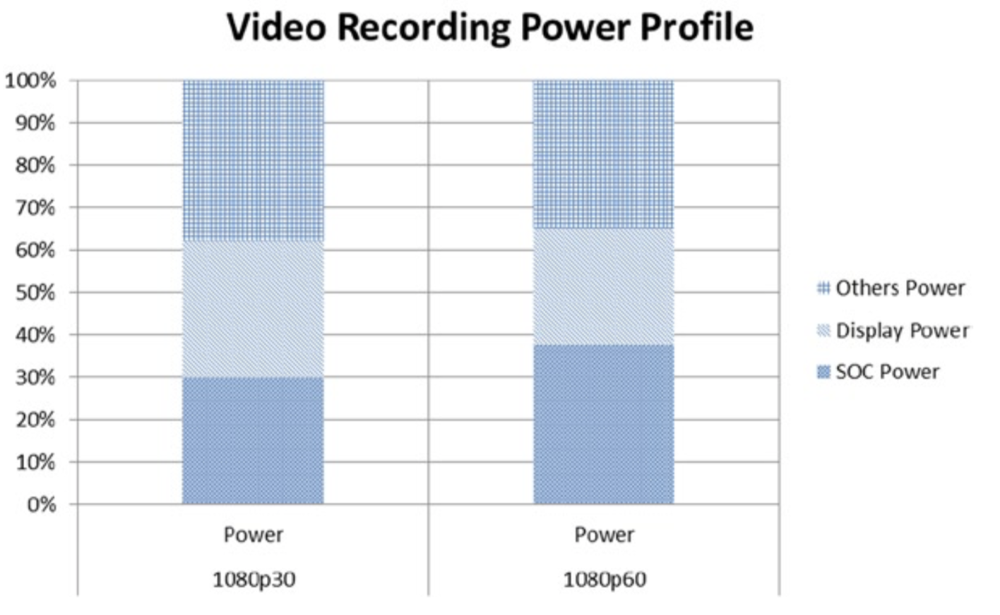

# 视频录制
在视频录制中，用户使用设备的主摄像头捕获1080p分辨率的视频，使用集成麦克风捕获音频。摄像头的输出（通常是压缩的）数据经过解码和预处理，并根据需要进行降噪和缩放。使用硬件加速编码生成的未压缩的源数据。编码并合流（*multiplexed*）视频和音频流，然后将其存储在本地文件中。虽然预览模式对于视频录制而言相当普遍，但为简单起见，图7-6所示的软件堆栈中未考虑视频预览。

**图7-6.** Android系统视频录制的软件堆栈

图7-7展示了英特尔架构平台上利用AVC录制1080p30和1080p60视频的功耗信息。录制1080p视频需要40%~60％的CPU消耗以及30%~60％的GPU消耗。GPU的消耗数量取决于视频帧率。SoC和显示单元各自均消耗约1/3的功耗。和视频播放类似，已下的部分也会产生大量功耗：稳压器（〜15％），内存（〜7％），平台的其它部分。请注意，由于编码的工作量较大，因此视频录制对GPU的消耗要高于视频播放。

**图7-7.** 视频录制的功耗图