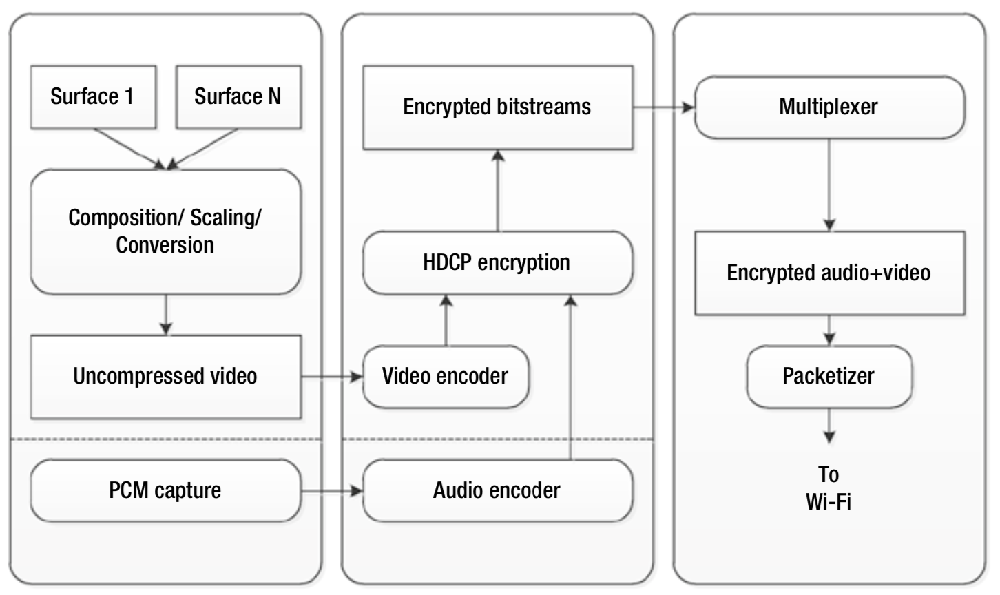
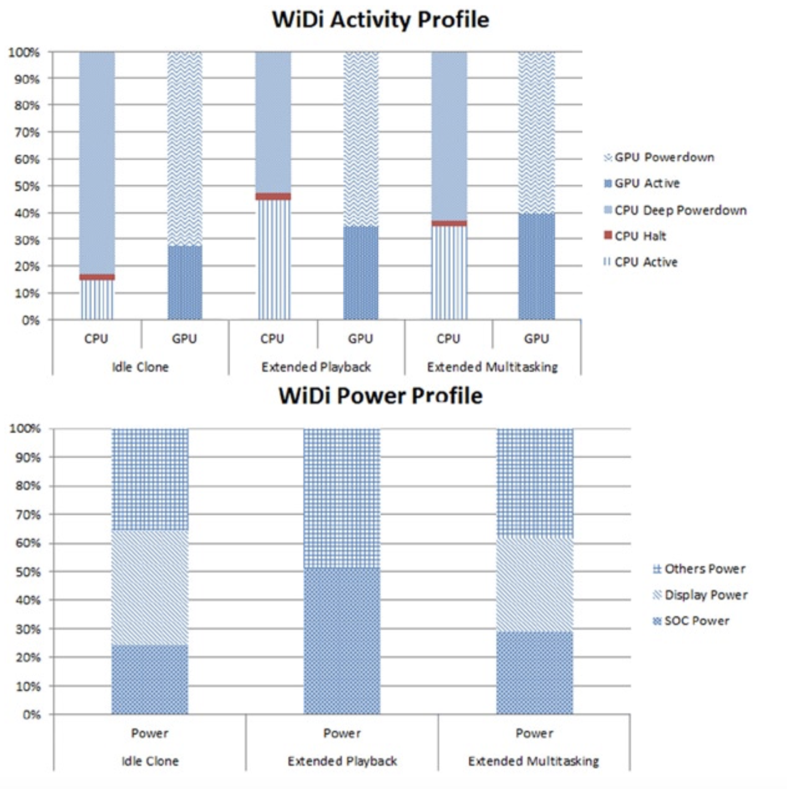

# 视频分发
在使用无线显示（WiDi）和Miracast进行视频传输的过程中，用设备的Wi-Fi把从本地显示器捕获的编码的屏幕内容流式的传输到远程HDTV或监视器。WiDi也支持无线传输所关联的音频内容。可以利用视频和音频编码的硬件加速功能为远程显示设备生成封装在Wi-Fi数据包中的音频-视频流，该远程设备会连接一个WiDi适配器，并且该视频流可在通过peer-to-peer链接传输。由于无线局域网（WLAN）的多角色支持，因此多个连接可能同时在无线访问点上可用，从而为WiDi对等连接以及与Internet的专用连接（同时共享该连接）提供服务频率。如下所述，多角色允许以克隆或多任务模式浏览Internet。利用WiDi的数字版权管理（DRM）协议保护视频播放或浏览Internet。第6章概述了WiDi的完整解决方案和Miracast的行业标准。

WiDi支持两种主要的使用模式：

* 克隆模式，在本地和远程显示器上都显示相同的内容。可以修改本地显示器的分辨率以匹配远程显示器的最大分辨率。另外，如果WiDi性能不足，则远程显示器的帧率可能会降低。
* 扩展模式，其中虚拟显示器可以远程传输数据流，并且内容不会显示在本地显示器上。扩展显示有两种方案：
    * 在远程显示器上显示内容，而本地显示器仅显示UI控件。
    * 允许多任务处理，其中视频显示在远程显示器上，而独立的应用程序（例如浏览器）也可以运行并在本地显示器上显示内容。

理想情况下，平台的设计应确保激活无线显示时不会降低平台的性能。

图7-8展示了英特尔架构平台的WiDi流程图。一个或多个屏幕内容被捕获、合成、缩放并转换为指定的格式以适合硬件加速的视频编码器，同时还会独立捕获并编码音频。然后，根据HDCP2协议对编码的视频和音频码流加密，并合流并打包加密的码流，进而生成MPEG-2数据包，用以准备通过Wi-Fi信道发送。

**图7-8.** Intel架构的无线显示流程图

图7-9展示了三种WiDi方案的活动详情（*activity profile*）：

* 设备空闲时的克隆模式——即本地显示屏显示的大部分是静态屏幕。
* 在扩展模式下播放视频，其中视频在远程显示器中播放。
* 扩展模式下的多任务，其中在远程显示器上播放视频时，在本地显示器上独立显示浏览器（或其他窗口）。

**图7-9.** 各种WiDi模式的活动详情

空闲克隆方案取决于显示器的刷新率，可以使用硬件加速以720p60或1080p30捕获并编码屏幕内容。编码的视频码流经过加密、与音频流合流、并在使用Wi-Fi协议传输之前分成传输数据包。硬件加速的视频也可以在合成、缩放、转换为未压缩的视频之前进行预处理。在克隆模式下播放视频时，使用硬件加速会同时进行解码，捕获和编码操作。对于扩展模式，本地显示器不显示视频，内容仅在扩展无线显示器中显示；此时没有进行合成，缩放或格式转换，仅执行解码和编码。在所有的情况下，音频通常都使用CPU编码。

在Intel体系结构，根据WiDi的情况，WiDi通常需要消耗15%~45％的CPU和30%~40％的GPU。尽管本地显示器在扩展视频模式下没有功耗，但SoC消耗了大约一半的平台功率，另一半则分配给了平台的其余部分。对于其他WiDi模式，显示器，SoC和平台的其余部分基本上均分了平台的功率。