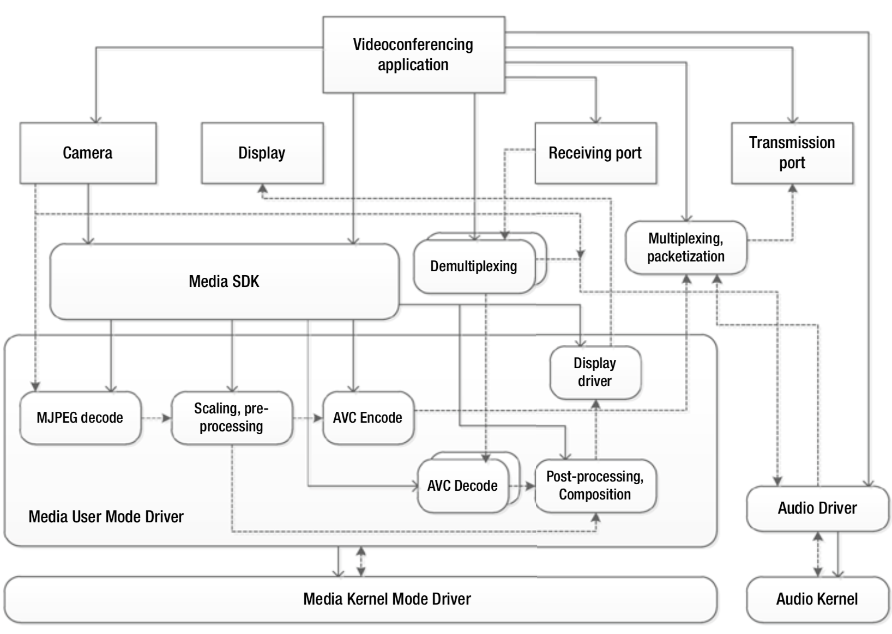

# 视频电话（会议）
多方视频会议是两方视频电话或视频聊天的扩展，多方视频会议使用设备集成的摄像头来捕获视频，并基于MJPEG或其他压缩格式进行后续处理。利用设备的硬件加速功能，可以对摄像头的输出进行解压缩（如果摄像头的输出已经压缩），然后以VBR码率将其重新编码为低延迟的具有一定错误恢复功能的视频格式。这基本上是同时应用视频播放和视频录制的使用模型，并且具有以下规定：

* 编码和解码操作必须实时同步，通常会采用硬件加速。
* 摄像头的输出也应实时输入到编码单元。摄像头的输出帧率应与编码帧率保持一致。
* 从摄像头捕获到输出打包的码流的端到端的延迟应该是恒定的。
* 视频基本流应与相应的音频基本流有适当同步。

对于多方视频会议，通常在本地显示器中有一个主视频窗口和多个涉及多方的缩略图视频。图7-10给出了典型的视频会议的流程图。假设摄像头的捕获格式为压缩格式，则在对捕获的视频进行编码、解码、缩放、预处理之前，需要将其编码为合适的格式（例如具有适当的码率，帧率和其他参数的AVC格式），以便在视频的质量、延迟、功耗和压缩量之间获得良好的折中效果。同样，在显示之前，将输入的视频码流解码并组合在一起。通常都会使用硬件加速完成如上的操作。合流/分流和打包/解包通常在CPU中完成，而音频可以通过特殊的硬件单元、音频驱动程序、内核进行处理。

**图7-10.** 视频会议流程图

视频会议的活动详情类似于WiDi。在这两种情况下，都涉及同时编码和多次解码。编码是在低延迟和可变码率的情况下进行的，以适应网络带宽的变化。视频会议和WiDI也都具有实时性的要求。