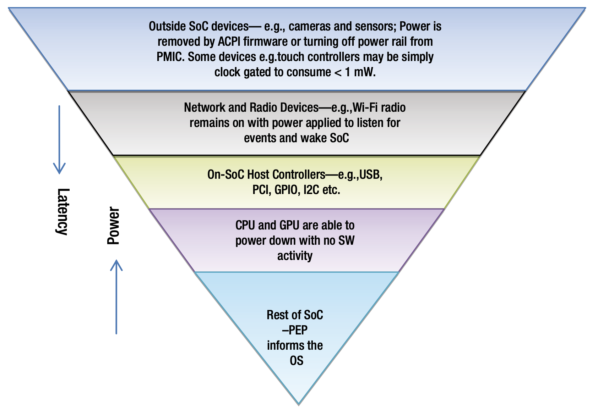
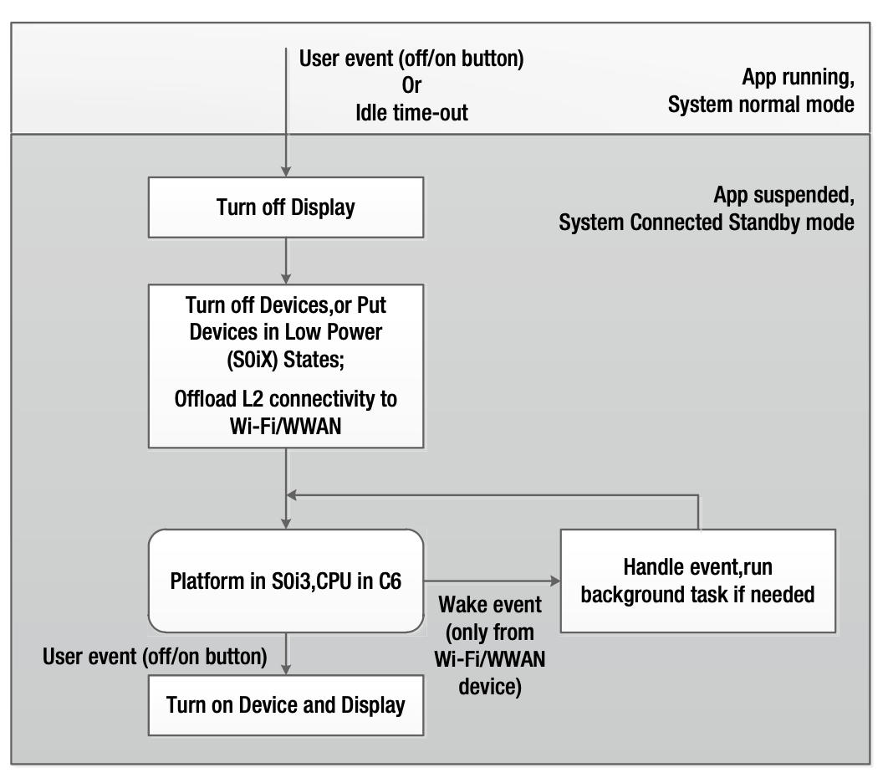
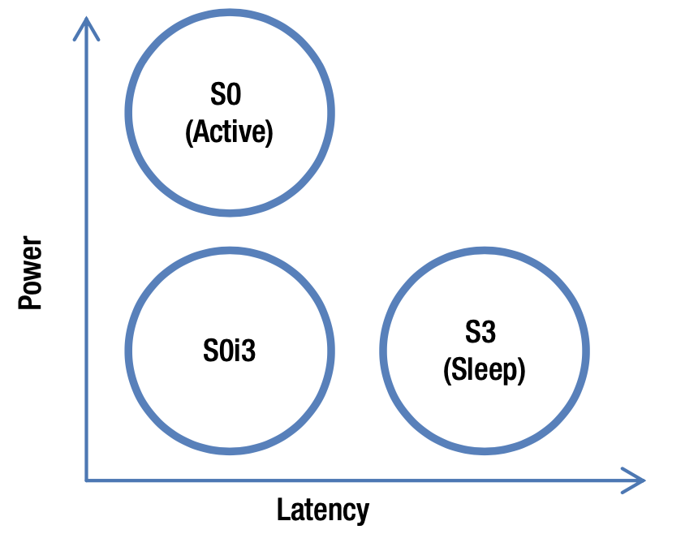

# 待机状态
Connected Standby（CS）模仿智能手机的电源模型，以在PC上提供即时开/关的用户体验。在Windows 8以及更高版本中，Connected Standby是低功耗状态，CS在保持与Internet连接的同时使用极低的功耗。CS使得系统可以连接到适当的可用网络，从而使得应用程序无需用户干预也能够保持更新或获取通知。传统睡眠状态（*Sleep state*）（S3）的唤醒的等待时间在2s+，而休眠（*Hibernate*）（S4）可能需要无限长的时间，但是支持CS的移动设备可以在500ms以内恢复系统。

当系统进入CS时，操作系统会关闭除了保留DRAM内容所需的最低要求外的大多数硬件。但是，网络接口控制器（*NIC，Network Interface Controller*）仍然可以获取一点点的电量，使其可以扫描接受到的数据包并匹配特殊的唤醒模式。为了保留网络连接，NIC将根据需要唤醒操作系统。操作系统还会每隔几个小时自主唤醒以更新其DHCP。因此，即使NIC在大部分时间都处于关机状态，系统仍可以保持其第2层和第3层的连接性。

另外，可以实时唤醒系统。例如，当有Skype呼叫到达时，系统需要快速启动铃声。通过特殊的唤醒模式数据包实现实时唤醒。Skype服务器在长时间运行的TCP套接字上发送数据包。NIC硬件经过编程以匹配该数据包并唤醒OS。操作系统接收并识别Skype数据包，然后开始播放铃声。

Connected Standby具有以下四点：

* 大多数硬件处于低功耗状态。
* 当NIC需要OS干预以维持第2层连接时，NIC会唤醒OS。
* 操作系统会定期唤醒NIC以刷新其第三层连接。
* 当发生实时事件（例如，Skype来电）时，NIC会唤醒操作系统。 

为Connected Standby平台设计的SoC和DRAM一般具有如下的特征：

* 空闲模式和活动模式之间的切换时间小于100ms。活动模式允许在CPU或GPU上运行代码，但可能不允许访问存储设备或其他主机控制器或外围设备。空闲模式可以是时钟门控状态或电源门控状态，但应为SoC和DRAM的最低功耗状态。
* 支持DRAM的自刷新模式，以最大程度地降低功耗。通常使用移动DRAM（LP-DDR）或低压PC DRAM（PC-DDR3L，PC-DDR3L-RS）。
* 支持Power Engine Plug-in（PEP）的轻量级驱动程序，PEP对SoC特定的电源依存关系进行抽象并协调设备状态和处理器空闲状态的依存关系。所有支持CS的平台都必须包含一个PEP，当SoC准备以最低功耗的空闲模式工作时，PEP应与操作系统进行通信。

如图7-11所示，Connected Standby状态下为低功耗目的标准备硬件的过程可以显示为上下颠倒的金字塔。整个SoC关机时，功耗最低，但这仅在SoC上的每个设备均关机时才会发生。因此，此状态的等待时间在Connected Standby中最高。

**图7-11.** 在Connected Standby期间准备过渡到低功耗状态

S0iX状态是最新的待机（*standby*）状态，包括S0i1，S0i1-Low Power Audio，S0i2和S0i3。可以在最新的英特尔平台上使用这些状态，并且所有操作系统均以启用这些状态。S0iX是特殊的待机状态，可让系统消耗很少的电量，因此它们对于Connected Standby至关重要。当按下“开/关”按钮或空闲超时后，设备进入CS模式。在CS模式下，设备消耗的功率非常低。例如，在CS模式下，基于Intel Z2760的设备消耗的功率小于100 mW，并且设备可以在此模式下停留15天以上而无需充电。图7-12显示了CS模式下的操作流程。

**图7-12.** Connected Standby的操作流程

与此形成鲜明对比的是ACPI S3状态，在该状态下，处理器在系统处于睡眠状态时将暂停所有活动，并且仅根据来自键盘、鼠标、触摸板或其他I/O设备的信号才能恢复活动。Connected Standby使用各种S0iX状态，以严格控制的方式自动暂停和恢复系统的活动，以确保低功耗并延长电池使用时间。具有45瓦时电池的典型系统在S3状态下可以达到100小时的电池寿命，而在S0i3中，电池寿命可以达到300小时。

图7-13显示了S0i3状态相对于S0和S3状态的比较。S0i3本质上兼顾了功耗和延迟的最佳性能：它比S0（活动）状态的功耗要少，所消耗的功率几乎与S3（休眠）状态的功耗相同，而唤醒延迟则类似于S0状态，以毫秒为单位。

**图7-13.** S0i3与传统的ACPI Sleep（S3）状态的相对功率和延迟的对比关系

表7-2提供了英特尔架构平台上进入/退出每个低功耗待机状态的预估等待时间。特别是在Windows 8和Windows 8.1操作系统上，从用户体验的角度来看，这些快速的延迟可转化为在节省功耗的前提下实现的异常快的唤醒速度。

**表7-2.** 英特尔架构平台上进入/退出待机状态的预估时间

| 状态 | 进入延迟 | 退出延迟 |
| --- | --- | --- |
| S0i1 | ~200 usec | ~400 usec |
| S0i2 | ~200 usec | ~420 usec |
| S0i3 | ~200 usec | ~3.4 msec |

