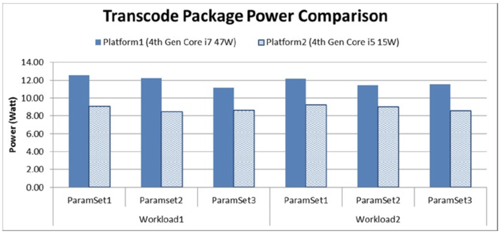

# 权衡性能与功耗的案例研究
考虑两个转码的工作负载：视频长度约5分钟、分辨率为1920x1080p、帧率为30fps，将视频从高码率的H.264格式转码为低码率的H264格式。两次转码不同的地方在于，与转码任务2相比，转码任务1的视频内容复杂度较低，场景变化少，细节少，动作慢。

表8-1显示了运行转码任务的Intel平台的平台配置。

**表8-1.** 转码实验所用的平台的配置信息

| 指标 | 平台1 | 平台2 |
| :--- | :--- | :--- |
| Processor | 4th-gen. Core i7 | 4th-gen. Core i5 |
| # Cores | 4 | 2 |
| CPU frequency | 2 GHz | 1.3 GHz |
| CPU turbo | 3.2 GHz | 2.6GHz |
| TDP | 47 W | 15 W |
| Cache size | 6 MB | 3 MB |
| Graphics | Intel (R) Iris Pro (TM) 5200 | Intel (R) Iris Pro (TM) 5000 |
| Max GPU frequency | 1.2 GHz | 1 GHz |
| Embedded DRAM | Yes | No |
| Memory | 4 GB dual channel | 4 GB dual channel |
| Memory speed | 1333 MHz | 1333 MHz |

我们还考虑了三组编码参数，编号分别为1、2和3。表8-2显示了每个参数的重要区别。

**表8-2.** 参数配置的重要区别

| 参数  | 参数集1 | 参数集2 | 参数集3 |
| :--- | :--- | :--- | :--- |
| Configuration | Fast | Faster | Fastest |
| Motion estimation algorithm | Algorithm 1 | Algorithm 1 | Algorithm 2 |
| Motion estimation search range | 48 pixels | 48 pixels | 28 pixels |
| Fractional pixel motion compensation | 1/8 pixel | 1/8 pixel | 1/4 pixel |
| Adaptive search | Yes | No | No |
| Multiple reference pictures | Yes | No | No |
| Multiple predictions | Yes | No | No |
| Macroblock mode decision | Complex | Complex  | Simplified |

图8-1显示了使用两种工作负载以及各种编码参数集在两个平台上的转码性能。值得注意的是，由于两个工作负载的复杂性不同，参数的调整对性能的影响也不同，并且影响的程度在两个不同的平台上也是不同的。

**图8-1.** 两个平台的转码性能比较

从图8-1可以看出，与平台2相比，平台1在编码速度方面的吞吐量平均提高了60％，其中嵌入式动态RAM占比10％，而GPU频率占比20％。其余30％的差异可归因于处理器图形硬件优化，GPU执行单元数量，缓存大小，CPU内核数量，CPU时钟速度，turbo容量等的组合。

当参数从快速过渡到最快时，Workload 2的性能不断提高。尤其是在平台1上，Workload 1的峰值性能比使用参数集3的实时速度快12倍以上。因此，很明显，工作负载特征以及参数调整会极大地影响转码性能。比较平台1上两个工作负载的最快参数集3，可以发现工作负载1的性能比工作负载2好13％。在平台2上也存在类似的趋势，其中工作负载1比工作负载2的性能高约12％。

由于工作负载2的特性以及平台2上资源的限制，参数集1在该平台上的性能明显降低，因为该参数集包括多个参考图片，多个预测以及对模式决策的详尽分析。

图8-2显示了两个平台在两个具有相同参数集的工作负载下功耗。

**图8-2.** 两个平台的转码功耗比较

从图8-2可以明显看出，与平台2相比，平台1平均要多消耗约34％的功耗。而对于工作负载，这两个平台都没有达到其最大TDP限制。但是，某些参数设置需要打开某些硬件单元从而消耗电量，而其他参数则不需要。从两个平台之间的功耗差异（14％〜44％）可以明显看出这一点。

如果在每个平台上考虑绝对功耗，也可以得出有趣的观察结果。调整参数后，功耗通常会降低，尤其是在平台1上。此外，在平台1上，工作负载1具有28％的动态功耗范围，而工作负载2仅具有8%的动态功耗范围。 但是，在平台2上，这些数字分别为7％和10％。这表明与平台2相比，在平台1上，工作负载1的功耗对更改的参数的反应更快。但是，在平台2上，这些工作负载不受计算的限制，因此对更改的参数没有反应。在这种情况下，缓存性能和GPU执行单元的数量成为主要因素，因而很少考虑编码参数。

图8-3显示了针对每个参数集的两个平台上两个工作负载的平台效率（以fps /瓦为单位）。平台1的效率通常比平台2更高，这主要是因为平台1的专用的嵌入式动态RAM、更高的GPU频率、更高的GPU执行单元数量以及更好的缓存性能。平台1的效率比平台2平均提高了约23％。

**图8-3.** 不同平台的转码效率

从图8-3中还可以看出，参数调整在两个平台上对工作负载1的影响都类似，但是对于工作负载2，平台2在平台效率方面显示出较大的差异。平台效率的这种行为不仅是由于参数变化，而且还由于工作负载的不同的特征。

从图8-3中还可以看出，参数调整在两个平台上对工作负载1的影响都类似，但是对于工作负载2，平台2在平台效率方面显示出较大的差异。平台效率的这种行为不仅是由于参数变化，而且还由于工作负载的不同的特征。

图8-4显示了性能与功耗分析的另一种观点。由于其可用资源的差异，这两个平台显然表现出不同的性能特征。在两个平台上，工作负载都存在聚集的现象。由于更大的缓存和嵌入式动态RAM的存在，与平台2相比，平台1通常消耗更多功耗，但是它也提供了更高的性能。

**图8-4.** 两个平台上的性能与功耗（WL和PS分别是工作负载和参数集的缩写）

从图8-4可以看出，在给定的平台上，适当的参数选择可以提供良好的节能机会。例如，在平台2上，与参数集1相比，使用参数集3可以使工作负载1节省近1瓦的电力。

在进行性能和功耗的权衡分析时，并行化技术或优化资源利用率通常对视觉质量的影响很小。但是，调整编码参数的同时也会对质量造成影响。在这些情况下，功耗—性能折衷变成了功耗—性能－质量的权衡。 如果码率控制算法试图以可变的码率保持相同的质量，会导整个视频存在不同的码率。此时，这种权衡就变成了功率—性能—编码效率的权衡。